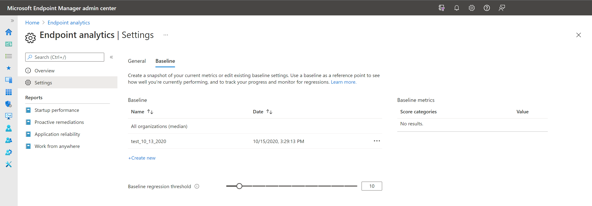

#  Endpoint analytics settings

From the settings page, you can select **General** or **Baseline**. Each of these settings is described below:

##  General settings

The **General** page in **Settings** allows you to see if Intune startup performance data collection has been enabled. It's automatically enabled for all your devices by default when you click **Start** to enable user-experience analytics. You can go to the Intune data collection policy node to change the set of devices on which boot and sign in records are collected.

  

###  Intune data collection policy

To assign this setting to a subset of devices, [Create a profile](../intune/configuration/device-profile-create.md#create-the-profile) with  the following information: 

  - **Name**: Enter a descriptive name for the profile, like **Intune data collection policy**
   
  - **Description**: Enter a description for the profile. This setting is optional, but recommended.
    
  - **Platform**: Select **Windows 10 and later**
   
  - **Profile type**: Select **Windows Health monitoring**
   
  - Configure the **Settings**:
   
       - **Health Monitoring**: Select **Enable** to collect event information from Windows 10 devices
    
    - **Scope**: Select **Boot performance**

  - Use the [Scope tags](/intune/configuration/device-profile-create#scope-tags) and [Applicability rules](/intune/configuration/device-profile-create#applicability-rules) to filter the profile to specific IT groups or devices in a group that meet a specific criteria.

### Configuration Manager data connector

To connect your Configuration Manager hierarchy with Endpoint analytics, you'll need to enable [Microsoft Endpoint Manager tenant attach](/mem/configmgr/tenant-attach/device-sync-actions). 

Once connected, you can [choose which devices you'd like to target](/mem/analytics/enroll-configmgr#bkmk_cm_enroll) for Endpoint Analytics in the Configuration Manager console.

> [!NOTE] 
> Some devices, such as non-Windows devices, are not eligible for Endpoint analytics, but may be eligible for [device actions with Microsoft Endpoint Manager tenant attach](/mem/configmgr/tenant-attach/device-sync-actions). Including these devices in your targeted collection will have no effect on Endpoint Analytics.

##  Baseline management

You can compare your current scores and subscores to others by setting a baseline.

1. There's a built-in baseline for **Commercial median**, which allows you to compare your scores to a typical enterprise.
1. You can create new baselines based on your current metrics to track progress or view regressions over time. Click the **Create new** button and give your new baseline a name. We recommend a name that includes the date, so it's easier to select from the drop-down in the reports pages.
1. There's a limit of 100 baselines per tenant. You can delete old baselines that are no longer needed.
1. Your current metrics will be flagged red and show as regressed if they fall below the current baseline in your reports. Because it's perfectly normal for metrics to fluctuate from day to day, you can set a regression threshold, which defaults to 10%. With this threshold, metrics are only flagged as regressed if they've regressed by more than 10%.

   

## Next steps
