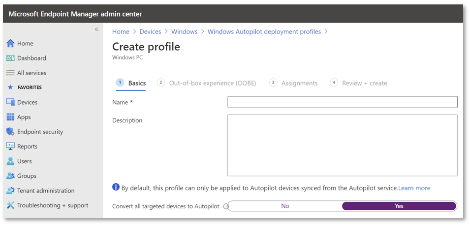

# Automatic registration of existing devices

**Applies to**

- Windows 10
- Windows Holographic, version 2004

You can automatically register an existing device if it's:
- running a [supported version](https://docs.microsoft.com/windows/release-information/) of Windows 10 semi-annual channel, and
- enrolled in an MDM service such an Intune
- a corporate device that is not already registered with Windows Autopilot

For devices that meet both these requirements, the MDM service can ask the device for the hardware hash. After it has that, it can automatically register the device with Windows Autopilot.

For more information on how to do this with Microsoft Intune, see [Create an Autopilot deployment profile](/intune/enrollment-autopilot#create-an-autopilot-deployment-profile) and review the description of the **Convert all targeted devices to Autopilot** setting. See the following example:

When using the [Windows Autopilot for existing devices](existing-devices.md) scenario, you don't need to pre-register the devices with Windows Autopilot. Instead, a configuration file (AutopilotConfigurationFile.json) containing all the Windows Autopilot profile settings is used. The device can then be registered with Windows Autopilot using the same **Convert all targeted devices to Autopilot** setting.

## Also see

[Registration overview](registration-overview.md)