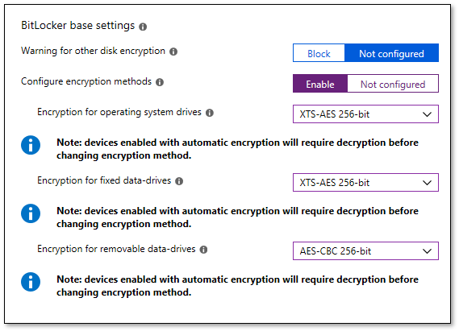

# Setting the BitLocker encryption algorithm for Autopilot devices

**Applies to**

-  Windows 10

With Windows Autopilot, you can configure BitLocker encryption settings to get applied before automatic encryption starts. This configuration makes sure the default encryption algorithm isn't applied automatically. Other BitLocker policies can also be applied before automatic BitLocker encryption begins. 

The BitLocker encryption algorithm is used when BitLocker is first enabled. The algorithm sets the strength  for full volume encryption. Available encryption algorithms are: AES-CBC 128-bit, AES-CBC 256-bit, XTS-AES 128-bit, or XTS-AES 256-bit encryption. The default value is XTS-AES 128-bit encryption. See [BitLocker CSP](/windows/client-management/mdm/bitlocker-csp) for information about the recommended encryption algorithms to use.

To make sure the BitLocker encryption algorithm you want is set before automatic encryption occurs for Autopilot devices:

1. Configure the [encryption method settings](/intune/endpoint-protection-windows-10#windows-encryption) in the Windows 10 Endpoint Protection profile to the encryption algorithm you want. 
2. [Assign the policy](/intune/device-profile-assign) to your Autopilot device group. 
  - **IMPORTANT**: The encryption policy must be assigned to **devices** in the group, not users.
3. Enable the Autopilot [Enrollment Status Page](enrollment-status.md) (ESP) for these devices. 
  - **IMPORTANT**: If the ESP isn't enabled, the policy won't apply before encryption starts.

An example of Microsoft Intune Windows Encryption settings is shown below.

  

A device that is encrypted automatically will need to be decrypted before changing the encryption algorithm.

The settings are available under Device Configuration -> Profiles -> Create profile -> Platform = Windows 10 and later, Profile type = Endpoint protection -> Configure -> Windows Encryption -> BitLocker base settings, Configure encryption methods = Enable.

It's also recommended to set Windows Encryption -> Windows Settings -> Encrypt = **Require**.

## Requirements

Windows 10, version 1809 or later.

## Next steps

[BitLocker overview](/windows/security/information-protection/bitlocker/bitlocker-overview)