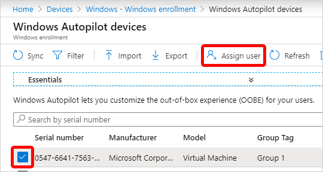
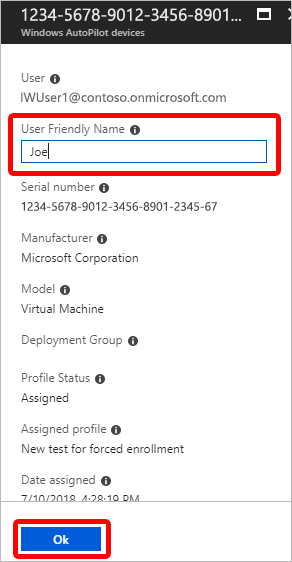

---
# required metadata

title: Enroll devices with Windows Autopilot
titleSuffix: Microsoft Intune
description: Learn how to enroll Windows 10 devices using Windows Autopilot.
keywords:
author: ErikjeMS
ms.author: erikje
manager: dougeby
ms.date: 07/09/2020
ms.topic: how-to
ms.service: microsoft-intune
ms.subservice: enrollment
ms.localizationpriority: high
ms.technology:
ms.assetid: a2dc5594-a373-48dc-ba3d-27aff0c3f944

# optional metadata

#ROBOTS:
#audience:

ms.reviewer: spshumwa
ms.suite: ems
search.appverid: MET150
#ms.tgt_pltfrm:
ms.custom: seodec18
ms.collection: 
- M365-modern-desktop
- m365initiative-coredeploy
- M365-identity-device-management
---

# Create device groups

**Applies to**

- Windows 10
- Windows Holographic, version 2004 or later

> [!NOTE]
> HoloLens 2 devices require Windows Autopilot self-deploying mode. For more information about using Windows Autopilot to deploy HoloLens 2 devices, see [Windows Autopilot for HoloLens 2](https://docs.microsoft.com/hololens/hololens2-autopilot).

## Create an Autopilot device group using Intune

1. In the [Microsoft Endpoint Manager admin center](https://go.microsoft.com/fwlink/?linkid=2109431), choose **Groups** > **New group**.
2. In the **Group** blade:
    1. For **Group type**, choose **Security**.
    2. Type a **Group name** and **Group description**.
    3. For **Membership type**, choose either **Assigned** or **Dynamic Device**.
3. If you chose **Assigned** for **Membership type** in the previous step, then in the **Group** blade, choose **Members** and add Autopilot devices to the group.
 Autopilot devices that aren't yet enrolled are devices where the name equals the serial number of the device.
4. If you chose **Dynamic Devices** for **Membership type** above, then in the **Group** blade, choose **Dynamic device members** and type any of the following code in the **Advanced rule** box. These rules only gather Autopilot devices because they target only Autopilot device attributes. Creating a group based off non-autopilot attributes won't guarantee that devices included in the group are registered to Autopilot.
    - If you want to create a group that includes all of your Autopilot devices, type: `(device.devicePhysicalIDs -any (_ -contains "[ZTDId]"))`
    - Intune's group tag field maps to the OrderID attribute on Azure AD devices. To create a group that includes all Autopilot devices with a specific group tag (the Azure AD device OrderID), type: `(device.devicePhysicalIds -any (_ -eq "[OrderID]:179887111881"))`
    - If you want to create a group that includes all of your Autopilot devices with a specific Purchase Order ID, type: `(device.devicePhysicalIds -any (_ -eq "[PurchaseOrderId]:76222342342"))`
 
    After adding the **Advanced rule** code, choose **Save**.
5. Choose **Create**. 

## Edit Autopilot device attributes
After you've uploaded an Autopilot device, you can edit certain attributes of the device.

1. In the [Microsoft Endpoint Manager admin center](https://go.microsoft.com/fwlink/?linkid=2109431),select **Devices** > **Windows** > **Windows enrollment** > **Devices** (under **Windows Autopilot Deployment Program**.
2. Select the device you want to edit.
3. In the pane on the right of the screen, you can edit:
    - Device name.
    - Group tag.
    - User Friendly Name (if you've assigned a user).
4. Select **Save**.

> [!NOTE]
> Device names can be configured for all devices, but are ignored in Hybrid Azure AD joined deployments. Device name still comes from the domain join profile for Hybrid Azure AD devices.

## Alerts for Windows Autopilot unassigned devices <!-- 163236 --> 

Alerts will show how many Autopilot program devices don't have Autopilot deployment profiles. Use the information in the alert to create profiles and assign them to the unassigned devices. When you click the alert, you see a full list of Windows Autopilot devices and detailed information about them.

To see alerts for unassigned devices, in the [Microsoft Endpoint Manager admin center](https://go.microsoft.com/fwlink/?linkid=2109431), choose **Devices** > **Overview** > **Enrollment alerts** > **Unassigned devices**. 

## Autopilot deployments report

You can see details on each device deployed through Windows Autopilot.
To see the report, go to the [Microsoft Endpoint Manager admin center](https://go.microsoft.com/fwlink/?linkid=2109431), choose **Devices** > **Monitor** > **Autopilot deployments**.
The data is available for 30 days after deployment.

This report is in preview. Device deployment records are currently triggered only by new Intune enrollment events. Deployments that don't trigger a new Intune enrollment won't appear this report. This case includes any kind of reset that maintains enrollment and the user portion of Autopilot pre-provisioning.

## Assign a user to a specific Autopilot device

You can assign a licensed Intune user to a specific Autopilot device. This assignment:
- Pre-fills a user from Azure Active Directory in the [company-branded](/azure/active-directory/fundamentals/customize-branding) sign-in page during Windows setup.
- Lets you set a custom greeting name.
- Doesn't pre-fill or modify Windows sign-in.

Prerequisites: Azure Active Directory Company Portal has been configured and Windows 10, version 1809 or later.

> [!NOTE]
> Assigning a user to a specific Autopilot device doesn't work if you are using ADFS.

1. In the [Microsoft Endpoint Manager admin center](https://go.microsoft.com/fwlink/?linkid=2109431), choose **Devices** > **Windows** > **Windows enrollment** > **Devices** (under **Windows Autopilot Deployment Program** > choose the device > **Assign user**.

    

2. Choose an Azure user licensed to use Intune and choose **Select**.

    

3. In the **User Friendly Name** box, type a friendly name or just accept the default. This string is the friendly name that displays when the user signs in during Windows setup.

    

4. Choose **Ok**.

## Delete Autopilot devices

You can delete Windows Autopilot devices that aren't enrolled into Intune:

- Delete the devices from Windows Autopilot at **Devices** > **Windows** > **Windows enrollment** > **Devices** (under **Windows Autopilot Deployment Program**. Choose the devices you want to delete, then choose **Delete**. Windows Autopilot device deletion can take a few minutes to complete.

Completely removing a device from your tenant requires you to delete the Intune device, the Azure Active Directory device, and the Windows Autopilot device records. These deletions can all be done from Intune:

1. If the devices are enrolled in Intune, you must first [delete them from the Intune All devices blade](../intune/remote-actions/devices-wipe.md#delete-devices-from-the-azure-active-directory-portal).

2. Delete the devices in Azure Active Directory devices at **Devices** > **Azure AD devices**.

3. Delete the devices from Windows Autopilot at **Devices** > **Windows** > **Windows enrollment** > **Devices** (under **Windows Autopilot Deployment Program** >. Choose the devices you want to delete, then choose **Delete**. Windows Autopilot device deletion can take a few minutes to complete.

## Using Autopilot in other portals

If you aren't interested in mobile device management, you can use Autopilot in other portals. While using other portals is an option, we recommend you only use Intune to manage your Autopilot deployments. When you use Intune and another portal, Intune isn't able to: 

- Display changes to profiles created in Intune, but edited in another portal.
- Synchronize profiles created in another portal.
- Display changes to profile assignments done in another portal.
- Synchronize profile assignments done in another portal.
- Display changes to the device list that were made in another portal.

## Windows Autopilot for existing devices

You can group Windows devices by a correlator ID when enrolling using [Autopilot for existing devices](https://techcommunity.microsoft.com/t5/Windows-IT-Pro-Blog/New-Windows-Autopilot-capabilities-and-expanded-partner-support/ba-p/260430) through Configuration Manager. The correlator ID is a parameter of the Autopilot configuration file. The [Azure AD device attribute enrollmentProfileName](/azure/active-directory/users-groups-roles/groups-dynamic-membership#rules-for-devices) is automatically set to equal "OfflineAutopilotprofile-\<correlator ID\>". So, arbitrary Azure AD dynamic groups can be created based off correlator ID by using the enrollmentprofileName attribute.

>[!WARNING] 
> Because the correlator ID is not pre-listed in Intune, the device may report any correlator ID they want. If the user creates a correlator ID matching an Autopilot or Apple ADE profile name, the device will be added to any dynamic Azure AD device group based off the enrollmentProfileName attribute. To avoid this conflict:
> - Always create dynamic group rules matching against the *entire* enrollmentProfileName value
> - Never name Autopilot or Apple ADE profiles beginning with "OfflineAutopilotprofile-".

## Next steps

After you configure Windows Autopilot for registered Windows 10 devices, learn how to manage those devices. For more information, see [What is Microsoft Intune device management?](../intune/remote-actions/device-management.md)