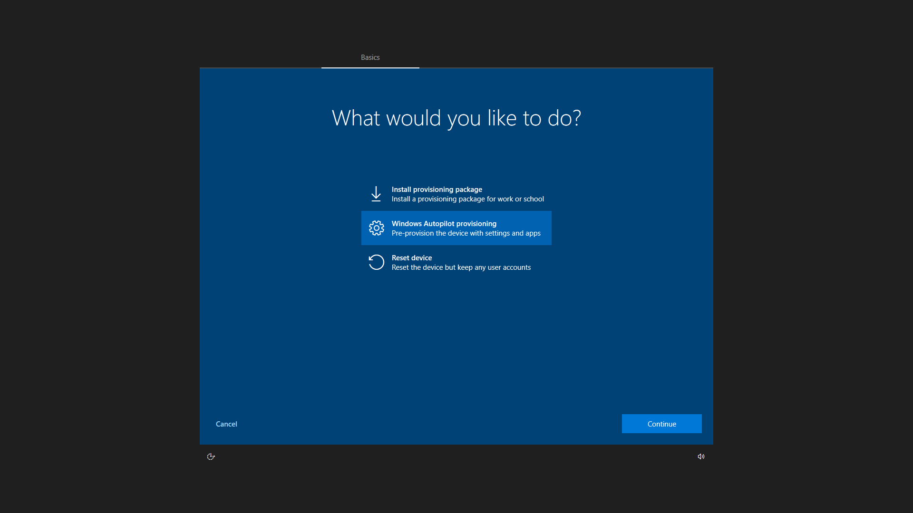
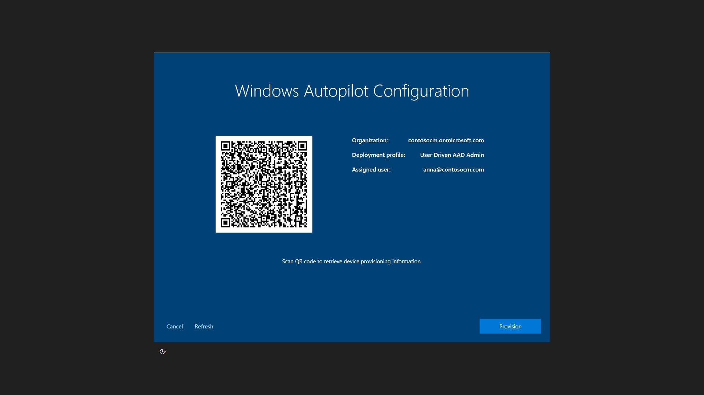

# Windows Autopilot for pre-provisioned deployment (Public preview)

**Applies to: Windows 10, version 1903** 

>[!IMPORTANT]
>The Windows Autopilot white glove feature has been renamed to **Windows Autopilot for pre-provisioned deployment**. All references in this documentation to **white glove** have been replaced with: **pre-provisioning**.  The term **white glove** might still appear in some blogs and other articles about Windows Autopilot. These references correspond to the pre-provisioning process described in this article.

Windows Autopilot helps organizations easily provision new devices by using the preinstalled OEM image and drivers. This lets end users get their devices business-ready by using a simple process.

 

Windows Autopilot can also provide a <I>pre-provisioning</I> service that helps partners or IT staff pre-provision a fully configured and business-ready Windows 10 PC. From the end user’s perspective, the Windows Autopilot user-driven experience is unchanged, but getting their device to a fully provisioned state is faster.

With **Windows Autopilot for pre-provisioned deployment**, the provisioning process is split. The time-consuming portions are done by IT, partners, or OEMs. The end user simply completes a few necessary settings and policies and then they can begin using their device.

 

Pre-provisioned deployments use Microsoft Intune in Windows 10, version 1903 and later. Such deployments build on existing Windows Autopilot [user-driven scenarios](user-driven.md) and support user-driven mode scenarios for both Azure Active Directory joined and Hybrid Azure Active Directory joined devices.

## Prerequisites

In addition to [Windows Autopilot requirements](software-requirements.md), Windows Autopilot for pre-provisioned deployment also requires:

- Windows 10, version 1903 or later.
- An Intune subscription.
- Physical devices that support TPM 2.0 and device attestation. Virtual machines aren't supported. The pre-provisioning process uses Windows Autopilot self-deploying capabilities, so TPM 2.0 is required. The TPM attestation process also requires access to a set of HTTPS URLs that are unique for each TPM provider. For more information, see the entry for Autopilot self-Deploying mode and Autopilot pre-provisioning in [Networking requirements](networking-requirements.md#tpm).
- Physical devices with Ethernet connectivity are required to perform pre-provisioning. Wi-fi connectivity isn't supported because of the requirement to choose a language, locale, and keyboard to make that Wi-fi connection. Enforcing this requirement in a pre-provisioning process could prevent the user from choosing their own language, locale, and keyboard when they receive the device. For more information, see [Using a wireless network connection with Windows Autopilot white glove](https://oofhours.com/2019/11/14/using-a-wireless-network-connection-with-windows-autopilot-white-glove/).

>[!IMPORTANT]
>Because the OEM or vendor performs the pre-provisioning process, this <u>doesn’t require access to an end-user's on-prem domain infrastructure</u>. This is unlike a typical hybrid Azure AD-joined scenario because rebooting the device is postponed. The device is resealed before the time when connectivity to a domain controller is expected, and the domain network is contacted when the device is unboxed on-prem by the end-user.

## Preparation

Devices slated for pre-provisioning are registered for Autopilot via the normal registration process. 

To be ready to try out Windows Autopilot for pre-provisioned deployment, make sure that you can first successfully use existing Windows Autopilot user-driven scenarios:

- User-driven Azure AD join. Make sure that you can deploy devices using Windows Autopilot and join them to an Azure Active Directory tenant.
- User-driven with Hybrid Azure AD join. Make sure that you can deploy devices using Windows Autopilot, join them to an on-premises Active Directory domain, and register them with Azure Active Directory to enable the Hybrid Azure AD join features.

If these scenarios can't be completed, Windows Autopilot for pre-provisioned deployment will also not succeed since it builds on top of these scenarios.

Before starting the pre-provisioning process in the provisioning service facility, you must configure an additional Autopilot profile setting by using your Intune account:

:::image type="content" source="images/allow-white-glove-oobe.png" alt-text="Screenshot of the Out-of-box experience (OOBE) portal and the highlighted setting to allow pre-provisioning":::

The Windows Autopilot for pre-provisioned deployment pre-provisioning process will apply all device-targeted policies from Intune. That includes certificates, security templates, settings, apps, and more – anything targeting the device. Additionally, any Win32 or LOB apps will be installed if they meet these two conditions:
- configured to install in the device context.
- targeted to the user pre-assigned to the Autopilot device.

Make sure not to target both win32 and LOB apps to the same device. 

> [!NOTE]
> Select the language mode as user specified in Autopilot profiles to ensure easy access into pre-provisioning mode. The pre-provisioning technician phase will install all device-targeted apps and any user-targeted, device-context apps that are targeted to the assigned user. If there is no assigned user, then it will only install the device-targeted apps. Other user-targeted policies will not apply until the user signs into the device. To verify these behaviors, be sure to create appropriate apps and policies targeted to devices and users.

## Scenarios

Windows Autopilot for pre-provisioned deployment supports two distinct scenarios:
- User-driven deployments with Azure AD Join. The device will be joined to an Azure AD tenant.
- User-driven deployments with Hybrid Azure AD Join. The device will be joined to an on-premises Active Directory domain, and separately registered with Azure AD.

Each of these scenarios consists of two parts, a technician flow and a user flow. At a high level, these parts are the same for Azure AD Join and Hybrid Azure AD join. The differences are primarily seen by the end user in the authentication steps.

### Technician flow

After the customer or IT Admin has targeted all the apps and settings they want for their devices through Intune, the pre-provisioning technician can begin the pre-provisioning process. The technician could be a member of the IT staff, a services partner, or an OEM – each organization can decide who should perform these activities. Regardless of the scenario, the process done by the technician is the same:
- Boot the device (running Windows 10 Pro, Enterprise, or Education SKUs, version 1903 or later).
- From the first OOBE screen (which could be a language selection or locale selection screen), don't click **Next**. Instead, press the Windows key five times to view an additional options dialog. From that screen, choose the **Windows Autopilot provisioning** option and then click **Continue**.

> [!NOTE]
> In Windows 10, versions 2004 and 20H2, if the Autopilot deployment profile Language/Region setting is not set to **User Select**, then OOBE will progress past the language/region/keyboard selection screens. This causes the pre-provisioning technician to arrive at the Azure AD login page, which is too late to enter pre-provisioning. This issue is fixed in Windows 11.

 

- On the **Windows Autopilot Configuration** screen, information will be displayed about the device:
 - The Autopilot profile assigned to the device.
 - The organization name for the device.
 - The user assigned to the device (if there is one).
 - A QR code containing a unique identifier for the device. You can use this code to look up the device in Intune. You might want to do this to make configuration changes, like assigning a user or adding the device to groups needed for app or policy targeting.
 - **Note**: The QR codes can be scanned using a companion app. The app also configures the device to specify who it belongs to. An [open-source sample of the companion app](https://github.com/Microsoft/WindowsAutopilotCompanion) that integrates with Intune by using the Graph API has been published to GitHub by the Autopilot team.
- Validate the information displayed. If any changes are needed, make the changes and then click **Refresh** to re-download the updated Autopilot profile details.

 

- Click **Provision** to begin the provisioning process.

If the pre-provisioning process completes successfully:
- A green status screen appears with information about the device, including the same details presented previously. For example, Autopilot profile, organization name, assigned user, and QR code. The elapsed time for the pre-provisioning steps is also provided.
 
- Click **Reseal** to shut down the device. At that point, the device can be shipped to the end user.

>[!NOTE]
>Technician flow inherits behavior from [self-deploying mode](self-deploying.md). Per the Self-Deploying Mode documentation, it uses the Enrollment Status Page to hold the device in a provisioning state and prevent the user from proceeding to the desktop after enrollment but before software and configuration is done applying. As such, if Enrollment Status Page is disabled, the reseal button may appear before software and configuration is done applying letting you proceed to the user flow before technician flow provisioning is complete. The green screen validates that enrollment was successful, not that the technician flow is necessarily complete.

If the pre-provisioning process fails:
- A red status screen appears with information about the device, including the same details presented previously. For example, Autopilot profile, organization name, assigned user, and QR code.The elapsed time for the pre-provisioning steps is also provided.
- Diagnostic logs can be gathered from the device, and then it can be reset to start the process over again.

### User flow

If the pre-provisioning process completed successfully and the device was resealed, you can deliver to the end user. The end user will complete the normal Windows Autopilot user-driven process following these steps:

- Power on the device.
- Select the appropriate language, locale, and keyboard layout.
- Connect to a network (if using Wi-Fi). Internet access is always required. If using Hybrid Azure AD Join, there must also be connectivity to a domain controller.
- On the branded sign-on screen, enter the user’s Azure Active Directory credentials.
- If using Hybrid Azure AD Join, the device will reboot; after the reboot, enter the user’s Active Directory credentials.
- Additional policies and apps will be delivered to the device, as tracked by the Enrollment Status Page (ESP). Once complete, the user will can access the desktop.

>[!NOTE]
>If the Microsoft Account Sign-In Assistant (wlidsvc) is disabled during the Technician Flow, the Azure AD sign in option may not show. Instead, users are asked to accept the EULA, and create a local account, which may not be what you want.

## Related topics

[Pre-provisioning video](https://youtu.be/nE5XSOBV0rI)
