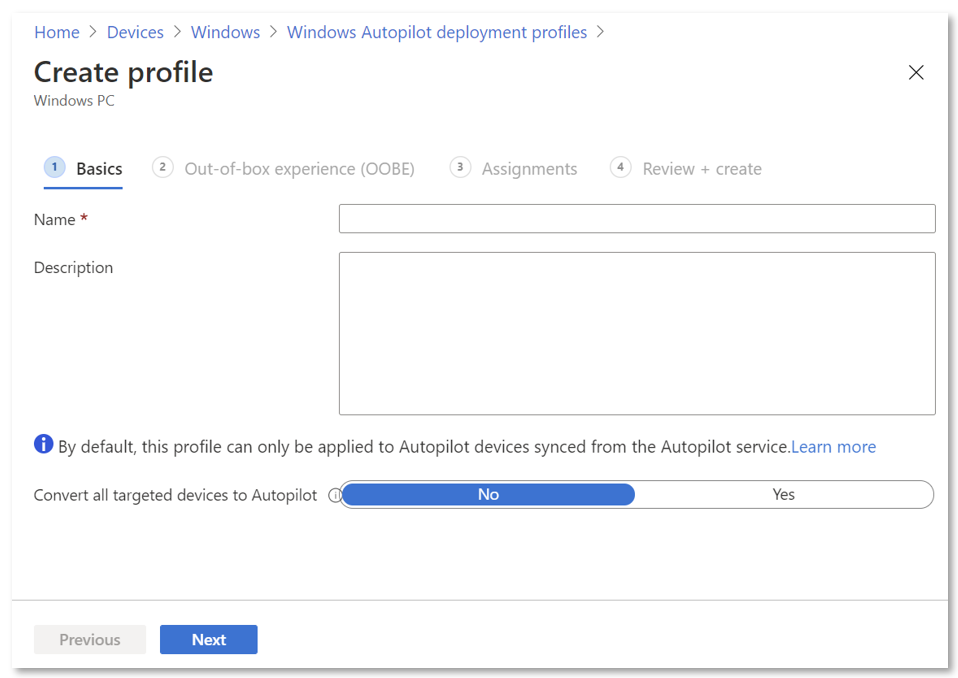
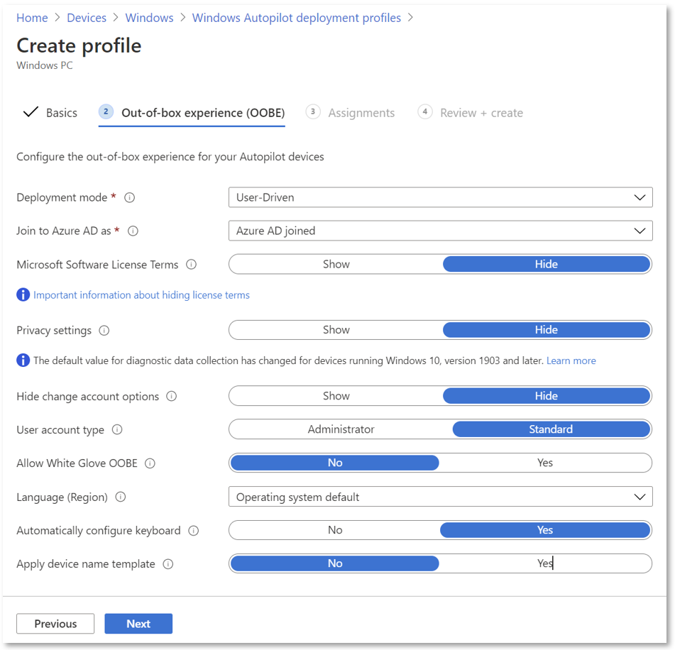
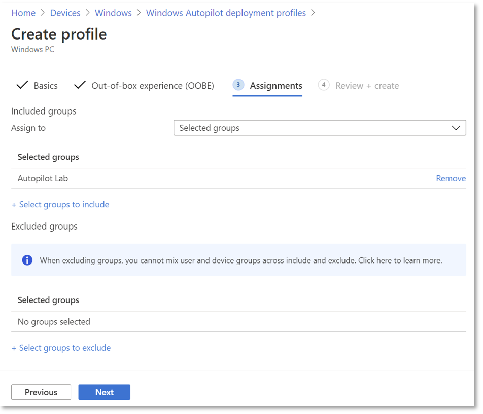
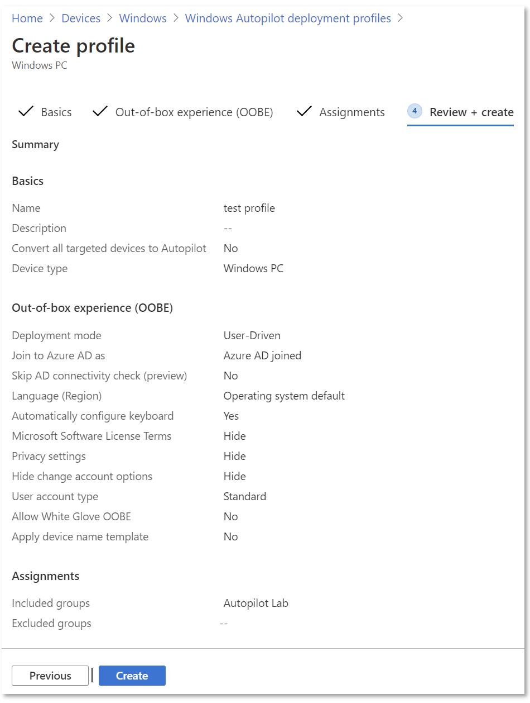

# Configure Autopilot profiles

**Applies to**

- Windows 10
- Windows Holographic, version 2004 or later

After you have [created a device group](enrollment-autopilot.md), you can apply a Windows Autopilot deployment profile to each device in the group.  Deployment profiles determine the deployment mode, and customize the OOBE for your end users.

## Create an Autopilot deployment profile

Autopilot deployment profiles are used to configure the Autopilot devices. You can create up to 350 profiles per tenant.
1. In the [Microsoft Endpoint Manager admin center](https://go.microsoft.com/fwlink/?linkid=2109431), choose **Devices** > **Windows** > **Windows enrollment** > **Deployment Profiles** > **Create Profile** > **Windows PC** or **HoloLens**. This article explains how to set up Autopilot for Windows PC. For more information about Autopilot and HoloLens, see [Windows Autopilot for HoloLens 2](/hololens/hololens2-autopilot).
2. On the **Basics** page, type a **Name** and optional **Description**.

    

3. If you want all devices in the assigned groups to automatically convert to Autopilot, set **Convert all targeted devices to Autopilot** to **Yes**. All corporate owned, non-Autopilot devices in assigned groups will register with the Autopilot deployment service. Personally owned devices won't be converted to Autopilot. Allow 48 hours for the registration to be processed. When the device is unenrolled and reset, Autopilot will enroll it. After a device is registered in this way, disabling this option or removing the profile assignment won't remove the device from the Autopilot deployment service. You must instead [remove the device directly](add-devices.md#delete-autopilot-devices).
4. Select **Next**.
5. On the **Out-of-box experience (OOBE)** page, for **Deployment mode**, choose one of these two options:
    - **User-driven**: Devices with this profile are associated with the user enrolling the device. User credentials are required to enroll the device.
    - **Self-deploying (preview)**: (requires Windows 10, version 1809 or later) Devices with this profile aren't associated with the user enrolling the device. User credentials aren't required to enroll the device. When a device has no user associated with it, user-based compliance policies don't apply to it. When using self-deploying mode, only compliance policies targeting the device will be applied.

    

    > [!NOTE]
    > Options that appear dimmed or shaded are currently not supported by the selected deployment mode.

6. In the **Join to Azure AD as** box, choose **Azure AD joined**.
7. Configure the following options:
    - **End-user license agreement (EULA)**: (Windows 10, version 1709 or later) Choose if you want to show the EULA to users.
    - **Privacy settings**: Choose if you want to show privacy settings to users.
      > [!IMPORTANT]
      > The default value for the Diagnostic Data setting varies between Windows versions. For devices running Windows 10, version 1903, the default value is set to Full during the out-of-box experience. For more information, see [Windows Diagnostics Data](/windows/privacy/windows-diagnostic-data)  
 
    - **Hide change account options (requires Windows 10, version 1809 or later)**: Choose **Hide** to prevent change account options from displaying on the company sign-in and domain error pages. This option requires [company branding to be configured in Azure Active Directory](/azure/active-directory/fundamentals/customize-branding).
    - **User account type**: Choose the user's account type (**Administrator** or **Standard** user). We allow the user joining the device to be a local Administrator by adding them to the local Admin group. We don't enable the user as the default administrator on the device.
    - **Allow White Glove OOBE** (requires Windows 10, version 1903 or later; [additional physical requirements](pre-provision.md#prerequisites)): Choose **Yes** to allow pre-provisioning support.
      > [!NOTE]
      > The **white glove** feature has been renamed to **pre-provision**. References to **White Glove OOBE** in Intune refer to the Autopilot [pre-provisioning](pre-provision.md) process.   When setting this to **No** (blocking pre-provisioning), be aware that it will still be possible to press the Windows key five times during OOBE to invoke pre-provisioning and progress down that path. However, Intune will subsequently enforce this setting and you will encounter a red screen indicating pre-provisioning failure with error code 0x80180005.
      > 
    - **Language (Region)**\*: Choose the language to use for the device. This option is available in all Deployment modes starting with Windows 10 2004.
    - **Automatically configure keyboard**\*: If a **Language (Region)** is selected, choose **Yes** to skip the keyboard selection page. This option is available in all Deployment modes starting with Windows 10 2004.

> [!NOTE]
> Lauguage and keyboard settings requieres Ethernet connectivity. Wi-fi connectivity isn't supported because of the requirement to choose a language, locale, and keyboard to make that Wi-fi connection
> 
    - **Apply device name template** (requires Windows 10, version 1809 or later, and Azure AD join type): Choose **Yes** to create a template to use when naming a device during enrollment. Names must be 15 characters or less, and can have letters, numbers, and hyphens. Names can't be all numbers. Use the [%SERIAL% macro](/windows/client-management/mdm/accounts-csp) to add a hardware-specific serial number. Or, use the [%RAND:x% macro](/windows/client-management/mdm/accounts-csp) to add a random string of numbers, where x equals the number of digits to add. You can only provide a pre-fix for hybrid devices in a [domain join profile](./windows-autopilot-hybrid.md#create-and-assign-a-domain-join-profile). 
  
8. Select **Next**.
9. On the **Assignments** page, choose **Selected groups** for **Assign to**.

    

10. Choose **Select groups to include**, and choose the groups you want to include in this profile.
11. If you want to exclude any groups, choose **Select groups to exclude**, and choose the groups you want to exclude.
12. Select **Next**.
13. On the **Review + Create** page, choose **Create** to create the profile.

    

> [!NOTE]
> Intune will periodically check for new devices in the assigned groups, and then begin the process of assigning profiles to those devices. This process can take several minutes to complete. Before deploying a device, ensure that this process has completed. You can check under **Devices** > **Windows** > **Windows enrollment** > **Devices** (under **Windows Autopilot Deployment Program** where you should see the profile status change from "Unassigned" to "Assigning" and finally to "Assigned."

## Edit an Autopilot deployment profile

After you've created an Autopilot deployment profile, you can edit certain parts of the deployment profile. 

1. In the [Microsoft Endpoint Manager admin center](https://go.microsoft.com/fwlink/?linkid=2109431), choose **Devices** > **Windows** > **Windows enrollment** > **Deployment profiles**.
2. Select the profile you would like to edit.
3. Select **Properties** on the left to change the name or description of the deployment profile. Click **Save** after you make changes.
5. Click **Settings** to make changes to the OOBE settings. Click **Save** after you make changes.

    > [!NOTE]
    > Changes to the profile are applied to devices assigned to that profile. However, the updated profile won't be applied to a device that has already enrolled in Intune until after the device is reset and reenrolled.

## Alerts for Windows Autopilot unassigned devices <!-- 163236 --> 

Alerts will show how many Autopilot program devices don't have Autopilot deployment profiles. Use the information in the alert to create profiles and assign them to the unassigned devices. When you click the alert, you see a full list of Windows Autopilot devices and detailed information about them.

To see alerts for unassigned devices, in the [Microsoft Endpoint Manager admin center](https://go.microsoft.com/fwlink/?linkid=2109431), choose **Devices** > **Overview** > **Enrollment alerts** > **Unassigned devices**. 

## Autopilot deployments report

You can see details on each device deployed through Windows Autopilot.
To see the report, go to the [Microsoft Endpoint Manager admin center](https://go.microsoft.com/fwlink/?linkid=2109431), choose **Devices** > **Monitor** > **Autopilot deployments**.
The data is available for 30 days after deployment.

This report is in preview. Device deployment records are currently triggered only by new Intune enrollment events. Deployments that don't trigger a new Intune enrollment won't appear this report. This case includes any kind of reset that maintains enrollment and the user portion of Autopilot pre-provisioning.

## Related topics

[Profile download](troubleshooting.md#profile-download) 
[Registering devices](add-devices.md)
