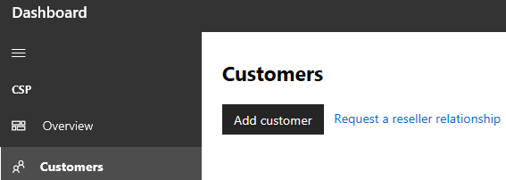
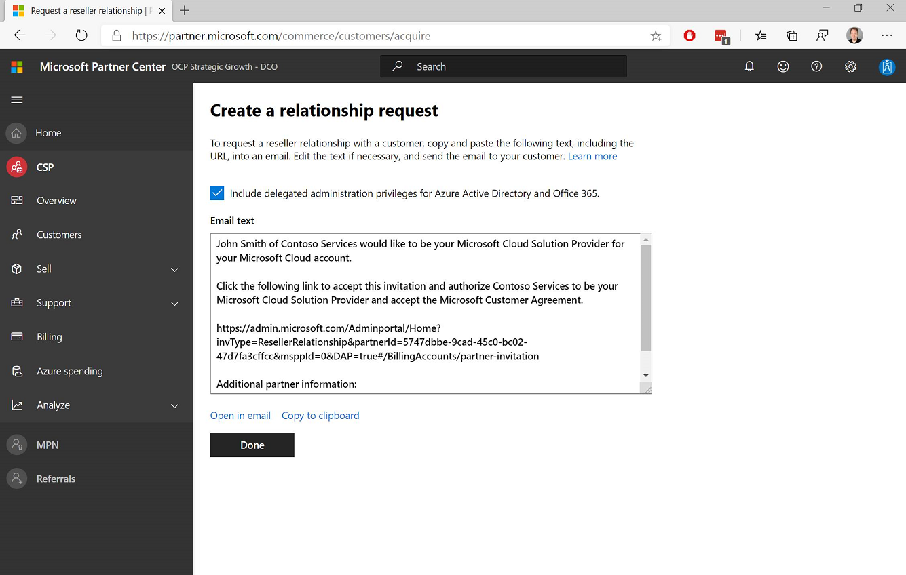
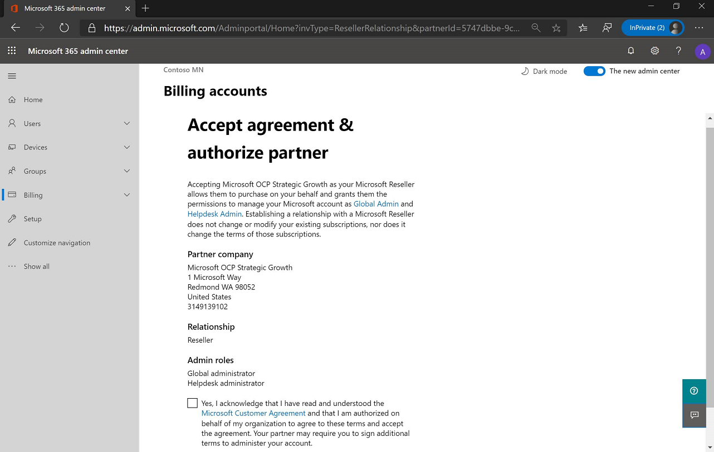
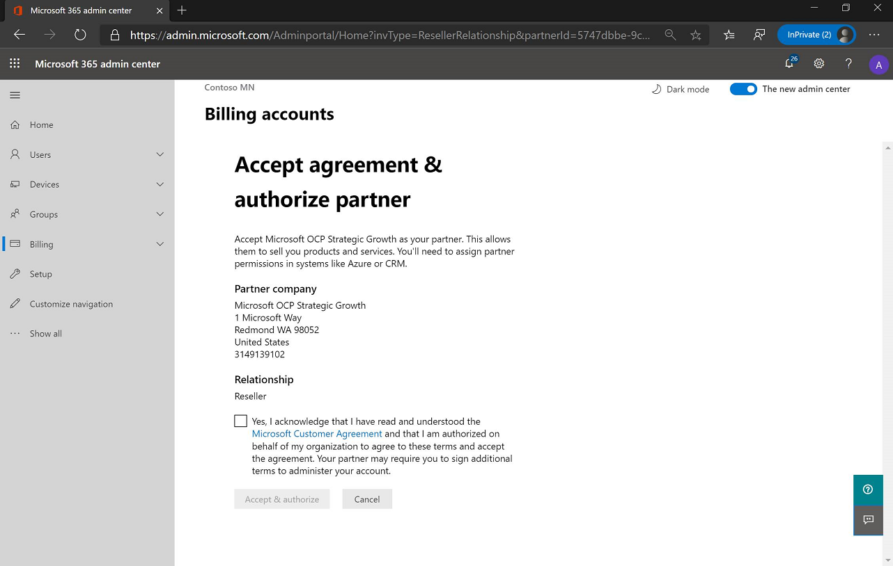
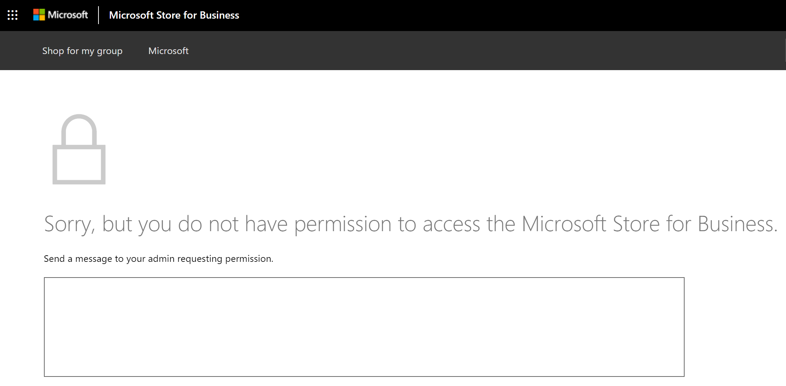

# Windows Autopilot customer consent

**Applies to: Windows 10**

This article describes how a cloud service provider (CSP) partner (direct bill, indirect provider, or indirect reseller) or an OEM can get customer authorization to register Windows Autopilot devices on the customer’s behalf.

## CSP authorization

CSP partners can get customer authorization to register Windows Autopilot devices on the customer’s behalf per the following restrictions:

<table>
<tr><td>Direct CSP<td>Gets direct authorization from the customer to register devices.
<tr><td>Indirect CSP Provider<td>Gets implicit permission to register devices through the relationship their CSP Reseller partner has with the customer. Indirect CSP Providers register devices through Microsoft Partner Center.
<tr><td>Indirect CSP Reseller<td>Gets direct authorization from the customer to register devices. At the same time, their indirect CSP Provider partner also gets authorization, which means that either the Indirect Provider or the Indirect Reseller can register devices for the customer. However, the Indirect CSP Reseller must register devices through the MPC UI (manually uploading CSV file). The Indirect CSP Provider can register devices using the MPC APIs.
</table>

### Steps

For a CSP to register Windows Autopilot devices for a customer, the customer must first grant that CSP partner permission using the following process:

1. CSP sends link to customer requesting authorization/consent to register/manage devices on their behalf. To do so:
    1. CSP logs into Microsoft Partner Center.
    2. Click **Dashboard** on the top menu.
    3. Click **Customer** on the side menu.
    4. Click the **Request a reseller relationship** link:

        
 
    5. Select the checkbox indicating if you want delegated admin rights:
 
        

        > [!NOTE]
        > Depending on your partner, they might request Delegated Admin Permissions (DAP) when requesting this consent. If possible, it's better to use the newer DAP-free process (shown in this document). If not, you can easily remove their DAP status either from Microsoft Admin Center or the Microsoft 365 admin portal: https://docs.microsoft.com/partner-center/customers_revoke_admin_privileges
    6. Send the template above to the customer via email.

2. Customer with Microsoft Admin Center global administrator privileges clicks the link in email. The link takes them to the following Microsoft 365 admin center page:

    

    The image above is what the customer will see if they requested delegated admin rights (DAP). The page says what Admin roles are being requested. If the customer didn't request delegated admin rights, they would see the following page:

     

    > [!NOTE]
    > A user without global admin privileges who clicks the link will see a message similar to the following:

    

3. Customer selects the **Yes** checkbox, followed by the **Accept** button. Authorization happens instantaneously.
4. To check that the authorization request is complete, the CSP can check the **Customers** list in their MPC account. If the customer is in the list, the request is complete. For example:

    

## OEM authorization

Each OEM has a unique link to provide to their respective customers, which the OEM can request from Microsoft via msoemops@microsoft.com.

1. OEM emails link to their customer.
2. Customer with Microsoft Store for Business (MSfB) global administrator privileges clicks the link in the email, which takes them directly to the following MSfB page:

    

    > [!NOTE]
    > A user without global admin privileges who clicks the link will see a message similar to the following:

    

3. Customer selects the **Yes** checkbox, followed by the **Accept** button, and they’re done. Authorization happens instantaneously.

    > [!NOTE]
    > Once this process has completed, it is not currently possible for an administrator to remove an OEM. To remove an OEM or revoke their permissions, send a request to msoemops@microsoft.com

4. The OEM can use the Validate Device Submission Data API to verify the consent has completed. This API is discussed in the latest version of the API Whitepaper, p. 14ff [https://devicepartner.microsoft.com/assets/detail/windows-autopilot-integration-with-oem-api-design-whitepaper-docx](https://devicepartner.microsoft.com/assets/detail/windows-autopilot-integration-with-oem-api-design-whitepaper-docx). **Note**: this link is only accessible by Microsoft Device Partners. As discussed in this article, it’s a best practice recommendation for OEM partners to run the API check to confirm they’ve received customer consent before attempting to register devices. This check can help avoid errors in the registration process.

    > [!NOTE]
    > During the OEM authorization registration process, no delegated admin permissions are granted to the OEM.

## Summary

At this stage of the process, Microsoft is no longer involved; the consent exchange happens directly between the OEM and the customer. And, it all happens instantaneously - as quickly as buttons are clicked.
