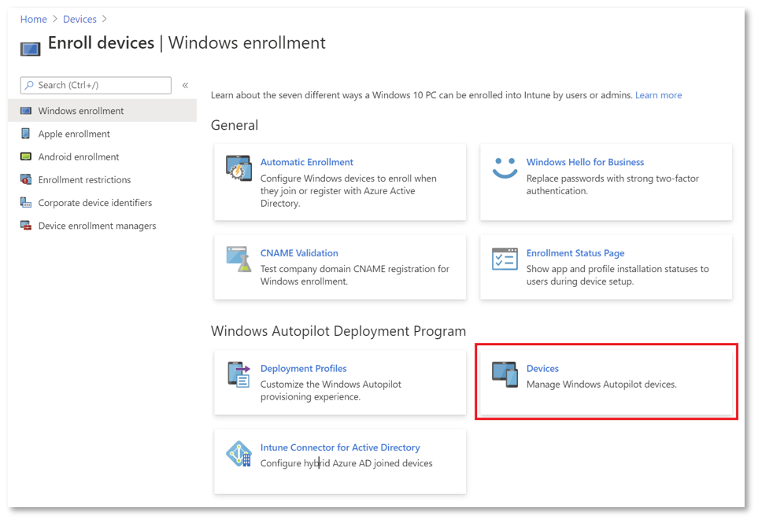

# Windows Autopilot registration overview

**Applies to**

- Windows 10
- Windows Holographic, version 2004

Before deploying a device using Windows Autopilot, the device must be registered with the Windows Autopilot deployment service. Successful registration requires that two processes are complete:

1. The device's unique hardware hash is captured and uploaded to the Autopilot service.
2. The device is associated to an Azure tenant ID.

Ideally, both of these processes are performed by the OEM, reseller, or distributor from which the devices were purchased. An OEM or other device provider uses the [registration authorization](registration-auth.md) process to perform device registration on your behalf. 

Registration can also be performed within your organization by collecting the hardware identity from new or existing devices and [uploading it manually](manual-registration). If devices meet certain requirements, they can also be configured for [automatic registration](automatic-registration) with Windows Autopilot.

Devices that have been registered with the Windows Autopilot service are displayed in the [admin center](https://go.microsoft.com/fwlink/?linkid=2109431) under **Devices | Windows enrollment** > **Windows Autopilot Deployment Program** > **Devices**:

> [!NOTE]
> Devices that are listed in Intune under **Devices** > **Windows | Windows devices** are not the same as Windows Autopilot devices (**Devices** > **Enroll devices** | **Windows enrollment** > **Windows Autopilot Deployment Program** | **Devices**). Windows Autopilot devices are added to the list of **Windows devices** when both of the following are complete:
> - The Autopilot registration process is successful.
> - A [licensed](licensing-requirements.md) user has signed in on the device.

For more information about registration, see the following topics:

- [OEM registration](oem-registration.md)
- [Reseller, distributor, or partner registration](partner-registration.md)
- [Automatic registration](automatic-registration.md)
- [Manual registration](manual-registration.md)

## Related topics

[Register devices manually](add-devices.md) 

