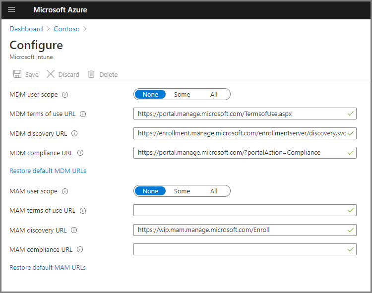
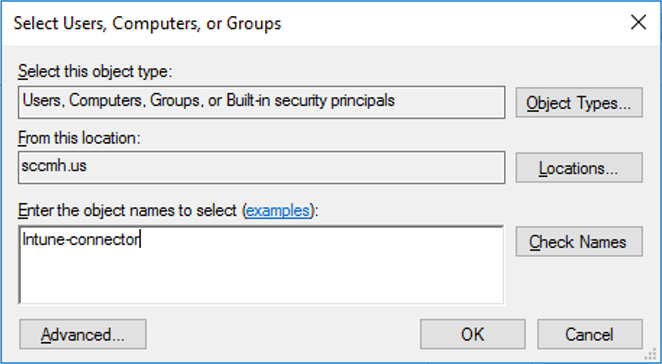
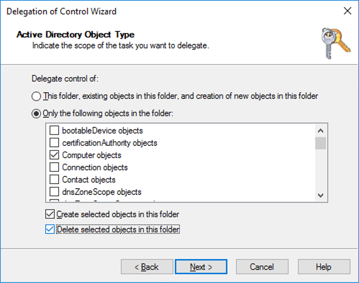

---
# required metadata

title: Enrollment for hybrid Azure AD-joined devices - Windows Autopilot
titleSuffix: 
description: Use Windows Autopilot to enroll hybrid Azure AD-joined devices in Microsoft Intune.
keywords:
author: ErikjeMS
ms.author: erikje
manager: dougeby
ms.date: 11/19/2020
ms.topic: how-to
ms.service: microsoft-intune
ms.subservice: enrollment
ms.localizationpriority: high
ms.technology:
ms.assetid: 8518d8fa-a0de-449d-89b6-8a33fad7b3eb
 
# optional metadata
 
#ROBOTS:
#audience:

ms.reviewer: priyar
ms.suite: ems
search.appverid: MET150
#ms.tgt_pltfrm:
ms.custom: seodec18
ms.collection: M365-identity-device-management
---
 

# Deploy hybrid Azure AD-joined devices by using Intune and Windows Autopilot
You can use Intune and Windows Autopilot to set up hybrid Azure Active Directory (Azure AD)-joined devices. To do so, follow the steps in this article.

## Prerequisites

Successfully configure your [hybrid Azure AD-joined devices](/azure/active-directory/devices/hybrid-azuread-join-plan). Be sure to [verify your device registration](/azure/active-directory/devices/hybrid-azuread-join-managed-domains#verify-the-registration) by using the Get-MsolDevice cmdlet.

The device to be enrolled must follow these requirements:
- Use Windows 10 v1809 or greater.
- Have access to the internet [following Windows Autopilot network requirements](/mem/autopilot/networking-requirements).
- Have access to an Active Directory domain controller. The device must be connected to the organization's network so that it can:
  - Resolve the DNS records for the AD domain and the AD domain controller.
  - Communicate with the domain controller to authenticate the user.
- Successfully ping the domain controller of the domain you're trying to join.
- If using Proxy, WPAD Proxy settings option must be enabled and configured.
- Undergo the out-of-box experience (OOBE).
- Use an authorization type that Azure Active Directory supports in OOBE.

## Set up Windows 10 automatic enrollment

1. Sign in to Azure, in the left pane, select **Azure Active Directory** > **Mobility (MDM and MAM)** > **Microsoft Intune**.

2. Make sure users who deploy Azure AD-joined devices by using Intune and Windows are members of a group included in **MDM User scope**.

    

3. Use the default values in the **MDM Terms of use URL**, **MDM Discovery URL**, and **MDM Compliance URL** boxes, and then select **Save**.

## Increase the computer account limit in the Organizational Unit

The Intune Connector for your Active Directory creates autopilot-enrolled computers in the on-premises Active Directory domain. The computer that hosts the Intune Connector must have the rights to create the computer objects within the domain. 

In some domains, computers aren't granted the rights to create computers. Additionally, domains have a built-in limit (default of 10) that applies to all users and computers that aren't delegated rights to create computer objects. The rights must be delegated to computers that host the Intune Connector on the organizational unit where hybrid Azure AD-joined devices are created.

The organizational unit that's granted the rights to create computers must match:
- The organizational unit that's entered in the Domain Join profile.
- If no profile is selected, the computer's domain name for your domain.

1. Open **Active Directory Users and Computers (DSA.msc)**.

2. Right-click the organizational unit to use to create hybrid Azure AD-joined computers > **Delegate Control**.

    

3. In the **Delegation of Control** wizard, select **Next** > **Add** > **Object Types**.

4. In the **Object Types** pane, select the **Computers** > **OK**.

    

5. In the **Select Users, Computers, or Groups** pane, in the **Enter the object names to select** box, enter the name of the computer where the Connector is installed.

    

6. Select **Check Names** to validate your entry > **OK** > **Next**.

7. Select **Create a custom task to delegate** > **Next**.

8. Select **Only the following objects in the folder** > **Computer objects**.

9. Select **Create selected objects in this folder** and **Delete selected objects in this folder**.

    
 
10. Select **Next**.

11. Under **Permissions**, select the **Full Control** check box. This action selects all the other options.

    

12. Select **Next** > **Finish**.

## Install the Intune Connector

The Intune Connector for Active Directory must be installed on a computer that's running Windows Server 2016 or later. The computer must also have access to the internet and your Active Directory. To increase scale and availability, you can install multiple connectors in your environment. We recommend installing the Connector on a server that's not running any other Intune connectors. Each connector must be able to create computer objects in any domain that you want to support.

> [!NOTE]
> If your organization has multiple domains and you install multiple Intune Connectors, you must use a service account that's able to create computer objects in all domains, even if you plan to implement hybrid Azure AD join only for a specific domain. If these are untrusted domains, you must uninstall the connectors from domains in which you don't want to use Windows Autopilot. Otherwise, with multiple connectors across multiple domains, all connectors must be able to create computer objects in all domains.

The Intune Connector requires the [same endpoints as Intune](../intune/fundamentals/intune-endpoints.md).

1. Turn off IE Enhanced Security Configuration. By default Windows Server has Internet Explorer Enhanced Security Configuration turned on. If you're unable to sign in to the Intune Connector for Active Directory, then turn off IE Enhanced Security Configuration for the Administrator. [How To Turn Off Internet Explorer Enhanced Security Configuration](/archive/blogs/chenley/how-to-turn-off-internet-explorer-enhanced-security-configuration). 
2. In the [Microsoft Endpoint Manager admin center](https://go.microsoft.com/fwlink/?linkid=2109431), select **Devices** > **Windows** > **Windows enrollment** > **Intune Connector for Active Directory** > **Add**. 
3. Follow the instructions to download the Connector.
4. Open the downloaded Connector setup file, *ODJConnectorBootstrapper.exe*, to install the Connector.
5. At the end of the setup, select **Configure**.
6. Select **Sign In**.
7. Enter the user Global Administrator or Intune Administrator role credentials. 
 The user account must have an assigned Intune license.
8. Go to **Devices** > **Windows** > **Windows enrollment** > **Intune Connector for Active Directory**, and then confirm that the connection status is **Active**.

> [!NOTE]
> After you sign in to the Connector, it might take a couple of minutes to appear in the [Microsoft Endpoint Manager admin center](https://go.microsoft.com/fwlink/?linkid=2109431). It appears only if it can successfully communicate with the Intune service.

### Configure web proxy settings

If you have a web proxy in your networking environment, ensure that the Intune Connector for Active Directory works properly by referring to [Work with existing on-premises proxy servers](../intune/enrollment/autopilot-hybrid-connector-proxy.md).

## Create a device group
1. In the [Microsoft Endpoint Manager admin center](https://go.microsoft.com/fwlink/?linkid=2109431), select **Groups** > **New group**.

1. In the **Group** pane, choose the following options:

    1. For **Group type**, select **Security**.
    2. Enter a **Group name** and **Group description**.
    3. Select a **Membership type**.

4. If you selected **Dynamic Devices** for the membership type, in the **Group** pane, select **Dynamic device members**.

5. In the **Advanced rule** box, enter one of the following code lines:
    - To create a group that includes all your Autopilot devices, enter `(device.devicePhysicalIDs -any _ -contains "[ZTDId]")`.
    - Intune's Group Tag field maps to the OrderID attribute on Azure AD devices. If you want to create a group that includes all of your Autopilot devices with a specific Group Tag(OrderID), type: `(device.devicePhysicalIds -any _ -eq "[OrderID]:179887111881")`
    - To create a group that includes all your Autopilot devices with a specific Purchase Order ID, enter `(device.devicePhysicalIds -any _ -eq "[PurchaseOrderId]:76222342342")`.
 
6. Select **Save** > **Create**. 

## Register your Autopilot devices

Select one of the following ways to enroll your Autopilot devices.

### Register Autopilot devices that are already enrolled

1. Create an Autopilot deployment profile with **Convert all targeted devices to Autopilot** set to **Yes**. 
2. Assign the profile to a group that contains the members that you want to automatically register with Autopilot.

For more information, see [Create an Autopilot deployment profile](enrollment-autopilot.md#create-an-autopilot-deployment-profile).

### Register Autopilot devices that aren't enrolled

If your devices aren't yet enrolled, you can register them yourself. For more information, see [Add devices](enrollment-autopilot.md#add-devices).

### Register devices from an OEM

If you're buying new devices, some OEMs can register the devices for you. For more information, see [OEM registration](add-devices.md#oem-registration).

Before they're enrolled in Intune, *registered* Autopilot devices are displayed in three places (with names set to their serial numbers):
- The **Autopilot Devices** pane in the Intune in the Azure portal. Select **Device enrollment** > **Windows enrollment** > **Devices**.
- The **Azure AD devices** pane in the Intune in the Azure portal. Select **Devices** > **Azure AD Devices**.
- The **Azure AD All Devices** pane in Azure Active Directory in the Azure portal by selecting **Devices** > **All Devices**.

After your Autopilot devices are *enrolled*, they're displayed in four places:
- The **Autopilot Devices** pane in the Intune in the Azure portal. Select **Device enrollment** > **Windows enrollment** > **Devices**.
- The **Azure AD devices** pane in the Intune in the Azure portal. Select **Devices** > **Azure AD Devices**.
- The **Azure AD All Devices** pane in Azure Active Directory in the Azure portal. Select **Devices** > **All Devices**.
- The **All Devices** pane in the Intune in the Azure portal. Select **Devices** > **All Devices**.

After your Autopilot devices are enrolled, their names become the hostname of the device. By default, the hostname begins with *DESKTOP-*.

## Create and assign an Autopilot deployment profile
Autopilot deployment profiles are used to configure the Autopilot devices.

1. In the [Microsoft Endpoint Manager admin center](https://go.microsoft.com/fwlink/?linkid=2109431), select **Devices** > **Windows** > **Windows enrollment** > **Deployment Profiles** > **Create Profile**.
2. On the **Basics** page, type a **Name** and optional **Description**.
3. If you want all devices in the assigned groups to automatically convert to Autopilot, set **Convert all targeted devices to Autopilot** to **Yes**. All corporate owned, non-Autopilot devices in assigned groups will register with the Autopilot deployment service. Personally owned devices won't be converted to Autopilot. Allow 48 hours for the registration to be processed. When the device is unenrolled and reset, Autopilot will enroll it. After a device is registered in this way, disabling this option or removing the profile assignment won't remove the device from the Autopilot deployment service. You must instead [remove the device directly](enrollment-autopilot.md#delete-autopilot-devices).
4. Select **Next**.
5. On the **Out-of-box experience (OOBE)** page, for **Deployment mode**, select **User-driven**.
6. In the **Join to Azure AD as** box, select **Hybrid Azure AD joined**.
7. If you're deploying devices off of the organization's network using VPN support, set the **Skip Domain Connectivity Check** option to **Yes**. For more information, see [User-driven mode for hybrid Azure Active Directory join with VPN support](user-driven.md#user-driven-mode-for-hybrid-azure-active-directory-join-with-vpn-support).
8. Configure the remaining options on the **Out-of-box experience (OOBE)** page as needed.
9. Select **Next**.
10. On the **Scope tags** page, select [scope tags](../intune/fundamentals/scope-tags.md) for this profile.
11. Select **Next**.
12. On the **Assignments** page, select **Select groups to include** > search for and select the device group > **Select**.
13. Select **Next** > **Create**.

It takes about 15 minutes for the device profile status to change from *Not assigned* to *Assigning* and, finally, to *Assigned*.

## (Optional) Turn on the enrollment status page

1. In the [Microsoft Endpoint Manager admin center](https://go.microsoft.com/fwlink/?linkid=2109431), select **Devices** > **Windows** > **Windows enrollment** > **Enrollment Status Page**.
2. In the **Enrollment Status Page** pane, select **Default** > **Settings**.
3. In the **Show app and profile installation progress** box, select **Yes**.
4. Configure the other options as needed.
5. Select **Save**.

## Create and assign a Domain Join profile

1. In the [Microsoft Endpoint Manager admin center](https://go.microsoft.com/fwlink/?linkid=2109431), select **Devices** > **Configuration profiles** > **Create Profile**.
2. Enter the following properties:
    - **Name**: Enter a descriptive name for the new profile.
    - **Description**: Enter a description for the profile.
    - **Platform**: Select **Windows 10 and later**.
    - **Profile type**: Select **Domain Join (Preview)**.
3. Select **Settings**, and then provide a **Computer name prefix**, **Domain name**.
4. (Optional) Provide an **Organizational unit** (OU) in [DN format](/windows/desktop/ad/object-names-and-identities#distinguished-name). Your options include:
    - Provide an OU in which you've delegated control to your Windows 2016 device that is running the Intune Connector.
    - Provide an OU in which you've delegated control to the root computers in your on-prem Active Directory.
    - If you leave this blank, the computer object will be created in the Active Directory default container (CN=Computers if you never [changed it](https://support.microsoft.com/help/324949/redirecting-the-users-and-computers-containers-in-active-directory-dom)).
 
    Here are some valid examples:
      - OU=Level 1,OU=Level2,DC=contoso,DC=com
      - OU=Mine,DC=contoso,DC=com
 
    Here are some examples that aren't valid:
      - CN=Computers,DC=contoso,DC=com (you can't specify a container, instead leave the value blank to use the default for the domain)
      - OU=Mine (you must specify the domain via the DC= attributes)
 
    > [!NOTE]
    > Don't use quotation marks around the value in **Organizational unit**.

5. Select **OK** > **Create**. The profile is created and displayed in the list.
6. [Assign a device profile](../intune/configuration/device-profile-assign.md#assign-a-device-profile) to the same group used at the step [Create a device group](windows-autopilot-hybrid.md#create-a-device-group). Different groups can be used if there's a need to join devices to different domains or OUs.

> [!NOTE]
> The naming capabilities for Windows Autopilot for Hybrid Azure AD Join do not support variables such as %SERIAL% and only support prefixes for the computer name.

## Next steps

After you configure Windows Autopilot, learn how to manage those devices. For more information, see [What is Microsoft Intune device management?](../intune/remote-actions/device-management.md).
