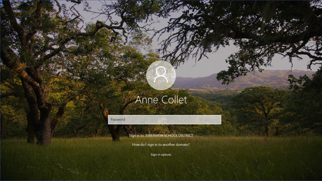
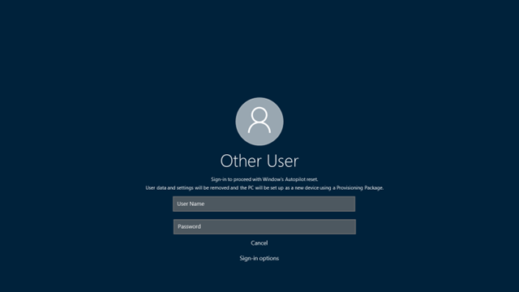

# Windows Autopilot Reset

- Applies to: Windows 10, version 1709 and later (local reset)
- Applies to: Windows 10, version 1809 and later (remote reset)

Windows Autopilot Reset takes the device back to a business-ready state, allowing the next user to sign in and get productive quickly and simply. Specifically, Windows Autopilot Reset:
- Removes personal files, apps, and settings.
- Reapplies a device’s original settings.
- Maintains the device's identity connection to Azure AD.
- Maintains the device's management connection to Intune.

The Windows Autopilot Reset process automatically keeps information from the existing device:
 
- Set the region, language, and keyboard to the original values.
- Wi-Fi connection details.
- Provisioning packages previously applied to the device
- A provisioning package present on a USB drive when the reset process is started 
- Azure Active Directory device membership and MDM enrollment information.

Windows Autopilot Reset will block the user from accessing the desktop until this information is restored, including reapplying any provisioning packages. For devices enrolled in an MDM service, Windows Autopilot Reset will also block until an MDM sync is completed. 
When Autopilot reset is used on a device, the device's primary user will be removed. The next user who signs in after the reset will be set as the primary user.
 
 
>[!NOTE]
>The Autopilot Reset does not support Hybrid Azure AD joined devices.

## Scenarios

Windows Autopilot Reset supports two scenarios:

- [Local reset](#reset-devices-with-local-windows-autopilot-reset) started by IT personnel or other administrators from the organization.
- [Remote reset](#reset-devices-with-remote-windows-autopilot-reset) started remotely by IT personnel via an MDM service such as Microsoft Intune.

Additional requirements and configuration details apply with each scenario.

## Reset devices with local Windows Autopilot Reset 

**Applies to: Windows 10, version 1709 and above**

The Intune Service Administrator role is required for this task. For more information, see [Add users and grant administrative permission to Intune](/intune/users-add).

IT admins can use a local Windows Autopilot Reset to:
- Quickly remove personal files, apps, and settings.
- Reset Windows 10 devices from the lock screen.
- Apply original settings and management enrollment (Azure Active Directory and device management)
The device is then ready to use. With a local Autopilot Reset, devices are returned to a fully configured or known IT-approved state.

To enable local Autopilot Reset in Windows 10:

1. [Enable the policy for the feature](#enable-local-windows-autopilot-reset)
2. [Trigger a reset for each device](#trigger-local-windows-autopilot-reset)

### Enable local Windows Autopilot Reset

To enable a local Windows Autopilot Reset, the **DisableAutomaticReDeploymentCredentials** policy must be configured. This policy is documented in the [Policy CSP](/windows/client-management/mdm/policy-csp-credentialproviders), **CredentialProviders/DisableAutomaticReDeploymentCredentials**. By default, local Windows Autopilot is disabled. This default ensures that a local Autopilot Reset isn't triggered by accident.

You can set the policy using one of these methods:

- MDM provider

 - When using Intune, you can create a new device configuration profile with the following settings:
   - **Platform** = **Windows 10 or later**
   - **Profile type** = **Device restrictions**
   - **Category** = **General**
   - **Automatic Redeployment** = **Allow**. Deploy this setting to all devices where a local reset should be permitted.
 - If you're using an MDM provider other than Intune, check your MDM provider documentation on how to set this policy. 

- Windows Configuration Designer

 You can [use Windows Configuration Designer](/windows/configuration/provisioning-packages/provisioning-create-package) to set the **Runtime settings > Policies > CredentialProviders > DisableAutomaticReDeploymentCredentials** setting to 0 and then create a provisioning package.

- Set up School PCs app

 The latest release of the Set up School PCs app supports enabling local Windows Autopilot Reset.

### Trigger local Windows Autopilot Reset

A local Windows Autopilot Reset is a two-step process: trigger it and then authenticate. Once you've done these two steps, you can let the process execute and once it is done, the device is again ready for use. 

**To trigger a local Autopilot Reset**

1. From the Windows device lock screen, enter the keystroke: **CTRL +  + R**. 

    

    These keystrokes will open up a custom login screen for the local Autopilot Reset. The screen serves two purposes:
    1. Confirm/verify that the end user has the right to trigger Local Autopilot Reset
    2. Notify the user in case a provisioning package, created using Windows Configuration Designer, will be used as part of the process.

        

2. Sign in with the admin account credentials. If you created a provisioning package, plug in the USB drive and trigger the local Autopilot Reset.

 Once the local Autopilot Reset is triggered, the reset process starts. Once provisioning is complete, the device is again ready for use.

## Reset devices with remote Windows Autopilot Reset

**Applies to: Windows 10, version 1809 or later**

You can use an MDM service such a Microsoft Intune to start the remote Windows Autopilot reset process. Resetting in this way avoids the need for IT staff to visit each machine to start the process.

To enable a device for a remote Windows Autopilot Reset, the device must be MDM managed and joined to Azure AD.

### Triggering a remote Windows Autopilot Reset

To trigger a remote Windows Autopilot Reset via Intune, follow these steps:
 
1. Navigate to **Devices** tab in the Intune console. 
2. In the **All devices** view, select the targeted reset devices and then click **More** to view device actions. 
3. Select **Autopilot Reset** to start the reset task. 

>[!NOTE]
>The Autopilot Reset option will not be enabled in Microsoft Intune for devices not running Windows 10 build 17672 or higher.

Once the reset is complete, the device is again ready for use.

## Troubleshooting

Windows Autopilot Reset requires that the [Windows Recovery Environment (WinRE)](/windows-hardware/manufacture/desktop/windows-recovery-environment--windows-re--technical-reference) is correctly configured and enabled on the device. If it isn't configured and enabled, an error such as `Error code: ERROR_NOT_SUPPORTED (0x80070032)` will be reported.

To make sure WinRE is enabled, use the [REAgentC.exe tool](/windows-hardware/manufacture/desktop/reagentc-command-line-options) to run the following command:

```cmd
reagentc /enable
```

If Windows Autopilot Reset fails after enabling WinRE, or if you're unable to enable WinRE, contact [Microsoft Support](https://support.microsoft.com) for assistance.
