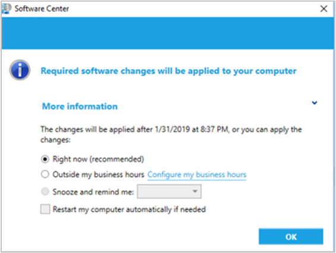
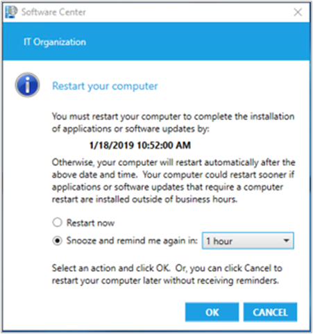

# Plan for Software Center

*Applies to: Configuration Manager (current branch)*

Users change settings, browse for applications, and install applications from Software Center. When you install the Configuration Manager client on a Windows device, it automatically installs Software Center as well.

For more information on the other features of Software Center, see the [Software Center user guide](../../core/understand/software-center.md).  

##  Configure Software Center  

Update your Configuration Manager sites and clients to version 1906 or later to benefit from the latest features of Software Center.

> [!IMPORTANT]
> These iterative improvements to Software Center and the management point are to retire the application catalog roles.
>
> - The Silverlight user experience isn't supported as of current branch version 1806.
> - Starting in version 1906, updated clients automatically use the management point for user-available application deployments. You also can't install new application catalog roles.
> - Support ends for the application catalog roles with version 1910.

- The client setting **Use new Software Center** in the **Computer Agent** group is enabled by default. The previous version of Software Center is no longer supported. For more information, see [Removed and deprecated features](../../core/plan-design/changes/deprecated/removed-and-deprecated-cmfeatures.md).

- Specify the visibility of the application catalog website link on the **Installation Status** tab of Software Center. For more information, see [Software Center](../../core/clients/deploy/about-client-settings.md#software-center) client settings.

- Starting in version 1906, you can add up to five custom tabs to Software Center. For more information, see [Software Center client settings](../../core/clients/deploy/about-client-settings.md#software-center). <!--4063773-->

- Users can configure user device affinity in Software Center. For more information, see [Link users and devices with user device affinity](../deploy-use/link-users-and-devices-with-user-device-affinity.md).

> [!IMPORTANT]
> To take advantage of new Configuration Manager features, first update clients to the latest version. While new functionality appears in the Configuration Manager console when you update the site and console, the complete scenario isn't functional until the client version is also the latest.

### Software Center and user-available applications

- Application catalog roles aren't required to display user-available applications in Software Center. This behavior helps you reduce the server infrastructure required to deliver applications to users. Software Center relies upon the management point to obtain this information, which helps larger environments scale better by assigning them to [boundary groups](../../core/servers/deploy/configure/boundary-groups.md#management-points).<!--1358309-->

- Users can browse and install user-available applications on Azure Active Directory (Azure AD)-joined devices. Starting in version 2006, they can get user-available apps on internet-based, domain-joined devices. For more information, see [Deploy user-available applications](../deploy-use/deploy-applications.md#deploy-user-available-applications).

- Starting in version 1906, Software Center communicates with a management point for apps targeted to users as available. It doesn't use the application catalog anymore. This change makes it easier for you to remove the application catalog from the site.

- Previously, Software Center picked the first management point from the list of available servers. Starting in version 1906, it uses the same management point that the client uses. This change allows Software Center to use the same management point from the assigned primary site as the client.

##  Replace toast notifications with dialog window

<!--3555947-->
Sometimes users don't see the Windows toast notification about a restart or required deployment. Then they don't see the experience to snooze the reminder. This behavior can lead to a poor user experience when the client reaches a deadline.

Starting in version 1902, when [software changes are required](#software-changes-are-required) or deployments [need a restart](#restart-required), you have the option of using a more intrusive dialog window.

### Software changes are required

When you [deploy an application](../deploy-use/deploy-applications.md) as required with a deadline in the future, on the **User Experience** page of the Deploy Software Wizard, select the following user notification options:

- **Display in Software Center and show all notifications**
- **When software changes are required, show a dialog window to the user instead of a toast notification**

Configuring this deployment setting changes the user experience for this scenario.

From the following toast notification:

  

To the following dialog window:

### Restart required

In the [Computer Restart](../../core/clients/deploy/about-client-settings.md#computer-restart) group of client settings, enable the following option: **When a deployment requires a restart, show a dialog window to the user instead of a toast notification**.  

Configuring this client setting changes the user experience for all required deployments that require a restart of the following types:

- [Application](../deploy-use/deploy-applications.md)
- [Task sequence](../../osd/deploy-use/manage-task-sequences-to-automate-tasks.md#BKMK_DeployTS)
- [Software update](../../sum/deploy-use/deploy-software-updates.md)

From the following toast notification:

  

To the following dialog window:

> [!IMPORTANT]
> In Configuration Manager 1902, under certain circumstances, the dialog box won't replace toast notifications. To resolve this issue, install the [update rollup for Configuration Manager version 1902](https://support.microsoft.com/help/4500571/update-rollup-for-configuration-manager-current-branch-1902). <!--4404715-->

## Brand Software Center

Change the appearance of Software Center to meet your organization's branding requirements. This configuration helps users trust Software Center.

### Configure Software Center branding

<!-- 1351224 -->
Customize the appearance of Software Center by adding your organization's branding elements and specifying the visibility of tabs.

For more information, see the following articles:

- [Software Center](../../core/clients/deploy/about-client-settings.md#software-center) group of client settings  
- [How to configure client settings](../../core/clients/deploy/configure-client-settings.md)  

### Branding priorities

Configuration Manager applies custom branding for Software Center according to the following priorities:  

1. **Software Center** client settings. For more information, see [About client settings](../../core/clients/deploy/about-client-settings.md#software-center).  

2. **Organization name** client setting in **Computer Agent** group. For more information, see [About client settings](../../core/clients/deploy/about-client-settings.md#computer-agent).  

#### Application catalog branding priorities

> [!IMPORTANT]
> The application catalog's Silverlight user experience isn't supported as of current branch version 1806. Starting in version 1906, updated clients automatically use the management point for user-available application deployments. You also can't install new application catalog roles. Support ends for the application catalog roles with version 1910.  

If you're using the application catalog, branding follows these priorities:  

1. **Software Center** client settings. For more information, see [About client settings](../../core/clients/deploy/about-client-settings.md#software-center).  

2. The *organization name* and *color* that you specify in the application catalog website point properties. For more information, see [Configuration options for application catalog website point](../../core/servers/deploy/configure/configuration-options-for-site-system-roles.md#BKMK_ApplicationCatalog_Website).  

3. **Organization name** client setting in **Computer Agent** group. For more information, see [About client settings](../../core/clients/deploy/about-client-settings.md#computer-agent).  

## See also

- [Software Center user guide](../../core/understand/software-center.md)
- [Plan for and configure application management](plan-for-and-configure-application-management.md)
