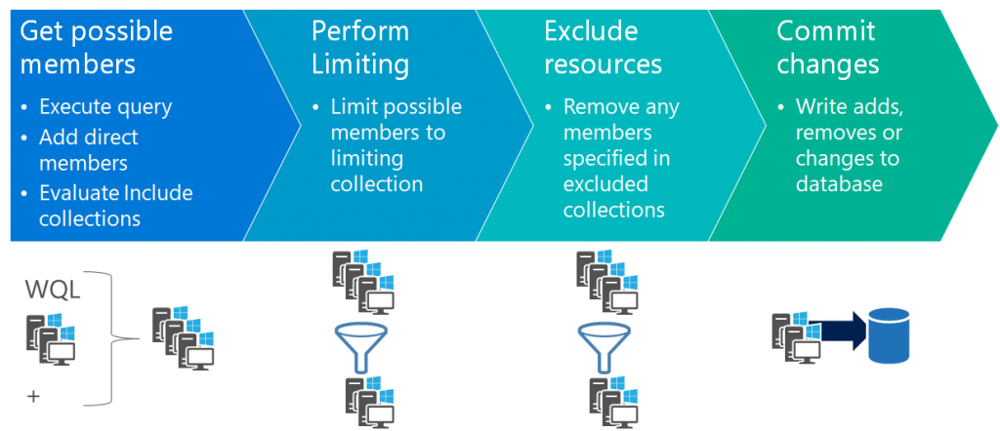
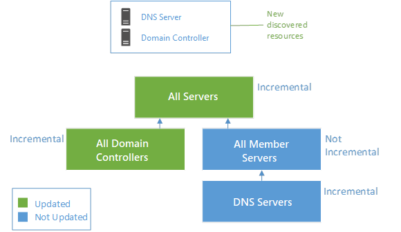
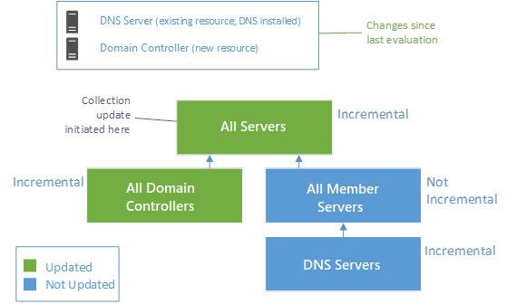

# Collection evaluation in Configuration Manager

*Applies to: Configuration Manager (current branch)*

Configuration Manager uses *collection evaluation* to update collection membership, based on the collection rules you define. Collection evaluation scope and timing differ depending on site and collection configuration and evaluation type. It's important to understand collection evaluation behavior so you can make appropriate collection design decisions.

Some collection management guidance can be contradictory. For example, for performance reasons, you should limit the number of collections that update frequently. However, updating collections frequently can be very convenient, since most Configuration Manager functionality is dependent on collections. To formulate an appropriate collection evaluation plan, carefully consider both performance impacts and business requirements.

## Evaluation process

The [colleval.log](https://docs.microsoft.com/mem/configmgr/core/plan-design/hierarchy/log-files#BKMK_ServerLogs) records when the collection evaluator creates, changes, and deletes collections.

At a high level, each individual collection evaluation and update follows these steps:



1. Execute the collection query.
1. Add any systems that are direct members.
1. Evaluate all *include* collections.
   
   If the include collections also have query rules, or have include or exclude collections, evaluate them also. If the include collections themselves are limiting collections, evaluate any collections below them. After fully evaluating the tree, return the results to the calling collection.
   
1. Perform a logical `AND` between the returned results and the limiting collection.
1. Evaluate the *exclude* collections.
   
   If the exclude collections also have query rules, or have include or exclude collections, evaluate them also. If these collections themselves are limiting collections, evaluate any collections below them. After fully evaluating the tree, return the results to the calling collection.
   
1. Perform a logical `OR` between the result set from evaluating the direct members and include collections, and the results of evaluating the exclude collections.
1. Write the changes to the database and perform updates.
1. Trigger any dependent collections to update as well. Dependent collections are collections that refer to the current collection using include or exclude rules, or are limited to the current collection.

## Collection evaluation types and triggers

These types of threads handle collection evaluation, depending on evaluation type:

- **Primary** for scheduled collection updates
- **Auxiliary** to manually update collections with dependent collections
- **Single** to manually update collections with no dependent collections
- **Express** for incremental collection updates

The following table describes collection evaluation triggers and their corresponding evaluation types. 

| Trigger | Evaluation Type | Description |
|---------|-----------------|-------------|
|Manual|Single or Auxiliary|Manual is the highest priority collection evaluation. When an administrator requests a manual collection evaluation, the collection evaluator assigns the next available evaluation thread to the evaluation.|
|Scheduled|Primary|The process of scheduled evaluation is the same as manual evaluation, except the evaluation is time-driven rather than event-driven.|
|Staging|Single or Auxiliary|In Configuration Manager 2012 and later, all collections directly or indirectly depend on **All Systems** or **All Users and Groups**. Both of these collections do a full collection evaluation at 4:00 AM daily. A change to either of these collections triggers updates of dependent collections, based on a [full collection graph](#collection-evaluation-graph).
|Incremental|Express|Incremental evaluation uses a collection evaluation graph to evaluate and update dependent collections if an update to the incremental collection membership changes. Configuration Manager 2012 and above monitors and updates resources objects in all collections that are configured for incremental updates.<br/><br/>Incremental collection evaluation is similar to the *delta* collection updates in Configuration Manager 2007, which added resources to a collection only when initially discovering them. If a collection query is based on information that will be updated later, like hardware inventory, Configuration Manager only adds or removes the resource from the collection during the scheduled collection update.|

## Collection evaluation graph

A *collection evaluation graph* maps all collections that relate to the collection targeted for evaluation. Before Configuration Manager 2012, a collection evaluation was an isolated event that updated only the targeted collection. In Configuration Manager 2012 and above, a collection evaluation involves the targeted collection and any related collections in the collection evaluation graph.

When collection evaluation starts, Configuration Manager builds a graph that includes all collections that could possibly need evaluating as a result of changes to the target collection, starting from the highest level in the cycle. The collection evaluator then moves through the graph in order, evaluating each collection membership in turn. After the collection is fully evaluated, the collection evaluator removes lower-level collections that won't be affected by this cycle from the collection evaluation graph.

If one or more of the collections being evaluated has an include or exclude rule, the collection evaluator adds the collection being included or excluded to the graph, along with any collections limited by that collection. If there are any changes during the evaluation of the include and exclude collections, the graph continues on that branch before returning to the main branch.

Configuration Manager builds two types of evaluation graphs, *incremental* or *full*.

### Incremental collection evaluation graph

An *incremental* collection evaluation graph maps referenced collections only if they're enabled for incremental evaluation. If an incremental evaluation is limited to a collection that isn't enabled for incremental evaluation, the graph evaluates the collection based on the existing membership of the limiting collection. 

For example, the following diagram shows newly discovered resources that are applicable to all collections. However, the collection evaluation only updates the **All Servers** and **All Servers with Windows Server 2008 R2** collections. The other collections aren't evaluated, because the **All Servers with Windows Server 2012 R2** collection isn't enabled for incremental evaluation.



### Full collection evaluation graph

Manual or scheduled collection evaluations build a *full* collection evaluation graph of all dependent collections. The graph includes all collections that reference the collection that is updating and subsequent collections. Configuration Manager continues to evaluate down the graph as long as updates occur to the collections being processed.

The following diagram shows how a scheduled or manual collection update request for the **All Servers** collection produces a full graph that includes all applicable collections. The two new DNS servers running Windows Server 2008 R2 and Windows Server 2012 R2 resources are in scope of the membership queries of all collections, so all the collections update.


Not all collections are always evaluated during a full evaluation. The collection evaluation graph only continues to evaluate dependent collections if an update occurs to the corresponding referenced collection. In the following example, the installation of DNS on the Windows Server 2012 R2 server makes it a member of the **All Windows Server 2012 R2 Servers with DNS Server** collection, but because there was no update to its limiting collection, this collection isn't evaluated during this evaluation. The **All Windows Server 2012 R2 Servers with DNS Server** collection will be evaluated during the next incremental evaluation cycle, because it's an incremental collection.



## Considerations and best practices

A full collection evaluation evaluates not only the targeted collection, but also any collections that the collection limits if an update occurs. Also, a collection with no schedule will still be evaluated if its limiting collection is updated. So it's possible that some collections may be evaluated more often than expected.

In a busy Configuration Manager environment, you can improve collection evaluation performance by scaling back schedules to avoid repeated collection evaluations. In a deep hierarchy, you can decrease collection evaluation frequency as the collections descend deeper in the hierarchy, because higher-level collection evaluations will also trigger lower-level collections to evaluate.

If a collection is configured for incremental evaluation and updates on a schedule, referencing collections that aren't enabled for incremental evaluation may not update as expected. Because updates likely occurred during incremental evaluation cycles, a full evaluation may not result in an update to the collection, and will therefore signal the end of the collection evaluation graph for that evaluation cycle. In that case, no referencing collection evaluations will be triggered. Consequently, don't rely on the collection evaluation graph to perform updates to referencing collections, but be aware of how the graph works so you can design an appropriate collection structure.

### Site hierarchy

A Configuration Manager environment may have one or more of the following three types of sites:

- The **Central Administration Site** (CAS) is at the root level of the Configuration Manager environment and manages the lower-level sites, but doesn't manage clients.
- **Primary sites** below the CAS act on replicated instructions from the CAS database to manage clients, and are the only sites that evaluate collections.
- **Secondary sites** act as proxies, using only data replicated from their associated primary sites, and don't evaluate collections.

The CAS doesn't evaluate collection membership. To request a collection update, the CAS sends a request to each primary site. The primary sites evaluate the collection and send the results back to the CAS. The collection evaluation results appear only after all the collection evaluation instructions have been replicated to all of the sites, all the sites have evaluated the collection, and all the data has been returned to the CAS and consolidated.

The following diagram demonstrates the flow when the CAS requests a manual collection update:


A collection update from a CAS with multiple primary sites can be time consuming, and if a collection doesn't evaluate in a timely fashion, it can be tempting to repeat the request.

Once a collection evaluation thread is started and the evaluation graph is loaded, evaluation continues until the collection evaluation graph is emptied. The thread then terminates and becomes available for the next evaluation. However, if another collection evaluation cycle is queued while the thread is occupied evaluating collections, the thread is immediately restarted to attempt an evaluation of the "missed" evaluation cycle.

Each evaluation method runs in its own thread. It's possible that within the thread, Configuration Manager may attempt to graph the same collection more than once. If this happens, Configuration Manager drops the second and subsequent requests.

To prevent these scenarios, avoid manual collection evaluations of large trees, especially when working from the CAS with multiple sites involved.

### Collection depth and cross-referencing

To strike a balance between business requirements and performance, it's important to understand the collection structure you're creating and the dependencies it has on other collections. If you create a collection with rules that reference one or more collections that also refer to other collections, be aware that all of those collections will be evaluated to create the membership of this collection.

The include and exclude collection rules in Configuration Manager make referencing collections easier than writing a custom WQL query. But if using include and exclude collections results in a high performance toll, you can use the WQL query method instead:

Include:

`Select * from SMSRSystem where SMSRSystem.ResourceId in (select ResourceID from SMS_CM_RES_COLL_[collection id])`

Exclude:

`Select * from SMSRSystem where SMSRSystem.ResourceId not in (select ResourceID from SMS_CM_RES_COLL_[collection id])`

### Incremental collection evaluation

When table data changes, a SQL trigger inserts a row in the **CollectionNotifications** table. The next time the collection evaluation schedule fires, it `AND`s the resource ID with the existing collection query and triggers updates on incremental collections.

Incremental collection executes one query per machine. The default site configuration for incremental collection evaluation is every five minutes. [Collection best practices](https://technet.microsoft.com/library/gg699372.aspx) recommend a limit of 200 incremental collections. The exact number depends on:

- The total number of collections
- The frequency of new resources being added and changed in the hierarchy
- The number of clients in a hierarchy
- The complexity of collection membership rules in a hierarchy

If the incremental evaluation cycle is taking longer than the configured frequency of updates, then Configuration Manager is constantly processing collection evaluations, which could impact the performance of the rest of the system. Reduce the number of collections configured for incremental evaluation, or increase the time between incremental evaluation cycles.

Given the potential impacts of incremental collections, it's important to have a policy or procedure for creating collections and assigning collection update schedules. Examples of policy considerations might be:

- Only use incremental updates for collections that are used for security scoping, client settings, and maintenance windows, because they affect client behavior and access to resources.
- For applications with no licensing approval, advertise applications to existing collections, and use global conditions to restrict availability.
- Outline appropriate periods for other collections that have full collection updates scheduled.

### CEViewer

You can use the [Collection Evaluation Viewer (CEViewer)](https://docs.microsoft.com/mem/configmgr/core/support/ceviewer) to monitor how many collections are being evaluated and how long each collection is taking to update. For Configuration Manager version 1806 and later, use the CEViewer version in the *CD.Latest* folder on the site server. For earlier Configuration Manager versions, the [System Center 2012 R2 Configuration Manager Toolkit](https://www.microsoft.com/en-us/download/details.aspx?id=50012) is still available from the Microsoft Download Center.

To manually perform a similar check with SQL, you can use the following query:

```sql
SELECT [t2].[CollectionName], [t2].[SiteID], [t2].[value] AS [Seconds], [t2].[LastIncrementalRefreshTime], [t2].[IncrementalMemberChanges] AS [IncChanges], [t2].[LastMemberChangeTime] AS [MemberChangeTime]
FROM (
    SELECT [t0].[CollectionName], [t0].[SiteID], DATEDIFF(Millisecond, [t1].[IncrementalEvaluationStartTime], [t1].[LastIncrementalRefreshTime]) * 0.001 AS [value], [t1].[LastIncrementalRefreshTime], [t1].[IncrementalMemberChanges], [t1].[LastMemberChangeTime], [t1].[IncrementalEvaluationStartTime], v1.[RefreshType]
    FROM [dbo].[Collections_G] AS [t0]
    INNER JOIN [dbo].[Collections_L] AS [t1] ON [t0].[CollectionID] = [t1].[CollectionID]
    inner join v_Collection v1 on [t0].[siteid] = v1.CollectionID
    ) AS [t2]
WHERE ([t2].[IncrementalEvaluationStartTime] IS NOT NULL) AND ([t2].[LastIncrementalRefreshTime] IS NOT NULL) and (refreshtype='4' or refreshtype='6')
ORDER BY [t2].[value] DESC
```

## Next steps
- [Introduction to collections in Configuration Manager](https://docs.microsoft.com/mem/configmgr/core/clients/manage/collections/introduction-to-collections)
- [Configuration Manager tools](https://docs.microsoft.com/mem/configmgr/core/support/tools)
- [Collection Evaluation Viewer](https://docs.microsoft.com/mem/configmgr/core/support/ceviewer)
- [ConfigMgrDogs Troubleshoot ConfigMgr 2012](https://channel9.msdn.com/Events/TechEd/Australia/2014/DCI411) session at TechEd Australia
