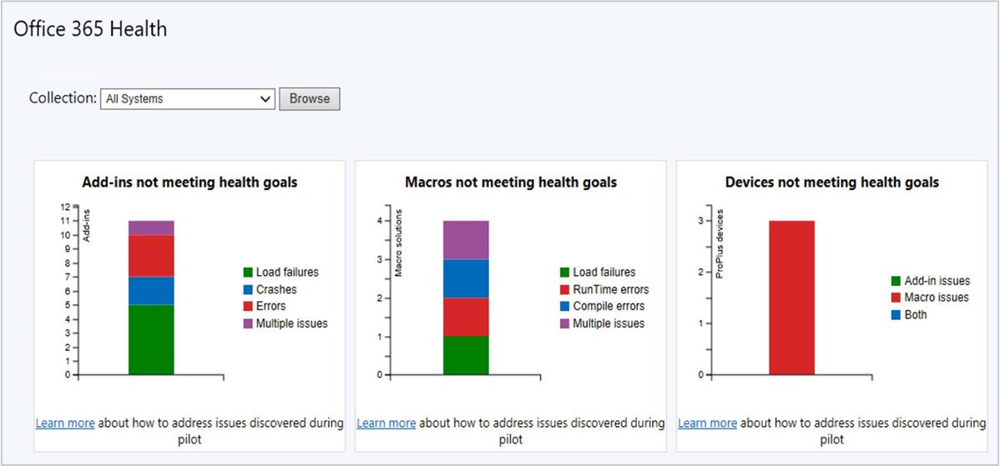

##  Office 365 ProPlus health dashboard

<!--4488301-->

As you plan your Microsoft 365 deployments, use the new Office 365 ProPlus health dashboard. It provides health insights for devices with Office 365 ProPlus to help identify issues.

The dashboard shows three main areas of insight:

- Add-in issues
- Macro issues
- Device overall issues

### Prerequisites

#### Client versions

- Microsoft 365 Apps for enterprise
- The latest version of the Configuration Manager client

#### Enable data collection

To enable data collection on clients, set the **EnableLogging** DWORD value to `1` in the following registry key:

`HKEY_CURRENT_USER\Software\Policies\Microsoft\Office\16.0\OSM`

You may need to create this registry key. You don't need to set any other values.

You can also use a group policy template to apply this setting. For more information, see [Office Telemetry Agent](https://docs.microsoft.com/deployoffice/compat/deploy-telemetry-dashboard#office-telemetry-agent). This Configuration Manager feature uses the same settings, but doesn't use the Office Telemetry Agent.

> [!IMPORTANT]
> Configuration Manager only collects Office data for this health dashboard. It's stored in the Configuration Manager site database controlled by your organization. It's not sent to Microsoft. This data is different than Office diagnostic data, which can be sent to Microsoft. For more information, see [Deploy Office Telemetry Dashboard](https://docs.microsoft.com/deployoffice/compat/deploy-telemetry-dashboard).

### Try it out!

Try to complete the tasks. Then send [Feedback](../../../../understand/find-help.md#product-feedback) with your thoughts on the feature.

In the Configuration Manager console, go to the **Software Library** workspace. Expand the **Office 365 Client Management** node, and select the **Office 365 Health** dashboard.

> [!NOTE]
> The health goals aren't configurable.

#### Add-ins not meeting health goals

- Load failures: The add-in failed to start.
- Crashes: The add-in failed while it was running.
- Error: The add-in reported an error.
- Multiple issues: The add-in has more than one of the above issues.

#### Macros not meeting health goals

- Load failures: The document failed to load.
- Runtime errors: An error happened while the macro was running. These errors can be dependent on the inputs so may not always occur.
- Compile errors: The macro didn't compile correctly so it won't attempt to run.
- Multiple issues: The macro has more than one of the above issues.

#### Devices not meeting health goals

This tile summarizes devices that have issues with add-ins, macros, or both.
