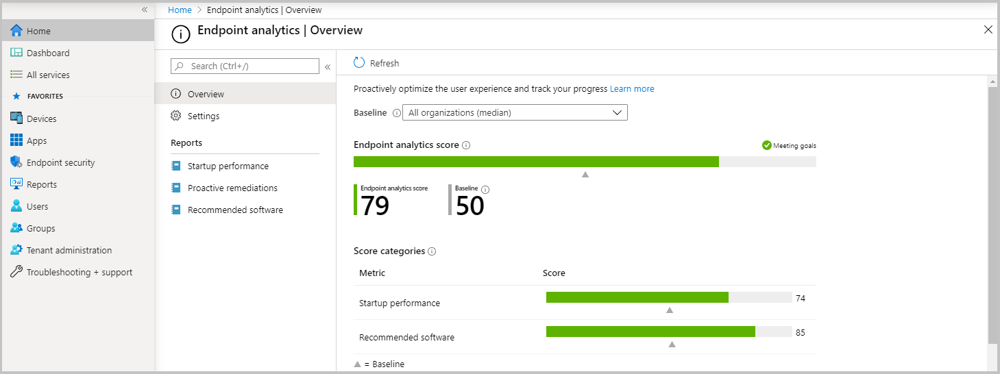
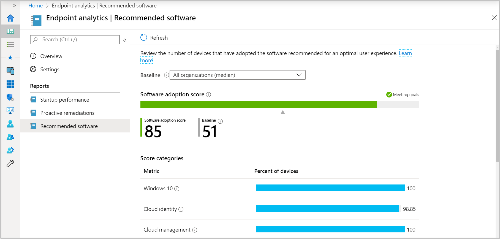
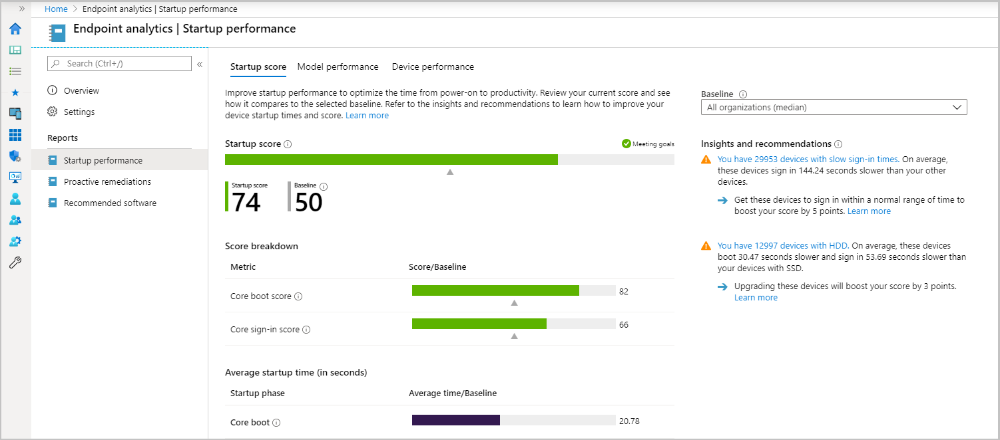
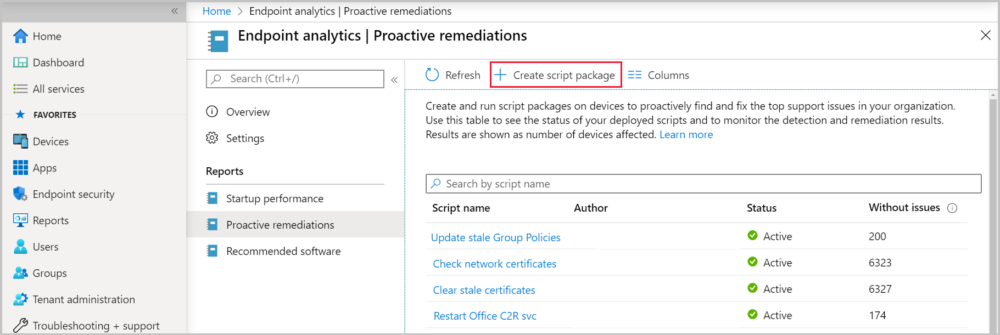
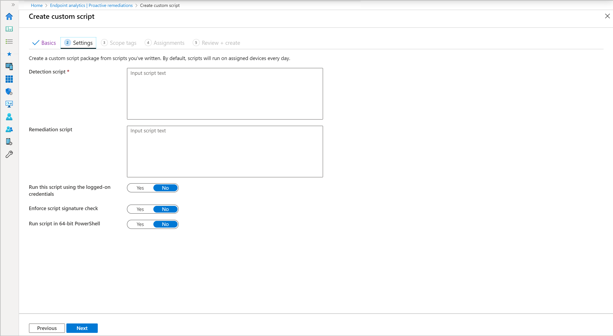
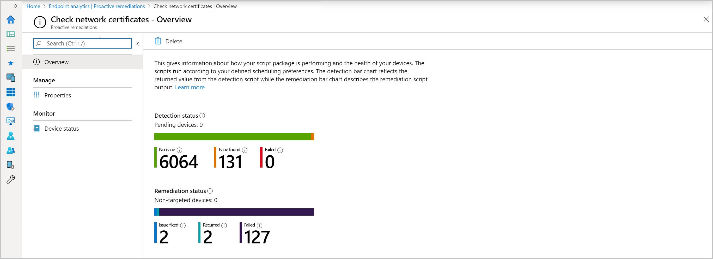
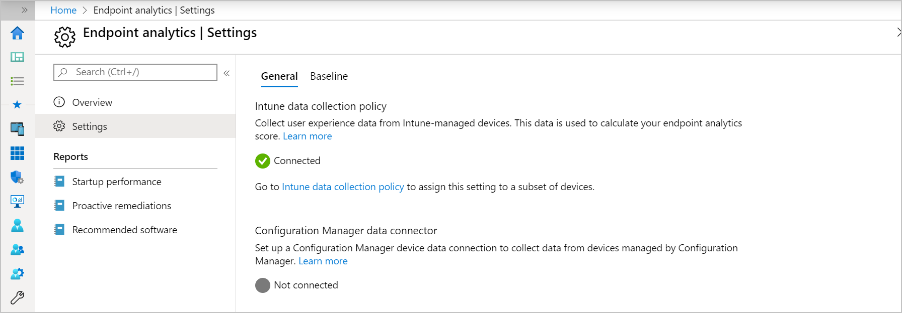
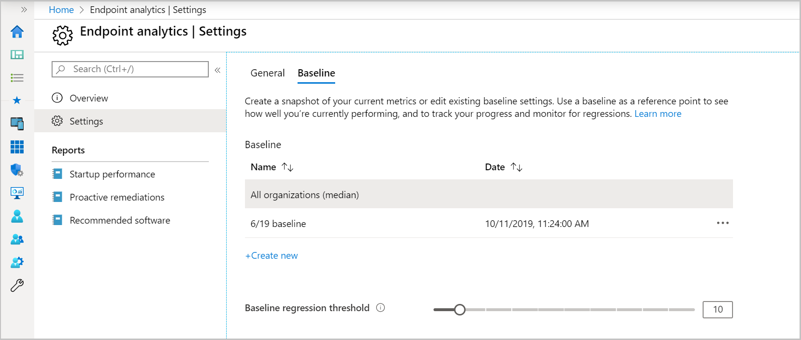

# <a name="bkmk_uea"></a> Endpoint analytics preview

> [!Note]  
> This information relates to a preview feature which may be substantially modified before it's commercially released. Microsoft makes no warranties, express or implied, with respect to the information provided here. 
>
> For more information about changes to Endpoint analytics, see [What's new in Endpoint analytics](whats-new-endpoint-analytics.md). 

## Endpoint analytics overview

It's not uncommon for end users to experience long boot times or other disruptions. These disruptions can be due to a combination of:

- Legacy hardware
- Software configurations that aren't optimized for the end-user experience
- Issues caused by configuration changes and updates

These issues and other end-user experience problems persist because IT doesn't have much visibility into the end-user experience. Generally, the only visibility into these issues come from a slow costly support channel that doesn't usually provide clear information about what needs to be optimized. It's not only IT support bearing the cost of these problems. The time information workers spend dealing with issues is also costly. Performance, reliability, and support issues that reduce user productivity can have a large impact on an organization's bottom line as well.

**Endpoint analytics** aims to improve user productivity and reduce IT support costs by providing insights into the user experience. The insights enable IT to optimize the end-user experience with proactive support and to detect regressions to the user experience by assessing user impact of configuration changes.

This initial release, focuses on three things:

- [**Recommended software**](#bkmk_uea_rs): Recommendations for providing the best user experience
- [**Proactive remediation scripting**](#bkmk_uea_prs): Fix common support issues before end-users notice issues
- [**Start up performance**](#bkmk_uea_bp): Help IT get users from power-on to productivity quickly without lengthy boot and sign in delays

This release is just the beginning. We'll be rapidly rolling out new insights for other key user-experiences soon after initial release. For more information about changes to Endpoint analytics, see [What's new in Endpoint analytics](whats-new-endpoint-analytics.md).

## <a name="bkmk_uea_prereq"></a> Getting started

To start using Endpoint analytics, verify the prerequisites, then start gathering data. 

### Technical Prerequisites

For this preview, you can enroll devices via Configuration Manager or Microsoft Intune. 

To enroll devices via Intune, this preview requires:
- Intune enrolled devices running Windows 10
- Startup performance insights are only available for devices running version 1903 or later of Windows 10 Enterprise (Home and Pro editions aren't currently supported), and the devices must be Azure AD joined or hybrid Azure AD joined. Workplace joined machines aren't currently supported.
- Network connectivity from devices to the Microsoft public cloud. For more information, see [endpoints](#bkmk_uea_endpoints).
- The [Intune Service Administrator role](https://docs.microsoft.com/intune/fundamentals/role-based-access-control) is required to [start gathering data](#bkmk_uea_start).
   - By clicking **Start**, you agree to and acknowledge that your customer data may be stored outside the location you selected when you provisioned your Microsoft Intune tenant.
   - After clicking **Start** for gathering data, other read-only roles can view the data.

To enroll devices via Configuration Manager, this preview requires:
- Configuration Manager version 2002 or newer
- Clients upgraded to version 2002 or newer
- [Microsoft Endpoint Manager tenant attach](https://docs.microsoft.com/en-us/mem/configmgr/tenant-attach/device-sync-actions) enabled with an Azure tenant location of North America (we will be expanding to other regions soon)

Whether enrolling devices via Intune or Configuration Manager, [**Proactive remediation scripting**](#bkmk_uea_prs) has the following requirements:
- Devices must be must be Azure AD joined or hybrid Azure AD joined and meet one of the following conditions:
- A Windows 10 Enterprise, Professional, or Education device that is managed by Intune
- A [co-managed](../../comanage/overview.md) device running Windows 10 Enterprise, version 1607 or later with the [Client apps workload](../../comanage/workloads.md#client-apps) pointed to Intune.
- A [co-managed](../../comanage/overview.md) device running Windows 10 Enterprise, version 1903 or later with the [Client apps workload](../../comanage/workloads.md#client-apps) pointed to Configuration Manager.

### Licensing Prerequisites

Endpoint analytics is included in the following plans: 

- [Enterprise Mobility + Security E3](https://www.microsoftvolumelicensing.com/ProductResults.aspx?doc=Product%20Terms,OST&fid=51) or higher
- [Microsoft 365 Enterprise E3](https://www.microsoft.com/en-us/microsoft-365/enterprise?rtc=1) or higher.

Proactive remediations also require one of the following licenses for the managed devices:
- Windows 10 Enterprise E3 or E5 (included in Microsoft 365 F3, E3, or E5)
- Windows 10 Education A3 or A5 (included in Microsoft 365 A3 or A5)
- Windows Virtual Desktop Access E3 or E5

### Permissions

#### Endpoint analytics permissions

The following permissions are used for Endpoint analytics:
- **Read** under the **Device configurations** category.
- **Read** under the **Organization** category. <!--temporary for pp-->
- Permissions appropriate to the user's role under the **Endpoint Analytics** category.

A read-only user would only need the **Read** permission under both the **Device configurations** and **Endpoint Analytics** categories. An Intune administrator would typically need all permissions.

#### Proactive remediations permissions

For Proactive remediations, the user needs permissions appropriate to their role under the **Device configurations** category.  Permissions in the **Endpoint Analytics** category aren't needed if the user only uses Proactive remediations.


## <a name="bkmk_uea_start"></a> Start gathering data

1. Go to `https://endpoint.microsoft.com/#blade/Microsoft_Intune_Enrollment/UXAnalyticsMenu`
1. Click **Start**. This will automatically assign a configuration profile to collect boot performance data from all eligible devices. You can [change assigned devices](#bkmk_uea_profile) later. It may take up to 24 hours for startup performance data to populate from your Intune enrolled devices after they reboot.
   - For more information about common issues, see [Troubleshooting startup performance device enrollment](#bkmk_uea_enrollment_tshooter).

## Overview page

Once your data is ready, you'll notice some information on the **Overview** page, explained in more detail below:

- The **User experience score** is a 50/50 weighted average of the **Recommended software** and **Startup performance scores**. We'll be expanding the set of subscores over time.

- You can compare your current score to other scores by setting a baseline.
  - As described in the [baseline](#bkmk_uea_baselines) section, there's a built-in baseline for *Commercial median* to see how you compare to a typical enterprise. You can create new baselines based on your current metrics so you can track progress or view regressions over time.
   - Baseline markers are shown for your overall score and subscores. If any of the scores have regressed by more than the configurable threshold from the selected baseline, the score is displayed in red and the top-level score is flagged as needing attention.
  - A status of **insufficient data** means you don't have enough devices reporting to provide a meaningful score. We currently require at least five devices.

- **Filters** will enable you to view your score on a subset of devices or users. However, the filter functionality isn't enabled in this preview.

- **Insights and recommendations** is a prioritized list to improve your score. This list is filtered to the subnode's context when you navigate to **Best practices** or **Recommended software**.

[](media/overview-page.png#lightbox)

## <a name="bkmk_uea_rs"></a> Recommended software

> [!Important]  
> Endpoint Analytics computes the **Software adoption** score for all your Intune managed devices, regardless of whether they've been enrolled in Endpoint Analytics or not.

Certain software is known to improve the end-user experience, independent of lower-level health metrics. For example, Windows 10 has a much higher Net Promoter score than Windows 7. The **Software adoption** score is a number between 0 and 100 that represents a weighted average of the percent of devices that have deployed various recommended software. The current weighting is higher for Windows than for the other metrics since users interact with them more often. The metrics are described below: 

[](media/recommended-software.png#lightbox)

### <a name="bkmk_uea_win10"></a> Windows 10

Windows 10 provides a better user experience than older versions of Windows. See the [TEI whitepaper](https://vc2prod.blob.core.windows.net/vc-resources/TEIStudies/TEI%20of%20Windows%2010.pdf) for more information.

This metric measures the percent of devices on Windows 10 versus an older version of Windows.

The recommended remediation action for moving devices from older versions of Windows is to create a deployment plan using [Desktop Analytics](../../desktop-analytics/overview.md).

### <a name="bkmk_uea_ap"></a> Autopilot

Microsoft Autopilot provides a simpler initial provisioning experience for Windows 10 PCs than the native experience by reducing the number of screens in the Out Of Box Experience (OOBE) and providing defaults, to ensure the employees device is correctly provisioning from the factory or on reset.

This metric measures the percent of Windows 10 devices that are registered for Autopilot.

The recommended remediation action is to register existing devices in Autopilot using [Microsoft Intune](https://docs.microsoft.com/intune/enrollment-autopilot).

### <a name="bkmk_uea_aad"></a> Azure Active Directory

Azure Active Directory (Azure AD) provides users with numerous productivity benefits including device-wide single sign-on to apps and services, Windows Hello sign-in, self-service BitLocker recovery, and corporate data roaming.

This metric measures the percent of devices enrolled in Azure AD.

Your Microsoft-Intune managed devices are already enrolled in Azure AD. The recommended remediation action for devices managed by Configuration Manager is to either [enroll them in Azure AD](https://docs.microsoft.com/azure/active-directory/devices/hybrid-azuread-join-managed-domains) or [co-manage them](../../comanage/overview.md). Co-managing devices also improves your cloud management score.

### <a name="bkmk_uea_intune"></a> Cloud management

Microsoft Intune provides users with several productivity benefits, including enabling access to corporate resources even when they are away from the corporate network, and eliminates the need for and performance overhead of Group Policy, resulting in a better end-user experience. This metric measures the percent of PCs enrolled in Microsoft Intune. See how [Microsoft is enabling this for our employees](https://www.microsoft.com/en-us/itshowcase/managing-windows-10-devices-with-microsoft-intune).

The recommended remediation action for devices managed by Configuration Manager that aren't yet enrolled in Intune is to [co-manage them](../../comanage/overview.md).

### <a name="bkmk_uea_np"></a> No commercial median

The built-in baseline of **Commercial median** doesn't currently have metrics for the subscores listed in the sections above.

## <a name="bkmk_uea_bp"></a> Startup performance

> [!NOTE]
> If you are not seeing startup performance data from all your devices, please see [Troubleshooting startup performance device enrollment](#bkmk_uea_enrollment_tshooter).

The startup performance score helps IT get users from power-on to productivity quickly, without lengthy boot and sign-in delays. The **Startup score** is a number between 0 and 100. This score is a weighted average of **Boot score** and the **Sign-in** score, which are computed as follows:

- **Boot score**: Based on the time from power-on to sign in. We look at the last boot time from each device, excluding the update phase, then score it from 0 (poor) to 100 (exceptional). These scores are averaged to provide an overall tenant boot score.
- **Sign-in score**: Based on the time from when credentials have been entered until the user can access a responsive desktop (meaning the desktop has rendered and the CPU usage has fallen below 50% for at least 2 seconds). We look at the last sign-in time to each device, excluding first sign-ins or sign-ins immediately after a feature update, then score it from 0 (poor) to 100 (exceptional). These scores are averaged to provide an overall tenant boot score.

[](media/startup-performance.png#lightbox)

### Insights

The **Startup performance** page also provides a prioritized list of **Insights and recommendations**, described in the following sections:

#### <a name="bkmk_uea_hdd"></a> Hard disk drives

Startup performance provides an insight on the number of devices on which the boot drive is a hard disk. Hard disk drives typically result in boot times three to four times longer than solid-state drives. We also report the expected improvement to start up performance you would gain by moving to solid-state drives.

Click though to see the list of devices that have hard disk drives. The recommended action is to upgrade these devices to solid-state drives.

#### <a name="bkmk_uea_gp"></a> Group Policy

Startup performance provides an insight on the number of devices that have delays to boot and sign-in times caused by Group Policy. Clicking through takes you to the devices view. The view is sorted by Group Policy time, so you can see affected devices for further troubleshooting.

If you click through to a particular device, you can see its boot and sign-in history. The history helps you determine if the issue is a regression and when it might have occurred.

While there are many articles on how to optimize Group Policies performance, you may choose to migrate to cloud-management instead. Migrating to cloud-management allows you to use [Intune security baselines](https://docs.microsoft.com/intune/protect/security-baselines) and the soon-to-be-released Policy Analytics tool.

#### <a name="bkmk_uea_sb"></a> Slow boot and sign-in times

Startup performance provides an insight on the number of devices with slow boot or sign-in times. A boot score or sign-in score of "0" means it's slow. Clicking through takes you to the devices view. The devices are sorted by core boot time or core sign-in time respectively, so you can see affected devices for further troubleshooting.

If you click through to a particular device, you can see its boot and sign-in history. The history helps you determine if the issue was a regression and when it might have occurred.

### Reporting tabs

The **Startup performance** page has reporting tabs that provide support for the insights, including:
1. **Model performance**. This tab lets you see the boot and sign-in performance by device model, which can help you identify if performance problems are isolated to particular models.
1. **Device performance**. This tab provides boot and sign-in metrics for all your devices. You can sort by a particular metric (for example, GP sign-in time) to see which devices have the worst scores for that metric to help with troubleshooting. You can also search for a device by name. If you click through a device you can see its boot and sign-in history, which can help you identify if there was a recent regression
1. **Startup processes**. This tab (if visible; we've only flighted this to some of you as we are still developing this feature) will show you which processes are impacting the sign-in "time to responsive desktop" phase; that is - keeping the CPU above 50% after the desktop has rendered.

## <a name="bkmk_uea_prs"></a> Proactive remediations

Proactive remediations are script packages that can detect and fix common support issues on a user's device before they even realize there's a problem. These remediations can help reduce support calls. You can create your own script package, or deploy one of the script packages we've written and used in our environment for reducing support tickets.

Each script package consists of a detection script, a remediation script, and metadata. Through Intune, you'll be able to deploy these script packages and see reports on their effectiveness. We're actively developing new script packages and would like to know your experiences using them. Reach out to your Endpoint analytics preview contact if you have any feedback on the script packages.

### <a name="bkmk_uea_prs_ps1"></a> Get the detection and remediation scripts

1. Copy the scripts from the bottom of this article in the [PowerShell scripts](#bkmk_uea_ps_scripts) section.
    - Script files whose names start with `det` are detection scripts. Remediation scripts start with `rem`.
    - For a description of the scripts, see the [Script descriptions](#bkmk_uea_scripts).
1. Save each script using the provided name. The name is also in the comments at the top of each script.
    - You can use a different script name, but it won't match the name listed in the [Script descriptions](#bkmk_uea_scripts) section.


### <a name="bkmk_uea_prs_deploy"></a> Deploying and monitoring scripts
The **Microsoft Intune Management Extension** service gets the scripts from Intune and runs them. The scripts are rerun every 24 hours. To deploy and monitor the scripts, follow the instructions below:

1. Go to the **Proactive remediations** node in the console.
1. Click the **Create script package** button to create a script package.
     [](media/proactive-remediations-create.png#lightbox)
1. In the **Basics** step, give the script package a **Name** and optionally, a **description**. The **Publisher** field can be edited, but defaults to your tenant name. **Version** can't be edited. 
1. On the **Settings** step, copy the text from the scripts you downloaded into the **Detection script** and **Remediation script** fields. 
   - You need the corresponding detection and remediation script to be in the same package. For example, the `Detect_stale_Group_Policies.ps1` detection script corresponds with the `Remediate_stale_GroupPolicies.ps1` remediation script.
       [](media/proactive-remediations-script-settings.png#lightbox)
1. Finish the options on the **Settings** page with the following recommended configurations:
   - **Run this script using the logged-on credentials**: This is dependent on the script. For more information, see the [Script descriptions](#bkmk_uea_scripts).
   - **Enforce script signature check**: No
   - **Run script in 64-bit PowerShell**: No
1. Click **Next** then assign any **Scope tags** you need.
1. In the **Assignments** step, select the device groups to which you want to deploy the script package.
1. Complete the **Review + Create** step for your deployment.
1. Under **Reporting** > **Endpoint analytics - Proactive remediations**, you can see an overview of your detection and remediation status.
       [](media/proactive-remediations-report-overview.png#lightbox)
1. Click on **Device status** to get status details for each device in your deployment.
       [](media/proactive-remediations-device-status.png#lightbox)


## <a name="bkmk_uea_set"></a> Endpoint analytics settings

From the settings page, you can select **General** or **Baseline**. Each of these settings is described below:

### <a name="bkmk_uea_gen"></a> General

The **General** page in **Settings** allows you to see if Intune startup performance data collection has been enabled. It's automatically enabled for all your devices by default when you click **Start** to enable user-experience analytics. You have the option to go to the Intune data collection policy node to change the set of devices on which boot and sign-in records are collected.


#### <a name="bkmk_uea_profile"></a> Intune data collection policy

To assign this setting to a subset of devices, [Create a profile](/intune/configuration/device-profile-create#create-the-profile) with  the following information: 

  - **Name**: Enter a descriptive name for the profile, like **Intune data collection policy**
   
  - **Description**: Enter a description for the profile. This setting is optional, but recommended.
    
  - **Platform**: Select **Windows 10 and later**
   
  - **Profile type**: Select **Windows Health monitoring**
   
  - Configure the **Settings**:
   
       - **Health Monitoring**: Select **Enable** to collect event information from Windows 10 devices
    
    - **Scope**: Select **Boot performance** 

  - Use the [Scope tags](/intune/configuration/device-profile-create#scope-tags) and [Applicability rules](/intune/configuration/device-profile-create#applicability-rules) to filter the profile to specific IT groups or devices in a group that meet a specific criteria.

> [!NOTE]
> There is a placeholder for instructions for configuring the Configuration Manager data connector. However, this functionality has not been implemented in this initial private preview.

  [](media/settings-general.png#lightbox)

### <a name="bkmk_uea_baselines"></a> Baseline management

You can compare your current scores and subscores to others by setting a baseline.

1. There's a built-in baseline for **Commercial median**, which allows you to compare your scores to a typical enterprise.
1. You can create new baselines based on your current metrics to track progress or view regressions over time. Click the **Create new** button and give your new baseline a name. We recommend a name that includes the date, so it's easier to select from the drop-down in the reports pages.
1. There's a limit of 100 baselines per tenant. You can delete old baselines that are no longer needed.
1. Your current metrics will be flagged red and show as regressed if they fall below the current baseline in your reports. Because it's perfectly normal for metrics to fluctuate from day to day, you can set a regression threshold, which defaults to 10%. With this threshold, metrics are only flagged as regressed if they've regressed by more than 10%.

   [](media/settings-baseline.png#lightbox)

## <a name="bkmk_uea_tshoot"></a> Troubleshooting

The sections below can be used to assist in troubleshooting issues you may encounter.

### <a name="bkmk_uea_enrollment_tshooter"></a> Troubleshooting startup performance device enrollment

If the overview page shows a startup performance score of zero accompanied by a banner showing it is waiting for data, or if the startup performance's device performance tab shows fewer devices than you expect, there are some steps you can take to troubleshoot the issue.

First, here's a quick summary of limitations for startup performance data collection:
1. Devices must be Windows 10 version 1903 or later.
2. Devices must be Azure AD joined. We currently do not support Workplace Joined devices, although are actively investigating the feasibility of adding this functionality to Windows.
3. Devices must be Windows 10 Enterprise edition. Windows 10 Home and Professional are not currently supported, although are actively investigating the feasibility of adding this functionality to Windows.

Note that these issues will not apply to data coming from the upcoming Configuration Manager connector; it will be able to collect data from any Configuration Manager client PC, regardless of version, edition, or directory configuration.

Second, here's a quick checklist to go through for troubleshooting:
1. Make sure you have the Windows Health Monitoring profile targeted to all the devices for which you want performance data. You can find a link to this profile from within the endpoint analytics setting page, or you navigate to it as you would any other Intune profile. Look at the assignment tab to make sure it is assigned to the expected set of devices. 
1. Have a look at which devices have been successfully configured for data collection. You can also see this information in the profiles overview page.  
   - There is a known issue where customers may see profile assignment errors, where affected devices show an error code of `-2016281112 (Remediation failed)`. We're actively investigating this issue.
1. Devices that have been successfully configured for data collection must be restarted after data collection has been enabled, and you must then wait up to 24 hours after for the device to show up in the device performance tab.
1. If your device has been successfully configured for data collection, has subsequently restarted, and after 24 hours you are still not seeing it, then it may be that the device can't reach our collection endpoints. This issue may happen if your company uses a proxy server and the endpoints have not been enabled in the proxy. For more information, see [Troubleshooting endpoints](#bkmk_uea_endpoints).


### <a name="bkmk_uea_endpoints"></a> Endpoints

To enroll devices to Endpoint analytics, they need to send required functional data to Microsoft. If your environment uses a proxy server, use this information to help configure the proxy.

To enable functional data sharing, configure your proxy server to allow the following endpoints:

> [!Important]  
> For privacy and data integrity, Windows checks for a Microsoft SSL certificate (certificate pinning) when communicating with the required functional data sharing endpoints. SSL interception and inspection aren't possible. To use Endpoint analytics, exclude these endpoints from SSL inspection.<!-- BUG 4647542 -->

| Endpoint  | Function  |
|-----------|-----------|
| `https://*.events.data.microsoft.com` | Used to send [required functional data](#bkmk_uea_datacollection) to the Intune data collection endpoint. |
| `https://graph.windows.net` | Used to automatically retrieve settings  when attaching your hierarchy to Endpoint analytics (on Configuration Manager Server role). For more information, see [Configure the proxy for a site system server](../plan-design/network/proxy-server-support.md#configure-the-proxy-for-a-site-system-server). |
| `https://*.manage.microsoft.com` | Used to synch device collection and devices with Endpoint analytics (on Configuration Manager Server role only). For more information, see [Configure the proxy for a site system server](../plan-design/network/proxy-server-support.md#configure-the-proxy-for-a-site-system-server). |


### Proxy server authentication

If your organization uses proxy server authentication for internet access, make sure that it doesn't block the data because of authentication. If your proxy doesn't allow devices to send this data, they won't show in Desktop Analytics.

#### Bypass (recommended)

Configure your proxy servers to not require proxy authentication for traffic to the data sharing endpoints. This option is the most comprehensive solution. It works for all versions of Windows 10.  

#### User proxy authentication

Configure devices to use the signed-in user's context for proxy authentication. This method requires the following configurations:

- Devices have the current quality update for a supported version of Windows

- Configure user-level proxy (WinINET proxy) in **Proxy settings** in the Network & Internet group of Windows Settings. You can also use the legacy Internet Options control panel.

- Make sure that the users have proxy permission to reach the data sharing endpoints. This option requires that the devices have console users with proxy permissions, so you can't use this method with headless devices.

> [!IMPORTANT]
> The user proxy authentication approach is incompatible with the use of Microsoft Defender Advanced Threat Protection. This behavior is because this authentication relies on the **DisableEnterpriseAuthProxy** registry key set to `0`, while Microsoft Defender ATP requires it to be set to `1`. For more information, see [Configure machine proxy and internet connectivity settings in Microsoft Defender ATP](https://docs.microsoft.com/windows/security/threat-protection/windows-defender-atp/configure-proxy-internet-windows-defender-advanced-threat-protection).

#### Device proxy authentication

This approach supports the following scenarios:

- Headless devices, where no user signs in, or users of the device don't have internet access

- Authenticated proxies that don't use Windows Integrated Authentication

- If you also use Microsoft Defender Advanced Threat Protection

This approach is the most complex because it requires the following configurations:

- Make sure devices can reach the proxy server through WinHTTP in local system context. Use one of the following options to configure this behavior:

  - The command line `netsh winhttp set proxy`

  - Web proxy auto-discovery (WPAD) protocol

  - Transparent proxy

  - Configure device-wide WinINET proxy using the following group policy setting: **Make proxy settings per-machine (rather than per-user)** (ProxySettingsPerUser = `1`)

  - Routed connection, or that uses network address translation (NAT)

- Configure proxy servers to allow the computer accounts in Active Directory to access the data endpoints. This configuration requires proxy servers to support Windows Integrated Authentication.  


## <a name="bkmk_uea_faq"></a> Frequently asked questions

### Why are the scripts exiting with a code of 1?

The scripts exit with a code of 1 to signal to Intune that remediation should occur. In this case, exiting a detection script with 1 means it's true that remediation is needed. Many script packages that run solely in CM may show compliant, but exit with a code of 1. For these scripts, exiting with a code of 1 isn't something alarming but you may want to verify the device remediates properly.

### Why did the Update Stale Group Policies script return with error 0x87D00321?

0x87D00321 is a script execution timeout error. This error typically occurs with machines that are connected remotely. A potential mitigation might be to only deploy to a dynamic collection of machines that have internal network connectivity.

## <a name="bkmk_uea_scripts"></a> Script descriptions

This table shows the script names, descriptions, detections, remediations, and configurable items. Script files whose names start with `Detect` are detection scripts. Remediation scripts start with `Remediate`. These scripts can be copied from the next section in this article.

|Script name|Description|
|---|---|
|**Update stale Group Policies** </br>`Detect_stale_Group_Policies.ps1` </br> `Remediate_stale_GroupPolicies.ps1`| Detects if last Group Policy refresh is greater than `7 days` ago.  </br>Customize the 7-day threshold by changing the value for `$numDays` in the detection script. </br></br>Remediates by running `gpupdate /target:computer /force` and `gpupdate /target:user /force`  </br> </br>Can help reduce network connectivity-related support calls when certificates and configurations are delivered via Group Policy. </br> </br> **Run the script using the logged-on credentials**: Yes|
|**Restart Office Click-to-Run service** </br> `Detect_Click_To_Run_Service_State.ps1` </br> `Remediate_Click_To_Run_Service_State.ps1`| Detects if the Click-to-Run service is set to automatically start and if the service is stopped. </br> </br> Remediates by setting the service to start automatically and starting the service if it's stopped. </br></br> Helps fix issues where Win32 Microsoft 365 Apps for enterprise won't launch because the Click-to-Run service is stopped. </br> </br> **Run the script using the logged-on credentials**: No|
|**Check network certificates** </br>`Detect_Expired_Issuer_Certificates.ps1` </br>`Remediate_Expired_Issuer_Certificates.ps1`|Detects certificates issued by a CA in either the Machine's or User's personal store that are expired, or near expiry. </br> Specify the CA by changing the value for `$strMatch` in the detection script. Specify 0 for `$expiringDays` to find expired certificates, or specify another number of days to find certificates near expiry.  </br></br>Remediates by raising a toast notification to the user. </br> Specify the `$Title` and `$msgText` values with the message title and text you want users to see. </br> </br> Notifies users of expired certificates that might need to be renewed. </br> </br> **Run the script using the logged-on credentials**: No|
|**Clear stale certificates** </br>`Detect_Expired_User_Certificates.ps1` </br> `Remediate_Expired_User_Certificates.ps1`| Detects expired certificates issued by a CA in the current user's personal store. </br> Specify the CA by changing the value for `$certCN` in the detection script. </br> </br> Remediates by deleting expired certificates issued by a CA from the current user's personal store. </br> Specify the CA by changing the value for `$certCN` in the remediation script. </br> </br> Finds and deletes expired certificates issued by a CA from the current user's personal store. </br> </br> **Run the script using the logged-on credentials**: Yes|

## <a name="bkmk_uea_ps_scripts"></a> PowerShell Scripts

### Detect_stale_Group_Policies.ps1

```powershell
#=============================================================================================================================
#
# Script Name:     Detect_stale_Group_Policies.ps1
# Description:     Detect if Group Policy has been updated within number of days
# Notes:           Remediate if "Match", $numDays default value of 7, change as appropriate
#
#=============================================================================================================================

# Define Variables
$numDays = 7

try {
    $gpResult = gpresult /R | Select-String -pattern "Last time Group Policy was applied:" | Select-Object -last 1

    if ($gpResult){
    [int]$lastGPUpdateDays = (New-TimeSpan -Start $lastGPUpdateDate -End (Get-Date)).Days
        if ($lastGPUpdateDays -gt $numDays){
            #We want within last $numDays so we get "Match"
            Write-Host "Match"
            exit 1
        }
        else {
            #Script succeeds but > $numDays since last update so remediate
            #Exit 1 for Intune and "Match" for ConfigMan
            Write-Host "No_Match"
            exit 0
        }
    }
}
catch {
    $errMsg = $_.Exception.Message
    Write-Error $errMsg
    exit 1
}
```

### Remediate_stale_GroupPolicies.ps1

```powershell
#=============================================================================================================================
#
# Script Name:     Remediate_stale_GroupPolicies.ps1
# Description:     This script triggers Group Policy update
# Notes:           No variable substitution needed
#
#=============================================================================================================================

try{
    $compGP = gpupdate /target:computer /force | out-string
    $userGP = gpupdate /target:user /force | out-string
    exit 0
}
catch{
    $errMsg = $_.Exception.Message
    Write-Error $errMsg
    exit 1
}
```

### Detect_Click_To_Run_Service_State.ps1

```powershell
#=============================================================================================================================
#
# Script Name:     Detect_Click_To_Run_Service_State.ps1
# Description:     Detect if Office 16 installed and if "Click to Run Service" is running.
# Notes:           No variable substitution should be necessary
#
#=============================================================================================================================

# Define Variables
$curSvcStat,$svcCTRSvc,$errMsg = "","",""

# Main script
If (-not (Test-Path -Path 'hklm:\Software\Microsoft\Office\16.0')){
    Return "Office 16.0 (or greater) not present on this machine"
    exit 0   
} 

Try{        
    $svcCTRSvc = Get-Service "ClickToRunSvc"
    $curSvcStat = $svcCTRSvc.Status
}

Catch{    
    $errMsg = $_.Exception.Message
    Write-Error $errMsg
    exit 1
}

If ($curSvcStat -eq "Running"){
    Write-Output $curSvcStat
    exit 0                        
}
Else{
    If($curSvcStat -eq "Stopped"){
    Write-Output $curSvcStat
    exit 1     
    }
}
Else{
    Write-Error "Error: " + $errMsg
    exit 1
}
```

### Remediate_Click_To_Run_Service_State.ps1

```powershell
#=============================================================================================================================
#
# Script Name:     Remediate_Click_To_Run_Service_State.ps1
# Description:     Start the "Click to Run Service" and change its startup type to Automatic
#       Notes:     No variable substitution needed
#
#=============================================================================================================================

# Define Variables
$svcCur = "ClickToRunSvc"
$curSvcStat,$svcCTRSvc,$errMsg = "","",""
$ctr = 0

# Main script
# Make sure nothing has changed since detection, the service exists and is stopped
Try{        
    $svcCTRSvc = Get-Service "ClickToRunSvc"
    $curSvcStat = $svcCTRSvc.Status
    }

Catch{    
    $errMsg = $_.Exception.Message
    }
        
# If the service got started between detection and now (nested if) then return
# If the service got uninstalled or corrupted between detection and now (else) then return the "Error: " + the error
If ($curSvcStat -ne "Stopped"){
    If ($curSvcStat -eq "Running"){
        return
    }
    Else{
        return "Error: " + $errMsg
    }
}

# Service should be there and stopped, change the startup type and start
Try{        
    Set-Service $svcCur -StartupType Automatic
    Start-Service $svcCur
    $svcCTRSvc = Get-Service $svcCur
    $curSvcStat = $svcCTRSvc.Status
        While ($curSvcStat.Equals("Stopped")){
            Start-Sleep -Seconds 5
            ctr++
            if(ctr == 12){
                Return "Service could not be started after 60 seconds"
                break
            }
        }
    }

Catch{    
    $errMsg = $_.Exception.Message
    Return $errMsg
    }

Return $curSvcStat
```

### Detect_Expired_Issuer_Certificates.ps1

```powershell
#=============================================================================================================================
#
# Script Name:     Detect_Expired_Issuer_Certificates.ps1
# Description:     Detect expired certificates issued by "CN=<your CA here>" in either Machine
#                  or User certificate store
# Notes:           Change the value of the variable $strMatch from "CN=<your CA here>" to "CN=..."
#                  For testing purposes the value of the variable $expiringDays can be changed to a positive integer
#                  Don't change the $results variable
#
#=============================================================================================================================

# Define Variables
$results = @()
$expiringDays = 0
$strMatch = "CN=<your CA here>"

try
{
    $results = @(Get-ChildItem -Path Cert:\LocalMachine\My -Recurse -ExpiringInDays $expiringDays | where {$_.Issuer -match $strMatch})
    $results += @(Get-ChildItem -Path Cert:\CurrentUser\My -Recurse -ExpiringInDays $expiringDays | where {$_.Issuer -match $strMatch}) 
    if (($results -ne $null)){
        #Below necessary for Intune as of 10/2019 will only remediate Exit Code 1
        Write-Host "Match"
        Return $results.count
        exit 1
    }
    else{
        #No matching certificates, do not remediate
        Write-Host "No_Match"        
        exit 0
    }   
}
catch{
    $errMsg = $_.Exception.Message
    Write-Error $errMsg
    exit 1
}
```

### Remediate_Expired_Issuer_Certificates.ps1

```powershell
#=============================================================================================================================
#
# Script Name:     Remediate_Expired_Issuer_Certificates.ps1
# Description:     Raise a Toast Notification if expired certificates issued by "CN=..."
#                  to user or machine on the machine where detection script found them. No remediation action besides
#                  the Toast is taken.
# Notes:           Change the values of the variables $Title and $msgText
#
#=============================================================================================================================

## Raise toast to have user contact whoever is specified in the $msgText

# Define Variables
$delExpCert = 0
$Title = "Title"
$msgText = "message"

# Main script
[Windows.UI.Notifications.ToastNotificationManager, Windows.UI.Notifications, ContentType = WindowsRuntime] | Out-Null
[Windows.UI.Notifications.ToastNotification, Windows.UI.Notifications, ContentType = WindowsRuntime] | Out-Null
[Windows.Data.Xml.Dom.XmlDocument, Windows.Data.Xml.Dom.XmlDocument, ContentType = WindowsRuntime] | Out-Null

$APP_ID = '{1AC14E77-02E7-4E5D-B744-2EB1AE5198B7}\WindowsPowerShell\v1.0\powershell.exe'

$template = @"
<toast>
    <visual>
        <binding template="ToastText02">
            <text id="1">$Title</text>
            <text id="2">$msgText</text>
        </binding>
    </visual>
</toast>
"@

$xml = New-Object Windows.Data.Xml.Dom.XmlDocument
$xml.LoadXml($template)
$toast = New-Object Windows.UI.Notifications.ToastNotification $xml
[Windows.UI.Notifications.ToastNotificationManager]::CreateToastNotifier($APP_ID).Show($toast)
```

### Detect_Expired_User_Certificates.ps1

```powershell
#=============================================================================================================================
#
# Script Name:     Detect_Expired_User_Certificates.ps1
# Description:     Detect expired certificates issued by "CN=<your CA here>" to User
# Notes:           Change the value of the variable $certCN from "CN=<your CA here>" to "CN=...".
#                  Don't change $results
#
#=============================================================================================================================

# Define Variables
$results = 0
$certCN = "CN=<your CA here>"

try
{   
    $results = Get-ChildItem -Path Cert:\CurrentUser\My -Recurse -ExpiringInDays 0 | where {$_.Issuer -eq($certCN)}
    if (($results -ne $null)){
        #Below necessary for Intune as of 10/2019 will only remediate Exit Code 1
        Write-Host "Match"
        Return $results.count
        exit 1
    }
    else{
        Write-Host "No_Match"
        exit 0
    }    
}
catch{
    $errMsg = $_.Exception.Message
    Write-Error $errMsg
    exit 1
}
```

### Remediate_Expired_User_Certificates.ps1

```powershell
#=============================================================================================================================
#
# Script Name:     Remediate_Expired_User_Certificates.ps1
# Description:     Remove expired certificates issued by "CN=<your CA here>" to User
# Notes:           Change the value of the variable $certCN from "CN=<your CA here>" to "CN=..."
#
#=============================================================================================================================

# Define Variables
$certCN = "CN=<your CA here>"

try
{
    Get-ChildItem -Path cert:\CurrentUser -Recurse -ExpiringInDays 0 | where {$_.Issuer -eq($certCN)} | Remove-Item
    exit 0
}
catch{
    $errMsg = $_.Exception.Message
    Write-Error $errMsg
    exit 1
}
```

## <a name="bkmk_uea_privacy"></a> Endpoint analytics data privacy

### Data flow

The following illustration shows how required functional data flows from individual devices through our data services, transient storage, and to your tenant. Data flows through our existing enterprise pipelines without reliance on Windows diagnostic data.

[](media/dataflow.png#lightbox)

1. Configure the **Intune data collection** policy for enrolled devices. By default, this policy is assigned to "All Devices" when you **Start** Endpoint analytics. However, you can [change the assignment](#bkmk_uea_set) at any time to a subset of devices or no devices at all.

2. Devices send required functional data.

    - For Intune devices with the assigned policy, data is sent from the Intune management extension. For more information, see [requirements](#bkmk_uea_prereq).
    - For Configuration Manager managed devices, data can also flow to Microsoft Endpoint Management through the ConfigMgr connector. The ConfigMgr connector is cloud attached. It only requires connection to an Intune tenant, not turning on co-management.

> [!Note]  
> The data required to compute the startup score for a device is generated during boot time. Depending on power settings and user behavior, it may take weeks after a device has been correctly assigned the policy to show the startup score on the admin console.  

3. The Microsoft Endpoint Management service processes data for each device and publishes the results for both individual devices and organizational aggregates in the admin console using MS Graph APIs.

The average latency end to end is about 12 hours and is gated by the time it takes to do the daily processing. All other parts of the data flow are near-real-time.

### <a name="bkmk_uea_datacollection"></a>Data collection

Currently, the basic functionality of Endpoint analytics collects information associated with boot performance records that falls into the [identified](https://docs.microsoft.com/mem/intune/protect/privacy-data-collect#identified-data) and [pseudonymized](https://docs.microsoft.com/mem/intune/protect/privacy-data-collect#pseudonymized-data) categories. As we add additional functionality over time, the data collected will vary as needed. The main datapoints currently being collected:

#### Identified data

- Hardware inventory information
  - **make:** Device manufacturer
  - **model:** Device model
  - **deviceClass:** The device classification. For example, Desktop, Server, or Mobile.
  - **Country:** The device region setting
- Application inventory, like
  - **name:** Windows
  - **ver:** The version of the current OS.
  
#### Pseudonymized data

- Diagnostic, performance, and usage data tied to a user and/or device
  - **logOnId**
  - **bootId:** The system boot ID
  - **coreBootTimeInMilliseconds:** Time for core boot
  - **totalBootTimeInMilliseconds:** Total boot time
  - **updateTimeInMilliseconds:** Time for OS updates to complete
  - **gpLogonDurationInMilliseconds**: Time for Group policies to process
  - **desktopShownDurationInMilliseconds:** Time for desktop (explorer.exe) to be loaded
  - **desktopUsableDurationInMilliseconds:** Time for desktop (explorer.exe) to be usable
  - **topProcesses:** List of processes loaded during boot with name, with cpu usage stats and app details (Name, publisher, version). For example *{\"ProcessName\":\"svchost\",\"CpuUsage\":43,\"ProcessFullPath\":\"C:\\\\Windows\\\\System32\\\\svchost.exe\",\"ProductName\":\"Microsoft&reg; Windows&reg; Operating System\",\"Publisher\":\"Microsoft Corporation\",\"ProductVersion\":\"10.0.18362.1\"}*
- Device data not tied to a device or user (if this data is tied to a device or user, Intune treats it as identified data)
  - **ID:** Unique device ID used by Windows Update
  - **localId:** A locally defined unique ID for the device. This is not the human-readable device name. Most likely equal to the value stored at HKLM\Software\Microsoft\SQMClient\MachineId.
  - **aaddeviceid:** Azure Active Directory device ID
  - **orgId:** Unique GUID representing the Microsoft O365 Tenant
  
> [!Important]  
> Our data handling policies are described in the [Microsoft Intune Privacy Statement](https://docs.microsoft.com/legal/intune/microsoft-intune-privacy-statement). We only use your customer data to provide you the services you signed up for. As described during the onboarding process, we anonymize and aggregate the scores from all enrolled organizations to keep the baselines up-to-date.


### Resources

For more information about related privacy aspects, see the following articles:

- [Microsoft Intune Privacy Statement](https://docs.microsoft.com/legal/intune/microsoft-intune-privacy-statement)
- [Windows 10 and privacy compliance](https://docs.microsoft.com/windows/privacy/windows-10-and-privacy-compliance)
- [Licensing terms and documentation](https://www.microsoftvolumelicensing.com/DocumentSearch.aspx?Mode=3&DocumentTypeId=31)  
- [Security and privacy at Microsoft Azure data centers](https://azure.microsoft.com/global-infrastructure/)  
- [Confidence in the trusted cloud](https://azure.microsoft.com/overview/trusted-cloud/)  
- [Trust Center](https://www.microsoft.com/trustcenter)  
