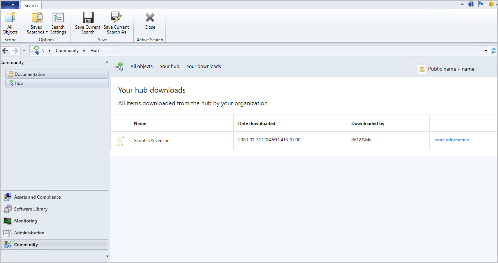

# Community hub and GitHub
<!--3555935, 3555936-->

The IT Admin community has developed a wealth of knowledge over the years. Rather than reinventing items like Scripts and Reports from scratch, we've built a **Configuration Manager Community hub** where IT Admins can share with each other. By leveraging the work of others, you can save hours of work. The Community hub fosters creativity by building on others work and having other people build on yours. GitHub already has industry-wide processes and tools built for sharing. Now, the Community hub will leverage those tools directly in the Configuration Manager Console as foundational pieces for driving this new community. For the initial release, the content made available in the Community hub will be uploaded only by Microsoft. In the future, IT Admins will be able to upload content on their own, using their own GitHub account.

> [!Note]  
> Community hub is an optional cloud-based feature. It was first introduced on June 9, 2020. For information on how to opt into Community hub, see [Optional features](install-in-console-updates.md#bkmk_options).

## About Community hub

Community hub supports the following objects:
- PowerShell Scripts
- Reports
- Task sequences
- Applications
- Configuration items  

## Prerequisites

- The device running the Configuration Manager console used to access the hub needs the following items:
   - Windows 10 build 17110 or higher
   - .NET Framework version 4.6 or higher

- To download reports, you need to turn on the option **Use Configuration Manager-generated certificates for HTTP site systems** at the site you're importing into. For more information, see [enhanced HTTP](/sccm/core/plan-design/hierarchy/enhanced-http).
   1. Go to **Administration** > **Site Configuration** > **Sites**.
   1. Select the site and choose **Properties** in the ribbon.
   1. On the **Communication Security** tab, select the option to **Use Configuration Manager-generated certificates for HTTP site systems**.

## Permissions

- To import a script: **Create** permission for **SMS_Scripts** class.
- To import a report: Full Administrator security role.

## Use the Community hub

1. Go to the **Community hub** node in the **Community** workspace.
1. Select an item to download.
1. You'll need appropriate permissions in your Configuration Manager site to download objects from the hub and import them into the site.
    - To import a script: **Create** permission for SMS_Scripts class.
    - To import a report: Full Administrator security role.
1. Downloaded reports are deployed to a report folder called **hub** on the reporting services point. Downloaded scripts can be seen in the **Run Scripts** node.
1. View all items downloaded from the hub by your organization by clicking on **Your downloads** from the **Community hub** node.

## Next steps

Learn more about creating and using the following objects:

- [Create and run PowerShell scripts](../../../apps/deploy-use/create-deploy-scripts.md)
- [Introduction to reporting](introduction-to-reporting.md)
- [Create and manage task sequences](../../../osd/deploy-use/manage-task-sequences-to-automate-tasks.md)
- [Create and deploy an application](../../../apps/get-started/create-and-deploy-an-application.md)
- [Create configuration items](../../../compliance/deploy-use/create-configuration-items.md)