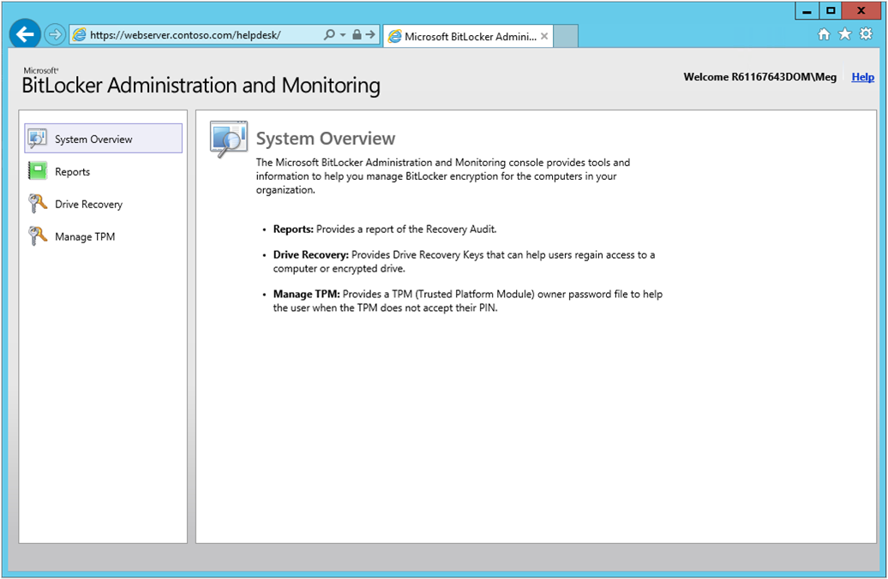
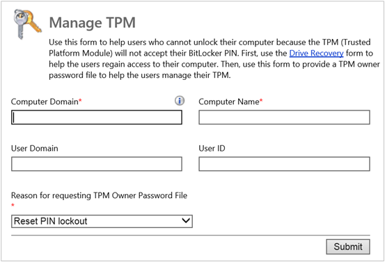
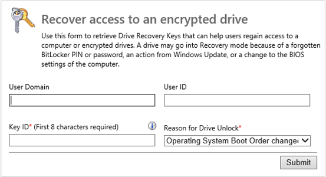

# BitLocker administration and monitoring website

*Applies to: Configuration Manager (current branch)*

<!--3601034-->

The BitLocker administration and monitoring website is an administrative interface for BitLocker Drive Encryption. It's also referred to as the help desk portal. Use this website to review reports, recover users' drives, and manage device TPMs.

Before you can use it, install this component on a web server. For more information, see [Set up BitLocker reports and portals](setup-websites.md).

Access the administration and monitoring website via the following URL: `https://webserver.contoso.com/HelpDesk`

> [!NOTE]
> You can view the **Recovery Audit Report** in the administration and monitoring website. You add other BitLocker management reports to the reporting services point. For more information, see [View BitLocker reports](view-reports.md).

## Groups

To access specific areas of the administration and monitoring website, your user account needs to be in one of the following groups. Create these groups in Active Directory using any name you want. When you install this website, you specify these group names. For more information, see [Set up BitLocker reports and portals](setup-websites.md).

|Group|Description|
|--- |--- |
|BitLocker help desk admins|Provides access to all areas of the administration and monitoring website. When you help a user recover their drives, you enter only the recovery key, and not the domain and user name. If a user is a member of both this group and the BitLocker help desk users group, the admin group permissions override the user group permissions.|
|BitLocker help desk users|Provides access to the **Manage TPM** and **Drive Recovery** areas of the administration and monitoring website. When you use either area, you need to fill in all fields including the user's domain and account name. If a user is a member of both this group and the BitLocker help desk admins group, the admin group permissions override the user group permissions.|
|BitLocker report users|Provides access to the **Reports** area of the administration and monitoring website.|

## Manage TPM

If a user enters the incorrect PIN too many times, they can lockout the TPM. The number of times that a user can enter an incorrect PIN before the TPM locks varies from manufacturer to manufacturer. From the **Manage TPM** area of the administration and monitoring website, access the centralized key recovery data system.

For more information about TPM ownership, see [Configure MBAM to escrow the TPM and store OwnerAuth passwords](/microsoft-desktop-optimization-pack/mbam-v25/mbam-25-security-considerations#bkmk-tpm).

> [!NOTE]
> Starting with Windows 10, version 1607, Windows doesn't keep the TPM owner password when provisioning the TPM.

1. Go to the administration and monitoring website in the web browser, for example `https://webserver.contoso.com/HelpDesk`.

1. In the left pane, select the **Manage TPM** area.

    

1. Enter the fully qualified domain name for the computer and the computer name.

1. If necessary, enter the user's domain and user name to retrieve the TPM owner password file.

1. Choose one of the following options for the **Reason for requesting TPM owner password file**:

    - Reset PIN lockout
    - Turn on TPM
    - Turn off TPM
    - Change TPM password
    - Clear TPM
    - Other

    After you **Submit** the form, the website returns one of the following responses:

    - If it can't find a matching TPM owner password file, it returns an error message.

    - The TPM owner password file for the submitted computer

    After you retrieve the TPM owner password file, the website displays the owner password.

1. To save the password to a file, select **Save**.

1. In the **Manage TPM** area, select the **Reset TPM lockout** option, and provide the TPM owner password file.

    The TPM lockout is reset. BitLocker restores the user's access to the device.

    > [!IMPORTANT]
    > Don't share the TPM hash value or TPM owner password file.

## Drive recovery

###  Recover a drive in recovery mode

Drives go into recovery mode in the following scenarios:

- The user loses or forgets their PIN or password
- The Trusted Module Platform (TPM) detects changes to the BIOS or startup files of the computer

To get a recovery password, use the **Drive recovery** area of the administration and monitoring website.

> [!IMPORTANT]
> Recovery passwords expire after a single use. On OS drives and fixed data drives, the single-use rule automatically applies. On removable drives, it applies when you remove and reinsert the drive.

1. Go to the administration and monitoring website in the web browser, for example `https://webserver.contoso.com/HelpDesk`.

1. In the left pane, select the **Drive Recovery** area.

    

1. If necessary, enter the user's domain and user name to view recovery information.

1. To see a list of possible matching recovery keys, enter the first eight digits of the recovery key ID. To get the exact recovery key, enter the entire recovery key ID.

1. Choose one of the following options as the **Reason for Drive Unlock**:

    - Operating system boot order changed
    - BIOS changed
    - Operating system files modified
    - Lost startup key
    - Lost PIN
    - TPM reset
    - Lost passphrase
    - Lost smartcard
    - Other

    After you **Submit** the form, the website returns one of the following responses:

    - If the user has multiple matching recovery passwords, it returns multiple possible matches.

    - The recovery password and recovery package for the submitted user.

        > [!NOTE]
        > If you're recovering a damaged drive, the recovery package option provides BitLocker with critical information that it needs to recover the drive.

    - If it can't find a matching recovery password, it returns an error message.

    After you retrieve the recovery password and recovery package, the website displays the recovery password.

1. To copy the password, select **Copy Key**. To save the recovery password to a file, select **Save**.

To unlock the drive, enter the recovery password or use the recovery package.

###  Recover a moved drive

When you move a drive to a new computer, because the TPM is different, BitLocker doesn't accept the previous PIN. To recover the moved drive, get the recovery key ID to retrieve the recovery password.

To recover a moved drive, use the **Drive recovery** area of the administration and monitoring website.

1. On the computer with the moved drive, start the computer in Windows Recovery Environment (WinRE) mode.

1. In WinRE, BitLocker treats the moved OS drive as a fixed data drive. BitLocker displays the drive's recovery password ID and prompts for the recovery password.

    > [!NOTE]
    > In some situations, during the startup process select **I forgot the PIN** if the option is available. Then enter recovery mode to display the recovery key ID.

1. Use the recovery key ID to get the recovery password from the administration and monitoring website. For more information, see [Recover a drive in recovery mode](#bkmk_recovery).

If you configured the moved drive to use a TPM chip on the original computer, complete the following steps. Otherwise, the recovery process is complete.

1. After you unlock the drive, start the computer in WinRE mode. Open a command prompt in WinRE, and use the `manage-bde` command to decrypt the drive. This tool is the only way to remove the **TPM + PIN** protector without the original TPM chip. For more information about this command, see [Manage-bde](/windows/security/information-protection/bitlocker/bitlocker-use-bitlocker-drive-encryption-tools-to-manage-bitlocker#bkmk-managebde).

1. When it's complete, start the computer normally. Configuration Manager will enforce the BitLocker policy to encrypt the drive with the new computer's TPM plus PIN.

###  Recover a corrupted drive

Use the recovery key ID to get a recovery key package from the administration and monitoring website. For more information, see [Recover a drive in recovery mode](#bkmk_recovery).

1. Save the **Recovery Key Package** on your computer, then copy it to the computer with the corrupted drive.

1. Open a command prompt as an administrator, and type the following command:

    `repair-bde <corrupted drive> <fixed drive> -kp <key package> -rp <recovery password>`

    Replace the following values:

    - `<corrupted drive>`: The drive letter of the corrupted drive, for example `D:`
    - `<fixed drive>`: The drive letter of an available hard disk drive of similar or larger size than the corrupted drive. BitLocker recovers and moves data on the corrupted drive to the specified drive. All data on this drive is overwritten.
    - `<key package>`: The location of the recovery key package
    - `<recovery password>`: The associated recovery password

    For example:

    `repair-bde C: D: -kp F:\RecoveryKeyPackage -rp 111111-222222-333333-444444-555555-666666-777777-888888`

For more information about this command, see [Repair-bde](/windows/security/information-protection/bitlocker/bitlocker-use-bitlocker-drive-encryption-tools-to-manage-bitlocker#bkmk-repairbde).

## Reports

The administration and monitoring website includes the **Recovery Audit Report**. Other reports are available from the Configuration Manager reporting services point. For more information, see [View BitLocker reports](view-reports.md).

1. Go to the administration and monitoring website in the web browser, for example `https://webserver.contoso.com/HelpDesk`.

1. In the left pane, select the **Reports** area.

1. From the top menu bar, select the **Recovery Audit Report**.

For more information on this report, see [Recovery Audit Report](view-reports.md#bkmk-audit)

> [!TIP]
> To save report results, select **Export** on the **Reports** menu bar.