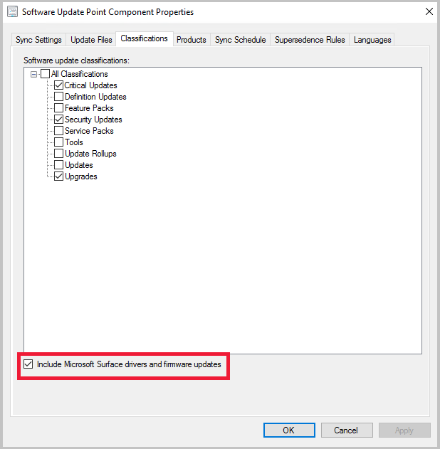
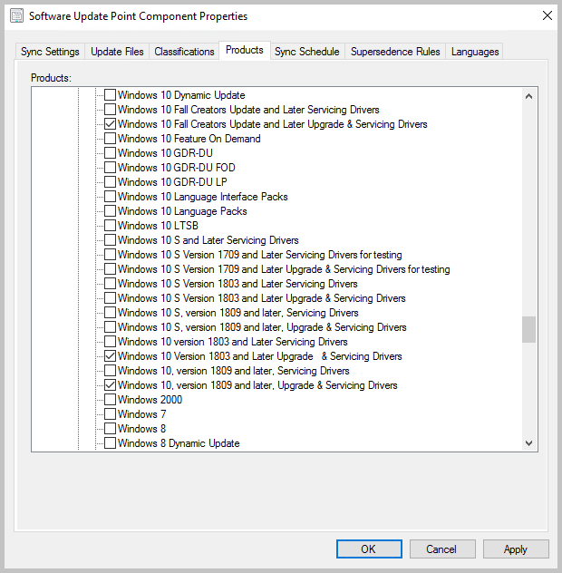
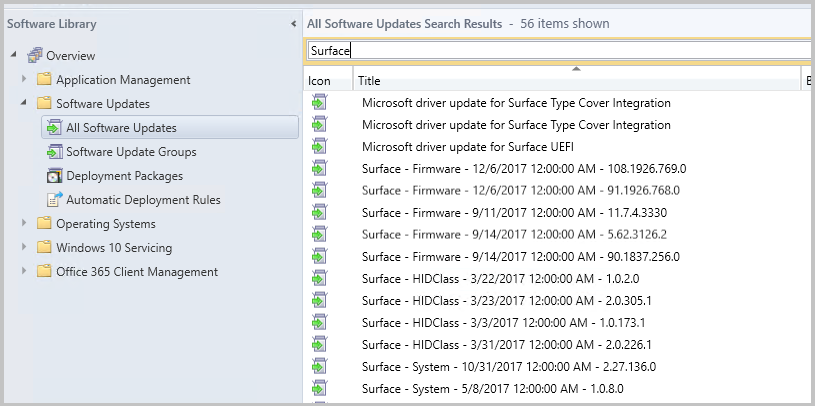

# Manage Surface drivers with Configuration Manager

*Applies to: System Center Configuration Manager (Current Branch)*

System Center Configuration Manager allows you to synchronize drivers for Surface devices and deploy them like a software update. This functionality allows you to ensure that your Surface devices are running the latest available drivers. This synchronization was first introduced in version 1706 as a pre-release feature and it became a feature in 1710. <!--3684621, 3608197, 1098490-->

## Prerequisites for synchronizing Surface drivers

- An internet connected top-level software update point.
- All software update points must run Windows Server 2016 with cumulative update KB4025339 or later installed.
- Configuration Manager doesn't enable this optional feature by default. Enable this feature before using it. For more information, see [Enable optional features from updates](../../core/servers/manage/install-in-console-updates.md#bkmk_options).<!--505213-->  

## Enable sync for Surface drivers

To enable synchronization of Surface drivers, do following steps:

1. Connect the Configuration Manger console to the top-level site server.
1. Go to **Administration** > **Site Configuration** > **Sites**, then click on your top-level site.
1. In the ribbon, select **Settings** > **Configure Site Components** > **Software Update Point**.
1. Click on the **Classifications** tab, then click the checkbox for **Include Microsoft Surface drivers and firmware updates** and click **Apply**.

     

1. In the Software Update Point Component Properties, click the **Products** tab. For more information, see the [Products for Surface drivers](#bkmk_prod) and [Surface Models](#bkmk_models) sections.
1. Select the products for each version of Windows 10 for which you would like to support Surface drivers. You'll notice that there are two different versions of each of the products for drivers:

   - Windows 10 *version* **Update and later Servicing Drivers**
   - Windows 10 *version* **Update and later Upgrade & Servicing Drivers**.

     

1. When you have finished selecting the products, click **OK**.
1. [Synchronize your software update point](../get-started/synchronize-software-updates.md) to bring the Surface drivers into Configuration Manager.
1. Once the Surface drivers are synchronized, deploy them  in the same manner as you deploy other updates.

## <a name="bkmk_prod"></a> Products for Surface drivers

Most drivers belong to the following product groups:

- Windows 10 and later version drivers
- Windows 10 and later Upgrade & Servicing Drivers
- Windows 10 Anniversary Update and Later Servicing Drivers
- Windows 10 Anniversary Update and Later Upgrade & Servicing Drivers
- Windows 10 Creators Update and Later Servicing Drivers
- Windows 10 Creators Update and Later Upgrade & Servicing Drivers
- Windows 10 Fall Creators Update and Later Servicing Drivers
- Windows 10 Fall Creators Update and Later Upgrade & Servicing Drivers
- Windows 10 S and Later Servicing Drivers
- Windows 10 S Version 1709 and Later Servicing Drivers for testing
- Windows 10 S Version 1709 and Later Upgrade & Servicing Drivers for testing
- Windows 10 S Version 1803 and Later Servicing Drivers
- Windows 10 S Version 1803 and Later Upgrade & Servicing Drivers
- Windows 10 S version 1809 and later, Servicing Drivers
- Windows 10 S version 1809 and later, Upgrade & Servicing Drivers
- Windows 10 S version 1903 and later, Servicing Drivers
- Windows 10 S version 1903 and later, Upgrade & Servicing Drivers
- Windows 10 Version 1803 and Later Servicing Drivers
- Windows 10 Version 1803 and Later Upgrade & Servicing Drivers
- Windows 10 version 1809 and later, Servicing Drivers
- Windows 10 Version 1809 and later, Upgrade & Servicing Drivers
- Windows 10 version 1903 and later, Servicing Drivers
- Windows 10 Version 1903 and later, Upgrade & Servicing Drivers

> [!NOTE]
> Most Surface drivers belong to multiple Windows 10 product groups. You may not have to select all the products that are listed here. To help reduce the number of products that populate your Update Catalog, we recommend that you select only the products that are required by your environment for synchronization.

## <a name="bkmk_models"></a> Surface models

The following table contains the Surface models and versions of Windows 10 on which Configuration Manager can install drivers. Surface driver updates aren't available in Configuration Manager the same day they're published to the Microsoft Update catalog. Configuration Manager maintains its own list of which Surface drivers it will import. Devices needing Windows 10 S products are noted. Microsoft aims to get the Surface drivers added to the allow list on the second Tuesday each month to make them available for synchronization to Configuration Manager. For more information, see [Frequently asked questions](#bkmk_faq).

</br>

|Surface Model|Windows 10 1709| Windows 10 1803|Windows 10 1809|Windows 10 1903|Windows 10 1909|
|----|----|----|----|----|----|
|Surface Pro 3|Yes| Yes| Yes |Yes|Yes|
|Surface Pro 4|Yes| Yes| Yes |Yes|Yes|
|Surface Pro 6|N/A| Yes| Yes |Yes|Yes|
|Surface Pro 7|N/A| N/A| N/A |Yes|Yes|
|Surface Pro X|N/A| N/A| N/A |Yes|Yes|
|Surface Book|Yes| Yes| Yes |Yes|Yes|
|Surface Book 2|Yes| Yes| Yes |Yes|Yes|
|Surface Book 3|N/A| N/A| N/A |Yes|Yes|
|Surface Laptop|Yes, with the product "Windows 10 S version 1709 and later Servicing drivers" selected| Yes, with the product "Windows 10 S version 1803 and later Servicing drivers" selected|Yes, with the product "Windows 10 S version 1809 and later Upgrade & Servicing drivers" selected|Yes, with the product "Windows 10 S version 1903 and later Upgrade & Servicing drivers" selected|Yes, with the product "Windows 10 S version 1903 and later Upgrade & Servicing drivers" selected|
|Surface Laptop 2|N/A| Yes |Yes|Yes|Yes|
|Surface Laptop 3|N/A| N/A|N/A|Yes |Yes|
|Surface Go|N/A| Yes, with the product "Windows 10 S version 1803 and later Servicing drivers" selected|Yes, with the product "Windows 10 S version 1809 and later Upgrade & Servicing drivers" selected|Yes, with the product "Windows 10 S version 1903 and later Upgrade & Servicing drivers" selected|Yes, with the product "Windows 10 S version 1903 and later Upgrade & Servicing drivers" selected|
|Surface Go 2|N/A| N/A| Yes |Yes|Yes, with the product "Windows 10 S version 1903 and later Upgrade & Servicing drivers" selected|
|Surface Studio|Yes| Yes| Yes |Yes|Yes|
|Surface Studio 2|N/A| Yes| Yes |Yes|Yes|

## Verify the configuration

To verify the software update point is configured correctly, use the **WsyncMgr.log** and the **WCM.log**.

1. Open WsyncMgr.log and check for the following log entry:

    ```text
    Surface Drivers can be supported in this hierarchy since all software update points are on Windows Server 2016, WCM SCF property Sync Catalog Drivers is set. 
    …
    Sync Catalog Drivers SCF value is set to : 1
    ```

1. If either of the following entries are logged in **WsyncMgr.log**, double check that you selected the **Include Microsoft Surface drivers and firmware updates** option in the properties of your software update point:
   - `Sync Surface Drivers option is not set`
   - `Sync Catalog Drivers SCF value is set to : 0`

1. Open **WCM.log** and look for items resembling the following entries:
   ```text
   <Categories>
   <Category Id="Product:05eebf61-148b-43cf-80da-1c99ab0b8699"><![CDATA[Windows 10 and later drivers]]></Category>
   <Category Id="Product:06da2f0c-7937-4e28-b46c-a37317eade73"><![CDATA[Windows 10 Creators Update and Later Upgrade & Servicing Drivers]]></Category>
   <Category Id="Product:c1006636-eab4-4b0b-b1b0-d50282c0377e"><![CDATA[Windows 10 S and Later Servicing Drivers]]></Category>
   … …
   </Categories>
   ```

   This entry is an XML element that lists every product group and classification that's currently synchronized by your software update point server. If you can't find the products that you've selected, double-check the products for the software update point are saved.
1. You can also wait until the next synchronization finishes. Then, check whether the Surface driver and firmware updates are listed in Software Updates in the Configuration Manager console. For example, the console might display the following information:
   

##  <a name="bkmk_faq"></a> Frequently asked questions (FAQ)

### After I follow the steps in this article, my Surface drivers are still not synchronized. Why?

If you synchronize from an upstream Windows Server Update Services (WSUS) server, instead of Microsoft Update, make sure that the upstream WSUS server is configured to support and synchronize Surface driver updates. All downstream servers are limited to updates that are present in the upstream WSUS server database.

There are more than 68,000 updates that are classified as drivers in WSUS. To prevent non-Surface related drivers from synchronizing to Configuration Manager, Microsoft filters driver synchronization against an allow list. After the new allow list is published and incorporated into Configuration Manager, the new drivers are added to the console following the next synchronization. Microsoft aims to get the Surface drivers added to the allow list on the second Tuesday each month to make them available for synchronization to Configuration Manager.

If your Configuration Manager environment is offline, a new allow list is imported every time you import [servicing updates](../../core/servers/manage/use-the-service-connection-tool.md) to Configuration Manager. You will also have to import a [new WSUS catalog](../get-started/synchronize-software-updates-disconnected.md) that contains the drivers before the updates are displayed in the Configuration Manager console. Because a stand-alone WSUS environment contains more drivers than a Configuration Manager SUP, we recommend that you establish a Configuration Manager environment that has online capabilities, and that you configure it to synchronize Surface drivers. This provides a smaller WSUS export that closely resembles the offline environment.

If your Configuration Manager environment is online and able to detect new updates, you will receive updates to the list automatically. If you don’t see the expected drivers, please review the WCM.log and WsyncMgr.log for any synchronization failures.

### My Configuration Manager environment is offline, can I manually import Surface drivers into WSUS?

No. Even if the update is imported into WSUS, the update won't be imported into the Configuration Manager console for deployment if it isn't listed in the allow list. You must use the [Service Connection Tool](../../core/servers/manage/use-the-service-connection-tool.md) to import servicing updates to Configuration Manager to update the allow list.

### What alternative methods do I have to deploy Surface driver and firmware updates?

For information about how to deploy Surface driver and firmware updates through alternative channels, see [Manage Surface driver and firmware updates](https://docs.microsoft.com/surface/manage-surface-driver-and-firmware-updates). If you want to download the .msi or .exe file, and then deploy through traditional software deployment channels, see [Keeping Surface Firmware Updated with Configuration Manager](https://docs.microsoft.com/archive/blogs/thejoncallahan/keeping-surface-firmware-updated-with-configuration-manager).

## Next steps

For more information about Surface drivers, see the following articles:

- [Considerations for Surface and System Center Configuration Manager](https://docs.microsoft.com/surface/considerations-for-surface-and-system-center-configuration-manager#deploy-surface-app-with-configuration-manager)
- [Surface Update History](https://support.microsoft.com/help/4036283/surface-surface-update-history)
- [Download the latest firmware and drivers for Surface devices](/surface/manage-surface-driver-and-firmware-updates)
