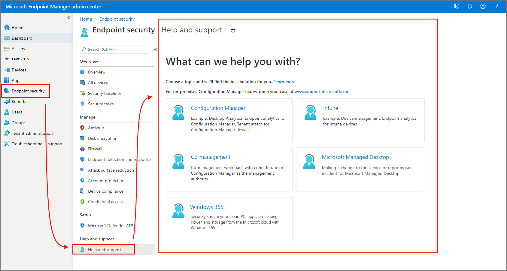
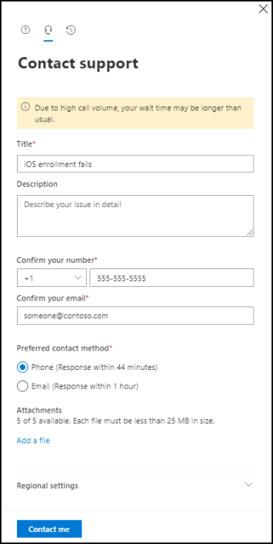
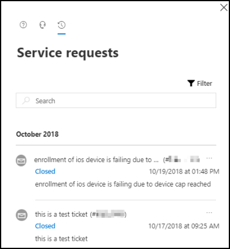

---
# required metadata

title: Get support in Microsoft Endpoint Manager admin center 
titleSuffix: Microsoft Intune
description: Get online and telephone support for Microsoft Intune and other device management cloud services from within Microsoft Endpoint Manager admin center. 
keywords:
author: brenduns
ms.author: brenduns
manager: dougeby
ms.date: 03/25/2022
ms.topic: how-to
ms.service: mem
ms.subservice: fundamentals
ms.localizationpriority: high
ms.technology:
ms.assetid: 
# optional metadata
 
#audience:
#ms.devlang:
ms.reviewer: hipethe
ms.suite: ems
search.appverid: MET150
#ms.tgt_pltfrm:
ms.custom: intune-classic
ms.collection:
  - M365-identity-device-management
  - highpri
---
 
# How to get support in Microsoft Endpoint Manager admin center

Microsoft provides global technical, pre-sales, billing, and subscription support for device management cloud-based services, including Intune, Configuration Manager, Windows 365, and Microsoft Managed Desktop. You can access support for all of these from **Help and Support** in the Microsoft Endpoint Manager admin center. In this article, we explain how to get to Help and support and review your different support options from within the admin center.

Support is available both online and by phone for paid and trial subscriptions. Online technical support is available in English and Japanese. Phone support and online billing support are available in additional languages.

## Access Help and support

Use one of the following links to open the Microsoft Endpoint Manager admin center. The link you use depends on how your tenant is hosted:

- **Public cloud**: Use [https://endpoint.microsoft.com](https://go.microsoft.com/fwlink/?linkid=2109431)
- **Private cloud** for government, which is also known as a sovereign cloud like Azure Government: Use [https://endpoint.microsoft.us](https://endpoint.microsoft.us)

From within the admin center, use one of the following methods to access Help and support:

- Go to **Troubleshooting + support** > **Help and support** to open the *Help and support* pane.

- From any node in the admin center, select **Help and support** to open the *Help and support* pane.

- From any node in the admin center, select the **?** icon in the upper-right corner to open the *Help* pane. Then, select **Help + support** to open the *Help and support* pane

The following image is an example of accessing help and support for Microsoft Intune by navigating to the Endpoint security node for Intune, and then selecting Help and support.

> 

On the **Help and support** pane, select a tile to focus support on the scenario you are seeking assistance for. The following information can help you choose the correct focus:

- **Intune**:
  - Managing devices with Intune
  - Endpoint analytics for Intune devices

- **Configuration Manager**:
  - Desktop Analytics
  - Endpoint analytics for Configuration Manager devices
  - Tenant attach for Configuration Manager devices

  For issues with **on-premises Configuration Manager**, open your case at [www.support.microsoft.com](https://support.microsoft.com).

- **Co-management**:
  - [Co-management workloads](./configmgr/comanage/workloads.md) with Intune or Configuration Manager as the management authority

- **Microsoft Managed Desktop**:
  
  *This tile is available only to Microsoft Managed Desktop customers.*

  - Information requests for the Microsoft Managed Desktop tenant or configuration
  - Change requests to the configuration of Microsoft Managed Desktop devices
  - Reporting an incident or outage

  If you are a Microsoft Managed Desktop customer, selecting that tile for Microsoft Managed Desktop related issues will take you to the Service Requests page. For more information on Service Requests, see [Admin support for Microsoft Managed Desktop](/microsoft-365/managed-desktop/working-with-managed-desktop/admin-support?view=o365-worldwide&preserve-view=true).

- **Windows 365**:
  - When you have a subscription for Windows 365, this tile opens Help and support for Windows 365.

> [!TIP]  
> Help and Support might fail to open for newly created tenants, and the following message is presented:
>
> - *We encountered an unknown problem. Please refresh the page but if the problem persists, please create a case through [M365 Admin Center](https://admin.microsoft.com) and reference the session ID provided.*
>
> The error details include a *Session ID*, *Extension* details, and more.
>
> This problem occurs when you've not authenticated and accessed the *How can we help?* page from your new tenant account through either the **Microsoft 365 Admin Center** at [https://admin.microsoft.com](https://admin.microsoft.com), or the **Office 365 portal** at [https://portal.office.com](https://portal.office.com). To resolve this problem, select the link for *Microsoft 365 Admin Center* in the message, or visit [https://portal.office.com](https://portal.office.com), and sign in. Following authentication at either site, go to the Admin area and click the Need Help icon in the lower right.  After completing these steps *Help and Support* for Intune becomes accessible.

## Review your support options

After you select a support scenario, the admin center presents the Help and Support page where the support scenario you’ve selected appears at the top **(1)**. If the wrong support scenario was selected, you’ll need to go back to make a different selection.

:::image type="content" source="./media/get-support/confirm-management-selection.png" alt-text="View the How can we help window":::

Above the *How can we help?* title are three icons that you can select to open different panes: **Find solutions**, **Contact support**, and **Service requests**. The pane you’re viewing is identified by which icon is underlined. By default, the Help and support page opens to the **Find solutions** pane. However, if you have an active support case, then Help and support opens to the **Service requests** pane where you can view details about your active and closed support cases.

> [!TIP]  
> Customers with a **Premier** or **Unified** support contract have [additional options](#premier-and-unified-support-options) for support. If you've a Premier or Unified support contract, you'll see a banner similar to the following image:
>
> 

### Find solutions

On the **Find solutions** pane, specify a few details about an issue in the provided text box. As you enter details, the console might offer suggestions based on what you've entered. Depending on the presence of specific keywords, the console offers one of two support experiences, depending on what is available for the product you selected: the traditional support experience and the updated support experience.

#### Traditional experience

For products that use traditional support, when you enter keywords, the **Find solutions** pane returns one or more of the following options based on the details you provide:

- **Run diagnostics** – From the console you can start automated tests and investigations of your tenant that can reveal known issues. When you run a diagnostic, you might receive mitigation steps you can take to help resolve the issue.
- **View insights** – Find links to documentation that provide context and background specific to the product area or actions you’ve described.
- **Recommended articles** – Browse suggested to troubleshooting topics and other content related to the issue you’ve described.

For example, for Microsoft Intune you might enter **device enrollment failure**. With these criteria, your results include the option to run diagnostics for a user account:

:::image type="content" source="./media/get-support/troubleshooting-insights.png" alt-text="View of Need help pane with options to run diagnostics, view insights, and read recommended articles":::

Running the diagnostics can identify issues for that account in Azure Active Directory (Azure AD). In this example, the user wasn’t assigned a license for Intune, preventing the device enrollment, and we see a link to relevant content:

:::image type="content" source="./media/get-support/diagnostic-resuslts.png" alt-text="View the diagnostic results":::

#### Updated support experience

*This support experience is currently available for Intune and Co-management.*

Some keywords will lead to an enhanced experience that helps you drill down to more scenario-specific support. For example, if you're using Microsoft Intune and enter a generic search for *Need help with Intune*, the console offers several more focused scenarios you can select clarify the problem and find more focused results.

:::image type="content" source="./media/get-support/scenarios-example.png" alt-text="View of the scenario options":::

When you select a scenario, new options are offered to help narrow down the issue.

:::image type="content" source="./media/get-support/drill-in-scenarios.png" alt-text="View of scenario options":::

When presented, you can run automated tests or diagnostics where applicable, and view insightful information to help troubleshoot the problem. You might also see remediation steps to help you fix the issue.

### Contact support

If you have administrative access to the admin center, you will see the **Contact Support** option which you can use to file an online support ticket for a supported service. This pane is available after you provide some basic keywords on the **Find solutions** pane.

:::image type="content" source="./media/get-support/contact-support.png" alt-text="Select the contact support icon":::

To create and manage a support incident, your account must have an Azure AD role that includes the *action* **microsoft.office365.supportTickets**. Guest users are an exception. They can't file support tickets, even when granted the correct action. For information about Azure AD roles and permissions that are required to create a support ticket, see [administrator roles in Azure Active Directory](/azure/active-directory/active-directory-assign-admin-roles-azure-portal).

> [!IMPORTANT]  
> For technical support with third-party products that work with Intune (like Saaswedo, Cisco, or Lookout), contact the supplier of that product first. Before you open a request with Intune support, make sure you configured the other product correctly.

When requesting assistance, provide a description of the problem with as much detail as needed. After confirming your phone and email contact information, select the method of contact you prefer. The window displays a response time for each contact method, which gives you an expectation of when you'll be contacted. Before submitting your request, attach files like logs or screenshots that can help fill in details about the issue.

After you fill in the required information, select **Contact me** to submit the request.

### Service requests

The **Service requests** pane displays your case history. Active cases are at the top of the list, with closed issues also available for review.

If you have an active support case number, you can enter it here to jump to that issue, or you can select any incident from the list of active and closed incidents to view more information about it.

When you're done viewing details for an incident, select the left arrow that appears at the top of the service request window just above the icons for the **How can we help?** pane icons. The back arrow returns the display to the list of support incidents you've opened.

## Premier and Unified support optionss

As a customer with a **Premier** or **Unified** support contract, you can specify a severity for your issue, and schedule a support callback for a specific time and day. These options are available when you open or submit a new issue and when you edit an active support case.

**Severity** - The options to specify the severity of an issue depend on your support contract:

- *Premier*: Severity of A, B, or C
- *Unified*: Critical, or non-critical

Selecting either a severity **A** or **Critical** issue limits you to a phone support case, which provides the fastest option to get support.

**Callback schedule** - You can request a callback on a specific day and time.

## Next steps

- [Billing and subscription management support](https://support.office.com/article/Contact-Office-365-for-business-support-Admin-Help-32a17ca7-6fa0-4870-8a8d-e25ba4ccfd4b)
- [Use the troubleshooting portal to help users at your company](./intune/fundamentals/help-desk-operators.md)
- [Microsoft Intune troubleshooting documentation](/troubleshoot/mem/intune/welcome-intune)
- [Volume licensing](https://go.microsoft.com/fwlink/p/?LinkID=282015)
