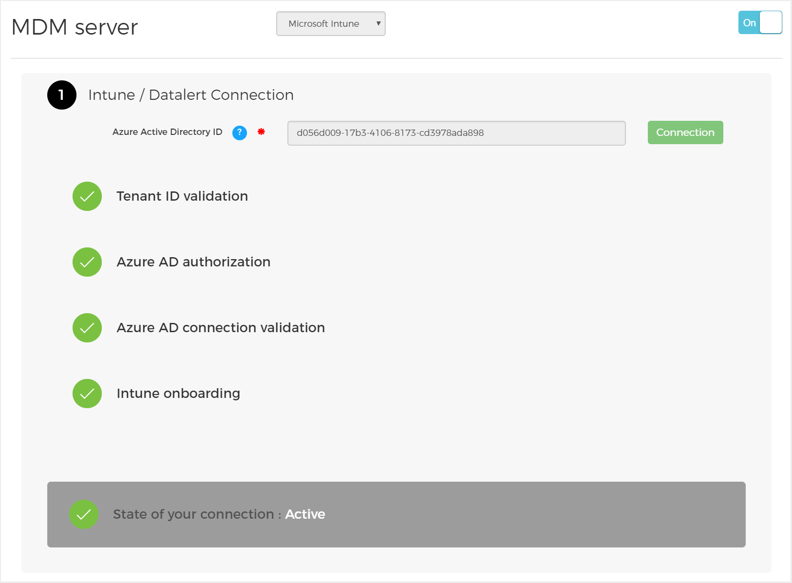
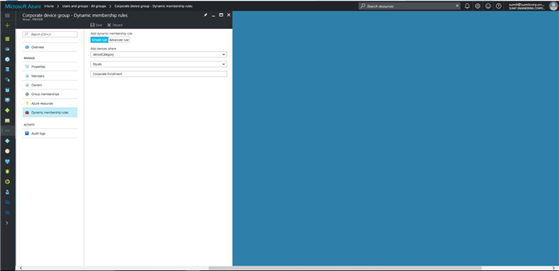
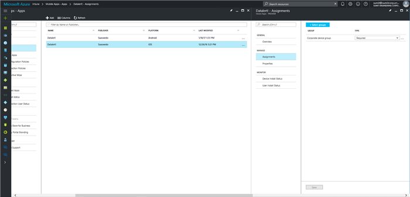
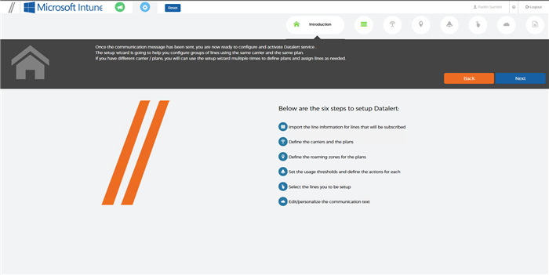

# Set up a telecom expense management service in Intune

Using Intune, you can manage telecom expenses from data usage on organization-owned mobile devices. Intune integrates with Saaswedo’s [Datalert telecom expense management](http://datalert.biz/get-started). Datalert is a real-time telecom expense management solution that manages telecom data usage. It can help avoid costly and unexpected data and roaming charges for your Intune-managed devices.

The integration with Datalert can set, monitor, and enforce roaming and domestic data usage limits. When the limits exceed your defined thresholds, alerts are automatically triggered. You can also configure the service to apply different actions, such as disabling roaming or exceeding the threshold, to individuals or groups. The Datalert management console includes reports that show data usage and monitoring information.

The following image shows how Intune integrates with Datalert:

  

To use the Datalert service with Intune, there are some configuration settings in Datalert and Intune. This article shows you how to:

- Configure settings in the Datalert console to connect the Datalert service to Intune.
- Confirm this connection is active and enabled in Intune.
- Use Intune to add the Datalert app to your devices.
- Turn off the Datalert service and for Intune (optional).

## Supported platforms

- Android 4.4 and newer devices that are Knox capable (Samsung)

  [Android versions that support Knox](https://seap.samsung.com/faq/what-versions-android-support-knox-standard-and-knox-premium-sdks-0) (opens Samsung's web site) lists the Knox supported versions.

- iOS 8.0 and newer
- iPadOS 13.0 and newer

## Prerequisites

- A subscription to Microsoft Intune, and access to the [Microsoft Endpoint Manager admin center](https://go.microsoft.com/fwlink/?linkid=2109431)
- A subscription to [Datalert](http://www.datalert.biz/) (opens Datalert's web site)

## Telecom expense management providers

Intune integrates with the following telecom expense management provider:

- [Saaswedo Datalert telecom expense management service](http://www.datalert.biz/) (opens Datalert's web site)

## Deploy the Intune and Datalert solution

### Step 1: Connect the Datalert service to Intune

1. Sign in to the Datalert management console with administrator credentials.

2. In the console, go to the **Settings** tab > **MDM configuration**.

3. Select **Unblock**. **Unblock** allows you to change or update the settings on the page.

4. In **Intune / Datalert Connection** > **Server MDM**, select **Microsoft Intune**.

5. For **Azure AD domain**, enter your Azure tenant ID. Select **Connection**.

    When you select **Connection**, the Datalert service checks in with Intune. It confirms there aren't any existing Datalert connections. After a few moments, a Microsoft sign in page appears, followed by the Datalert Azure authentication.

6. On the Microsoft authentication page, select **Accept**.

    You're redirected to a Datalert **thank you** page that closes after a few moments. Datalert validates the connection, and shows green check marks next to the items that validated. If validation fails, you see a message in red. Contact Datalert support for help.

    The following image shows the green check marks when the connection succeeds:

      

7. In **Datalert App / ADAL Consent**, set the switch to **On**. On the Microsoft authentication page, select **Accept**.

    You're redirected to a Datalert **thank you** page that closes after a few moments. Datalert validates the connection, and shows green check marks next to the items that validated. If validation fails, you see a message in red. Contact Datalert support for help.

    The following image shows the green check marks when the connection succeeds:

      

8. In **MDM Profiles management (optional)**, set the switch to **On**. This setting allows Datalert to read the available profiles in Intune to help you set up policies. 

    On the Microsoft authentication page, select **Accept**.

    You're redirected to a Datalert **thank you** page that closes after a few moments. Datalert validates the connection, and shows green check marks next to the items that validated. If validation fails, you see a message in red. Contact Datalert support for help.

    The following image shows the green check marks when the connection succeeds:

   

### Step 2: Confirm telecom expense management is active in Intune

After you complete Step 1, your connection is automatically enabled. In Intune, the connection status shows **Active**. To confirm the status is active, use the following steps:

1. Sign in to the [Microsoft Endpoint Manager admin center](https://go.microsoft.com/fwlink/?linkid=2109431).

2. Select **Tenant administration** > **Connectors and tokens** > **Telecom Expense Management**. Look for the **Active** connection status:

   

### Step 3: Deploy the Datalert app to devices

To confirm that data usage from only organization-owned lines is collected, be sure to:

- Create device categories in Intune.
- Target the Datalert app to only organizational phones.

This section lists these steps.

#### Create device categories and device groups mapped to your categories

Depending on your organizational needs, create at least two device categories, such as Corporate and Personal. Then, create dynamic device groups for each category. You can create more categories for your organization, as needed.

To create device categories in Intune, see [map devices to groups](../enrollment/device-group-mapping.md).

These categories are shown to users during enrollment ([enroll Android devices](../enrollment/android-enroll.md)). Depending on the category users choose, the enrolled device is moved to the corresponding device group.

  

#### Add the Datalert app to Intune

The following steps add the Datalert app. As an example, iOS/iPadOS is used. [Add apps](../apps/apps-add.md) and [use scope tags](../fundamentals/scope-tags.md) have more specific information on these steps.

1. In the [Microsoft Endpoint Manager admin center](https://go.microsoft.com/fwlink/?linkid=2109431), select **Apps** > **All apps** > **Add**.

2. Select your **App type**. For example, for iOS/iPadOS, select **Store App - iOS/iPadOS**.

3. In **Search the App Store**, type **Datalert** to find the Datalert app.

4. Choose the **Datalert** app > **Select**:

   

5. Enter any additional properties, such as app information and scope tags:

   

6. Select **OK** > **Add** to save your changes. The Datalert app is shown in the list.

#### Assign the Datalert app to the corporate device group

1. In **Apps** > **All apps**, select the Datalert app you added in the previous step.

2. Select **Assignments** > **Add group**. Choose how the app is assigned. [Assign apps to groups in Intune](../apps/apps-deploy.md) has more details on these settings.

    In these steps, you'll choose to make the app installation required or optional for the group. The following example shows the installation as required. When required, users must install the Datalert app after enrolling their device.

   

### Step 4: Add organization phone lines to the Datalert console

Intune and Datalert services are now configured to communicate with each other. Next, add your organization paid phone lines to the Datalert console. And, enter thresholds and actions for any cellular or roaming usage violations. You can manually add corporate paid phone lines to the Datalert console, or automatically add them after the device is enrolled in Intune.

To set these items, go to the [Datalert setup for Microsoft Intune](http://www.datalert.fr/microsoft-intune/intune-setup) (opens Datalert's web site). Under the **Settings** tab, follow the steps in the setup wizard.

  

The Datalert service is now active. It starts monitoring data usage, and disabling cellular and roaming data on devices that exceed the configured usage limits.

## End user enrollment

For the end-user experience, the following articles may help:

- [Enroll your iOS/iPadOS device in telecom expense management](https://docs.microsoft.com/user-help/enroll-your-device-with-telecom-expense-management-ios)
- [Enroll your Android device in telecom expense management](https://docs.microsoft.com/user-help/enroll-your-device-with-telecom-expense-management-android)

## Turn off the Datalert service

1. In the [Microsoft Endpoint Manager admin center](https://go.microsoft.com/fwlink/?linkid=2109431), select **Tenant administration** > **Connectors and tokens** > **Telecom Expense Management**.
2. Set **Enable Telecom Expense Management and block cellular or roaming data on devices that exceed usage quotas you configure** to **Disable**.
3. **Save** your changes.

> [!IMPORTANT]
> If you disable the Datalert service in Intune:
>
> - All the actions that are applied to devices due to past violations of the usage limits, are undone.
> - Users are no longer blocked from data access and roaming.
> - Intune still receives the signals coming from the service, but Intune ignores the signals.

## Next steps

Data usage reporting is available in Saaswedo’s Datalert management console.
