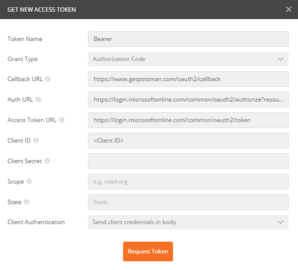
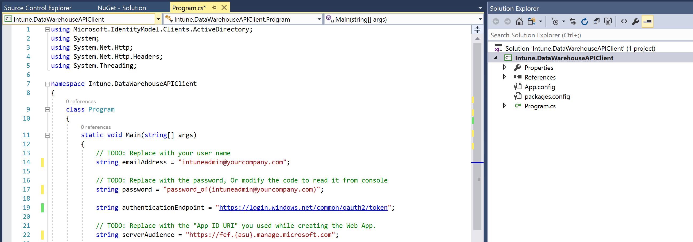
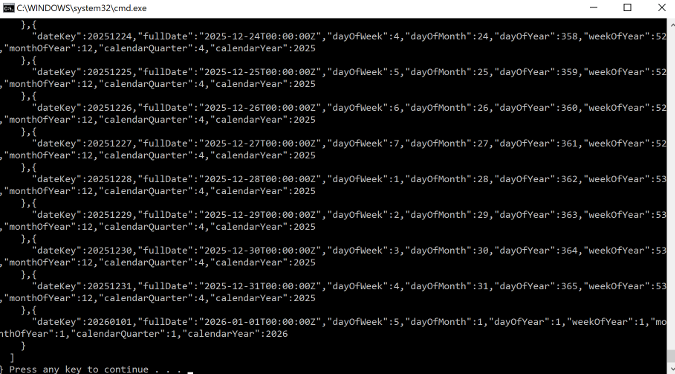

---
# required metadata
title: Get data from the Data Warehouse API with a REST client
titleSuffix: Microsoft Intune
description: This topic describes how to retrieve data from the Microsoft Intune Data Warehouse using a RESTful API.
keywords:
author: Erikre
ms.author: erikre
manager: dougeby
ms.date: 12/16/2021
ms.topic: reference
ms.service: microsoft-intune
ms.subservice: developer
ms.localizationpriority: medium
ms.technology:
ms.assetid: D6D15039-4036-446C-A58F-A5E18175720A

# optional metadata
#ROBOTS:
#audience:

ms.reviewer: jamiesil
ms.suite: ems
search.appverid: MET150
#ms.tgt_pltfrm:
ms.custom: intune-classic
ms.collection: M365-identity-device-management
---

# Get data from the Intune Data Warehouse API with a REST client

You can access the Intune Data Warehouse data model through RESTful endpoints. To gain access to your data, your client must authorize with Microsoft Azure Active Directory (Azure AD) using OAuth 2.0. To enable access, first set up a native app in Azure and grant permissions to the Microsoft Intune API. Your local client gets authorization, and then the client can communicate with the Data Warehouse endpoints through the native app.

The steps to set up a client to get data from the  Data Warehouse API require you to:

1. Create a client app as a native app in Azure
3. Grant the client app access to the Microsoft Intune API
3. Create a local REST client to get the data

Use the following steps to learn how to authorize and access the API with a REST client. First, you will look at using a generic REST client using Postman. Postman is a commonly used tool troubleshooting and developing REST clients to work with APIs. For more information about Postman, see the [Postman](https://www.getpostman.com) site. Then you can look at a C# code sample. The sample provides an example for authorizing a client and getting data from the API.

## Create a client app as a native app in Azure

Create a native app in Azure. This native app is the client app. The client
running on your local machine references the Intune Data Warehouse API when the local client requests credentials.

1. Sign in to the [Azure Active Directory admin center](https://aad.portal.azure.com/).
2. Choose **Azure Active Directory** > **App Registrations** to open the **App registrations** pane.
3. Select **New app registration**.
4. Type the app details.
    1. Type a friendly name, such as 'Intune Data Warehouse Client' for the **Name**.
    2. Select **Accounts in this organizational directory only (Microsoft only - Single tenant)** for the **Supported account types**.
    3. Type a URL for the **Redirect URI**. The Redirect URI will depend on the specific scenario, however if you plan on using Postman, type
     `https://www.getpostman.com/oauth2/callback`. You will use the callback for client authentication step when authenticating to Azure AD.
5. Select **Register**.
6. Note the **Application (client) ID** of this app. You will use the ID in the next section.

## Grant the client app access to the Microsoft Intune API

You now have an app defined in Azure. Grant access from the native app to the Microsoft Intune API.

1. Sign in to the [Azure Active Directory admin center](https://aad.portal.azure.com/).
2. Choose **Azure Active Directory** > **App Registrations** to open the **App registrations** pane.
3. Select the app that you need to grant access. You named the app something such as **Intune Data Warehouse Client**.
4. Select **API permissions** > **Add a permission**.
5. Find and select the Intune API. It is named **Microsoft Intune API**.
6. Select **Delegated Permissions** box and click the **Get data warehouse information from Microsoft Intune** box.
7. Click **Add permissions**.
8. Optionally, Select **Grant admin consent for Microsoft** in the Configured permissions pane, then select **Yes**. This will grant access to all accounts in the current directory. This will prevent the consent dialog box from appearing for every user in the tenant. For more information, see [Integrating applications with Azure Active Directory](/azure/active-directory/develop/active-directory-integrating-applications).
9. Select **Certificates & secrets** > **+ New client secret** and generate a new secret. Make sure to copy it someplace safe because you won't be able to access it again.

## Get data from the Microsoft Intune API with Postman

You can work with the Intune Data Warehouse API with a generic REST client such as Postman. Postman can  provide insight into the features of the API, the underlying OData data model, and troubleshoot your connection to the API resources. In this section, you can find information about generating an Auth2.0 token for your local client. The client will need the token to authenticate with Azure AD and access the API resources.

### Information you will need to make the call

You need the following information to make a REST call using Postman:

| Attribute        | Description                                                                                                                                                                          | Example                                                                                       |
|------------------|--------------------------------------------------------------------------------------------------------------------------------------------------------------------------------------|-----------------------------------------------------------------------------------------------|
| Callback URL     | Set this as the callback URL in your app settings page.                                                                                                                              | `https://www.getpostman.com/oauth2/callback`                                                    |
| Token Name       | A string used to pass the credentials to the Azure app. The process generates your token so you can make a call to the Data Warehouse API.                          | Bearer                                                                                        |
| Auth URL         | This is the URL used to authenticate. | https://login.microsoftonline.com/common/oauth2/authorize?resource=https://api.manage.microsoft.com/ |
| Access Token URL | This is the URL used to grant the token.                                                                                                                                              | https://login.microsoftonline.com/common/oauth2/token |
| Client ID        | You created, and noted this when creating the native app in Azure.                                                                                               | 4184c61a-e324-4f51-83d7-022b6a81b991                                                          |
| Client Secret        | You created, and noted this when creating the native app in Azure.                                                                                               | Ksml3dhDJs+jfK1f8Mwc8                                                          |
| Scope (Optional) | Blank                                                                                                                                                                               | You can leave the field blank.                                                                     |
| Grant Type       | The token is an authorization code.                                                                                                                                                  | Authorization code                                                                            |

### OData endpoint

You also need the endpoint. To get your Data Warehouse endpoint, you will need the custom feed URL. You can get the OData endpoint from the Data Warehouse pane.

1. Sign in to the [Microsoft Endpoint Manager admin center](https://go.microsoft.com/fwlink/?linkid=2109431).
3. Open the **Data Warehouse** pane by selecting **Reports** > **Data warehouse**.
4. Copy the custom feed url under **OData feed for reporting service**. It should look something like: `https://fef.tenant.manage.microsoft.com/ReportingService/DataWarehouseFEService?api-version=v1.0`

The endpoint follows the following format:
`https://fef.{yourtenant}.manage.microsoft.com/ReportingService/DataWarehouseFEService/{entity}?api-version={verson-number}`

For example, the **dates** entity looks like:
`https://fef.tenant.manage.microsoft.com/ReportingService/DataWarehouseFEService/dates?api-version=v1.0`

For more information, see [Intune Data Warehouse API endpoint](reports-api-url.md).

### Make the REST call

To get a new access token for Postman, you must add the Azure AD authorization URL, add your Client ID, and Client Secret. Postman will load the authorization page where you will type your credentials.

#### Add the information used to request the token

1. Download Postman if you do not already have it installed. To download Postman, see [www.getpostman](https://www.getpostman.com).
2. Open Postman. Choose the HTTP operation **GET**.
3. Paste the endpoint URL into the address. It should look something like:  

    `https://fef.tenant.manage.microsoft.com/ReportingService/DataWarehouseFEService/dates?api-version=v1.0`
4. Choose the **Authorization** tab, and select **OAuth 2.0** from the **Type** list.
5. Select **Get New Access Token**.
6. Verify that you have already added the Callback URL to your app in Azure. The Callback URL is `https://www.getpostman.com/oauth2/callback`.
7. Type Bearer for the **Token Name**.
8. Add the **Auth URL**. It should look something like:  

    `https://login.microsoftonline.com/common/oauth2/authorize?resource=https://api.manage.microsoft.com/`
9. Add the **Access Token URL**. It should look something like:  

     `https://login.microsoftonline.com/common/oauth2/token`

10. Add the **Client ID** from the native app that you created in Azure and named `Intune Data Warehouse Client`. It should look something like:  

     `88C8527B-59CB-4679-A9C8-324941748BB4`

11. Add the **Client Secret** you generated from within the native app that you created in Azure. It should look something like:  

     `Ksml3dhDJs+jfK1f8Mwc8 `

12. Select **Authorization Code** as the Grant Type.

13. Select **Request Token**.

    

14. Type your credentials in the Active AD authorization page. The list of tokens in Postman now contains the token named `Bearer`.
15. Select **Use Token**. The list of headers contains the new key value of Authorization and the value `Bearer <your-authorization-token>`.

#### Send the call to the endpoint using Postman

1. Select **Send**.
2. The return data appears in the Postman response body.

    

## Create a REST client (C#) to get data from the Intune Data Warehouse

The following sample contains a simple REST client. The code uses the **httpClient** class from the .NET library. Once the client gains credentials to Azure AD, the client constructs a GET REST call to retrieve the dates entity from the Data Warehouse API.

> [!Note]  
> You can access the following code [sample on GitHub](https://github.com/Microsoft/Intune-Data-Warehouse/blob/master/Samples/CSharp/Program.cs). Refer to the GitHub repo for the latest changes and updates to the sample.

1. Open **Microsoft Visual Studio**.
2. Choose **File** > **New Project**. Expand **Visual C#**, and choose **Console App (.NET Framework)**.
3. Name the project `IntuneDataWarehouseSamples`, browse to where you would like to save the project, and then select **OK**.
4. Right-click the name of the solution in the Solution Explorer, and then select **Manage NuGet Packages for Solution**. Select **Browse**, and then type `Microsoft.IdentityModel.Clients.ActiveDirectory` in the search box.
5. Choose the package, select the **IntuneDataWarehouseSamples** project under Manage Packages for Your Solution, and then select **Install**.
6. Select **I Accept** to accept the NuGet package license.
7. Open `Program.cs` from the Solution Explorer.

    

8. Replace the code in *Program.cs* with the following code:  

   ```csharp
   namespace IntuneDataWarehouseSamples
   {
   using System;
   using System.Net.Http;
   using System.Net.Http.Headers;
   using Microsoft.IdentityModel.Clients.ActiveDirectory;

   class Program
   {
    static void Main(string[] args)
   {
   /**
   * TODO: Replace the below values with your own.
   * emailAddress - The email address of the user that you will authenticate as.
   *
   * password  - The password for the above email address.
   *    This is inline only for simplicity in this sample. We do not
   *    recommend storing passwords in plaintext.
   *
   * applicationId - The application ID of the native app that was created in AAD.
   *
   * warehouseUrl   - The data warehouse URL for your tenant. This can be found in
   *      the Microsoft Endpoint Manager admin center.
   *
   * collectionName - The name of the warehouse entity collection you would like to
   *      access.
   */
   var emailAddress = "intuneadmin@yourcompany.com";
   var password = "password_of(intuneadmin@yourcompany.com)";
   var applicationId = "<Application ID>";
   var warehouseUrl = "https://fef.{yourinfo}.manage.microsoft.com/ReportingService/DataWarehouseFEService?api-version=v1.0";
   var collectionName = "dates";

   var adalContext = new AuthenticationContext("https://login.windows.net/common/oauth2/token");
   AuthenticationResult authResult = adalContext.AcquireTokenAsync(
   resource: "https://api.manage.microsoft.com/",
   clientId: applicationId,
   userCredential: new UserPasswordCredential(emailAddress, password)).Result;

   var httpClient = new HttpClient();
   httpClient.DefaultRequestHeaders.Authorization = new AuthenticationHeaderValue("Bearer", authResult.AccessToken);

   var uriBuilder = new UriBuilder(warehouseUrl);
   uriBuilder.Path += "/" + collectionName;

   HttpResponseMessage response = httpClient.GetAsync(uriBuilder.Uri).Result;

   Console.Write(response.Content.ReadAsStringAsync().Result);
   Console.ReadKey();
   }
   }
   }
   ```

9. Update the `TODO`s in the code sample.
10. Press **Ctrl + F5** to build and execute the Intune.DataWarehouseAPIClient client in Debug mode.

    

11. Review the console output. The output contains data in a JSON format pulled from the **dates** entity in your Intune tenant.

## Next steps

You can find details on authorization, the API URL structure, and OData endpoints in [Use the Intune Data Warehouse API](reports-api-url.md).

You can also refer to the Intune Data Warehouse Data Model to find the data entities contained in the API. For more information, see [Intune Data Warehouse API Data Model](reports-ref-data-model.md)
