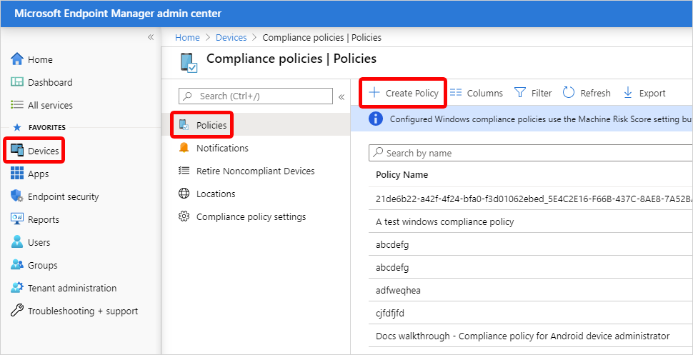
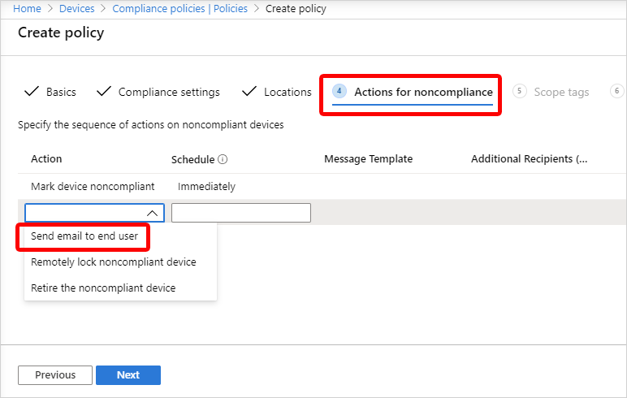

---
# required metadata

title: Move Android devices from device administrator to work profile management
titleSuffix: Microsoft Intune
description: Move Android devices from device administrator to work profile management in Intune.
keywords:
author: ErikjeMS 
ms.author: erikje
manager: dougeby
ms.date: 03/20/2020
ms.topic: conceptual
ms.service: microsoft-intune
ms.subservice: enrollment
ms.localizationpriority: high
ms.technology:
ms.assetid: 

# optional metadata

#ROBOTS:
#audience:

ms.reviewer: chmaguir
ms.suite: ems
search.appverid: MET150
#ms.tgt_pltfrm:
ms.custom: intune-azure;seodec18 
ms.collection: M365-identity-device-management
---

# Move Android devices from device administrator to work profile management

You can move Android devices from device administrator to work profile management by using the compliance setting for the Android device administrator platform. This setting lets you make devices non-compliant if they are managed with device administrator. 

Users who sign in to a non-compliant device will see a notification informing them that they must update their device management. After they tap **Resolve**, they'll be taken to a checklist that will  guide them through:
1. Unenrolling from device administrator management
2. Enrolling into work profile management
3. Resolving any compliance issues. 

## Prerequisites

- You must have devices enrolled with [Android device administrator management](android-enroll-device-administrator.md).
- Set up Android work profile management by [connecting your Intune tenant account to your Android Enterprise account](connect-intune-android-enterprise.md).
- [Set Android Enterprise work profile enrollment](android-work-profile-enroll.md) for the group of users who are moving to Android work profile.
- Consider increasing your user device limits. When unenrolling devices from device administrator management, device records might not be immediately removed. To provide cushion during this period, you might need to increase device limit capacity so that the users can enroll into work profile management.
  - [Configure Azure Active Directory device settings](https://docs.microsoft.com/azure/active-directory/devices/device-management-azure-portal.md#configure-device-settings) to for Maximum number of devices per user.
  - Adjust the [Intune device limit restrictions](enrollment-restrictions-set.md#create-a-device-limit-restriction) by setting the Device limit. 

## Create device compliance policy

1. In the [Microsoft Endpoint Manager Admin Center](https://go.microsoft.com/fwlink/?linkid=2109431), select **Devices** > **Compliance policies** > **Policies** > **Create Policy**.

    

2. On the **Create a policy** page, set **Platform** to **Android device administrator** > **Create**.
3. On the **Basics** page, type in the **Name** and **Description** > **Next**.

    
    
4. On the **Compliance settings** page, in the **Device Health** section, set **Block devices managed with device administrator** to **Yes** > **Next**.
5. On the **Locations** page, you can add locations if you want > **Next**.
6. On the **Actions for noncompliance**, set a **Send email to end user** action.

    

    In the email, you can include the URL below in your messages to users. The URL will launch the Android Company Portal to the **Update device settings** page. This page starts their flow to move to work profile management.
    - [https://portal.manage.microsoft.com/UpdateSettings.aspx](https://portal.manage.microsoft.com/UpdateSettings.aspx).
    - For US government, you can use this link instead: [https://portal.manage.microsoft.us/UpdateSettings.aspx](https://portal.manage.microsoft.us/UpdateSettings.aspx).
  
  > [!NOTE]
  > - Of course, you can use user-friendly hyper-text for the links in your communication with users. However, don't use URL-shorteners because the links may not work if changed that way.
  > - If the Android Company Portal open and in the background, when a user taps the link they might go to the last page they had open instead. So, your messaging can include something like this: "Close the Android Company Portal before tapping this link."

  Choose **Next**.

7. On the **Scope tags** page, select any scope tags you want to include.
8. On the **Assignments** page, assign the policy to a group that has devices enrolled with device administrator management > **Next**.
9. On the **Review + create** page, confirm all your settings and then select **Create**.

## Next steps
[Manage Android work profile devices with Intune](android-enterprise-overview.md)

