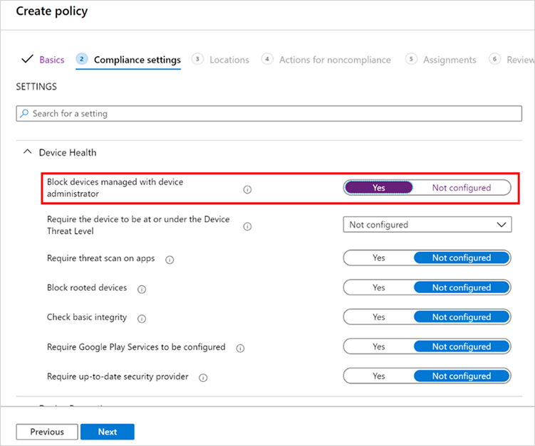
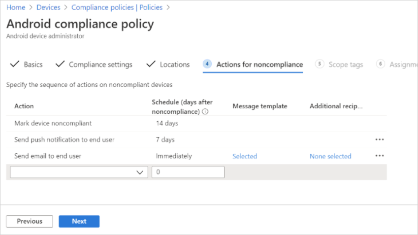

---
# required metadata

title: Move Android devices from device administrator to work profile management
titleSuffix: Microsoft Intune
description: Move Android devices from device administrator to work profile management in Intune.
keywords:
author: ErikjeMS 
ms.author: erikje
manager: dougeby
ms.date: 03/20/2020
ms.topic: conceptual
ms.service: microsoft-intune
ms.subservice: enrollment
ms.localizationpriority: high
ms.technology:
ms.assetid: 

# optional metadata

#ROBOTS:
#audience:

ms.reviewer: chmaguir
ms.suite: ems
search.appverid: MET150
#ms.tgt_pltfrm:
ms.custom: intune-azure;seodec18 
ms.collection: M365-identity-device-management
---

# Move Android devices from device administrator to work profile management

You can help users move their Android devices from device administrator to work profile management by using the compliance setting to **Block devices managed with device administrator**. This setting lets you make devices non-compliant if they're managed with device administrator. 

When users see that they're out of compliance for this reason, they can tap **Resolve**. They'll be taken to a checklist that will  guide them through:
1. Unenrolling from device administrator management
2. Enrolling into work profile management
3. Resolving any compliance issues. 

## Prerequisites

- Users must have [Android device administrator enrolled devices](android-enroll-device-administrator.md) with Android Company Portal version 5.0.4720.0 or later.
- Set up Android work profile management by [connecting your Intune tenant account to your Android Enterprise account](connect-intune-android-enterprise.md).
- [Set Android Enterprise work profile enrollment](android-work-profile-enroll.md) for the group of users who are moving to Android work profile.
- Consider increasing your user device limits. When unenrolling devices from device administrator management, device records might not be immediately removed. To provide cushion during this period, you might need to increase device limit capacity so that the users can enroll into work profile management.
  - [Configure Azure Active Directory device settings](https://docs.microsoft.com/azure/active-directory/devices/device-management-azure-portal#configure-device-settings) for Maximum number of devices per user.
  - Adjust the [Intune device limit restrictions](enrollment-restrictions-set.md#create-a-device-limit-restriction) by setting the Device limit. 

## Create device compliance policy

1. In the [Microsoft Endpoint Manager admin center](https://go.microsoft.com/fwlink/?linkid=2109431), select **Devices** > **Compliance policies** > **Policies** > **Create Policy**.

    

2. On the **Create a policy** page, set **Platform** to **Android device administrator** > **Create**.
3. On the **Basics** page, type in the **Name** and **Description** > **Next**.

    
    
4. On the **Compliance settings** page, in the **Device Health** section, set **Block devices managed with device administrator** to **Yes** > **Next**.

    

5. On the **Locations** page, you can add locations if you want > **Next**.

6. On the **Actions for noncompliance** tab, you can configure the [available actions for noncompliance](../protect/actions-for-noncompliance.md#available-actions-for-noncompliance) to customize the end user experience for this flow.

These are some actions to consider.

    - **Mark device noncompliant**: By default, this action is set to zero (0) days, marking devices as noncompliant immediately. Changing this to a greater number of days provides users with a grace period in which they can see the flow to move to work profile management without yet being marked noncompliant. For example, setting this to 14 days would give users two weeks to move from device administrator to work profile management without the risk of losing access to resources.
    - **Send push notification to end user**: Configure this to send push notifications to the device administrator devices. When a user selects the notification, it will launch the Android Company Portal to the **Update device settings** page where they can start the flow to move to work profile management.
    - **Send email to end user**: Configure this to send emails to users about the move from device administrator to work profile management. In the email, you can include the URL below , which when selected, will launch the Android Company Portal to the Update device settings page where they can start the flow to move to work profile management.
    - `https://portal.manage.microsoft.com/UpdateSettings.aspx`.
    - For US government, you can use this link instead: `https://portal.manage.microsoft.us/UpdateSettings.aspx`.
  
    > [!NOTE]
    > - Of course, you can use user-friendly hyper-text for the links in your communication with users. However, don't use URL-shorteners because the links may not work if changed that way.
    > - If the Android Company Portal is open and in the background, when a user taps the link they might go to the last page they had open instead.
    > - Users must tap the link on an Android device. If they instead paste it into a browser, it will not launch the Android Company Portal. 

    Choose **Next**.

7. On the **Scope tags** page, select any scope tags you want to include.
8. On the **Assignments** page, assign the policy to a group that has devices enrolled with device administrator management > **Next**.
9. On the **Review + create** page, confirm all your settings and then select **Create**.

## Troubleshooting

The [end user flow to move to new device management setup](../user-help/move-to-new-device-management-setup.md) guides users through unenrolling from device administrator management and getting set up with work profile management. Users must have [Android device administrator enrolled devices](android-enroll-device-administrator.md) with Android Company Portal version 5.0.4720.0 or later.

### User sees an error after tapping Resolve
If users see an error after tapping the **Resolve** button, it's likely because of one of these reasons:
- Work profile enrollment isn't set up correctly (either an Android Enterprise account isn't connected or enrollment restrictions are set to block work profile enrollment).
- The device is running Android 4.4 or earlier, which doesn't support work profile enrollment. 
- The device manufacturer doesn't support work profile enrollment on the device model.

### Resolve button doesn't appear on the user's device
The **Resolve** button won't appear on the user's device if the user enrolls into device administrator management after they've been targeted with the device compliance policy explained above.

To get the **Resolve** button to appear, the user must postpone setup and restart the process from the notification.

To avoid this condition, use enrollment restrictions to block enrollment into device administrator management.

### User sees an error after tapping URL to Update device settings page
Users might see an error page in the browser when they tap the URL to the **Update device settings page** of the Android Company Portal. This error can be caused by one of the following:
- The device isn't an Android.
- The Android device doesn't have the Company Portal app.
- The Android Company Portal version is earlier than 5.0.4720.0.
- The Android device uses Android 6 or earlier. 

## Next steps
[See the end user flow](../user-help/move-to-new-device-management-setup.md)
[Manage Android work profile devices with Intune](android-enterprise-overview.md)
