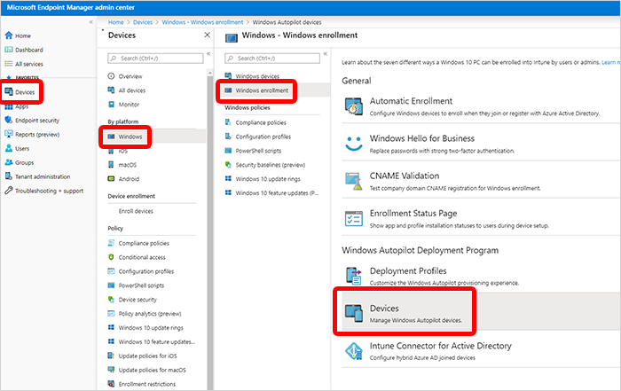
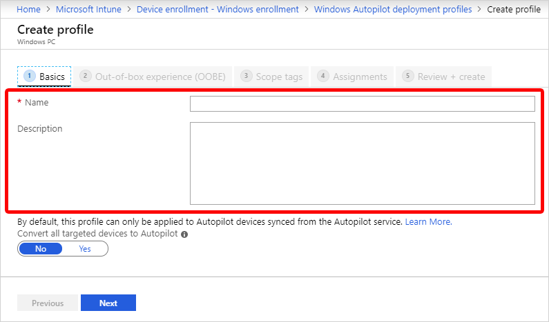
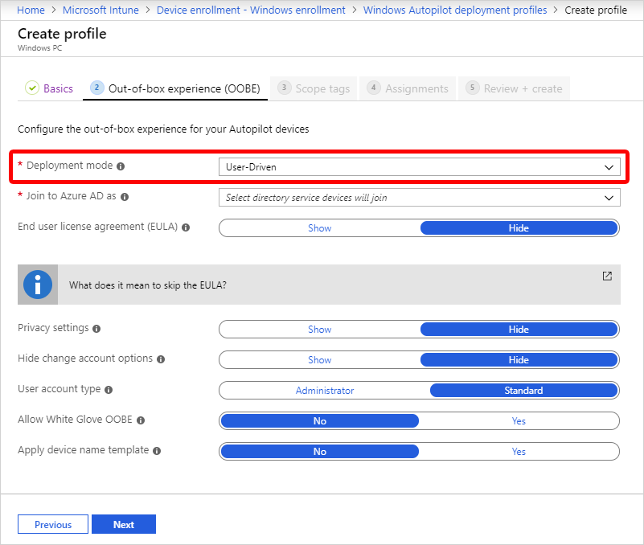
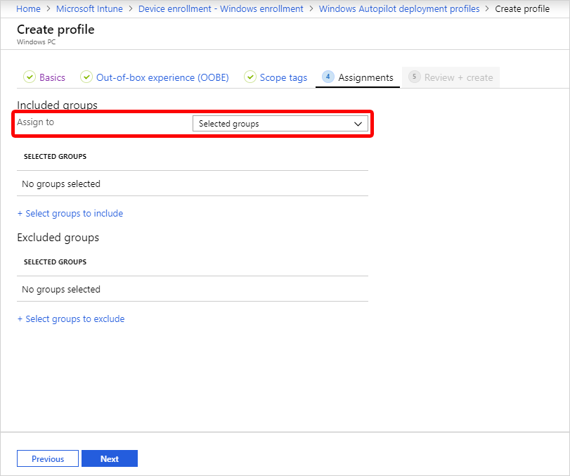
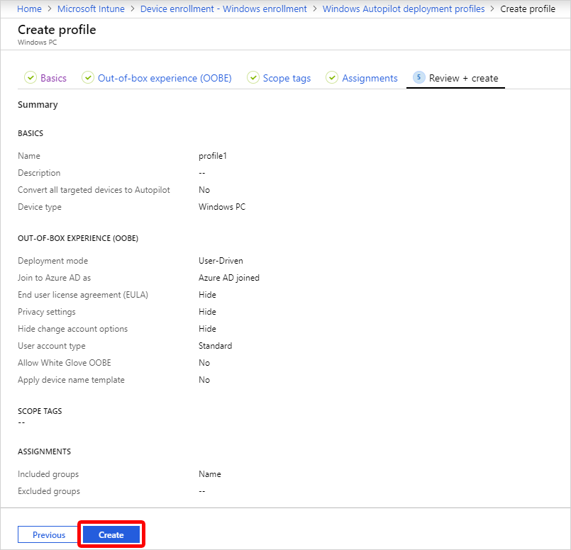

---
# required metadata

title: Enroll devices using Windows Autopilot
titleSuffix: Microsoft Intune
description: Learn how to enroll Windows 10 devices using Windows Autopilot.
keywords:
author: ErikjeMS
ms.author: erikje
manager: dougeby
ms.date: 05/15/2020
ms.topic: how-to
ms.service: microsoft-intune
ms.subservice: enrollment
ms.localizationpriority: high
ms.technology:
ms.assetid: a2dc5594-a373-48dc-ba3d-27aff0c3f944

# optional metadata

#ROBOTS:
#audience:

ms.reviewer: spshumwa
ms.suite: ems
search.appverid: MET150
#ms.tgt_pltfrm:
ms.custom: seodec18
ms.collection: M365-identity-device-management
---

# Enroll Windows devices in Intune by using the Windows Autopilot  
The Windows Autopilot simplifies enrolling devices in Intune. Building and maintaining customized operating system images is a time-consuming process. You might also spend time applying these custom operating system images to new devices to prepare them for use before giving them to your end users. With Microsoft Intune and Autopilot, you can give new devices to your end users without the need to build, maintain, and apply custom operating system images to the devices. When you use Intune to manage Autopilot devices, you can manage policies, profiles, apps, and more after they're enrolled. For an overview of benefits, scenarios, and prerequisites, see [Overview of Windows Autopilot](https://docs.microsoft.com/windows/deployment/windows-autopilot/windows-10-autopilot).

There are four types of Autopilot deployment:

- [Self Deploying Mode](https://docs.microsoft.com/windows/deployment/windows-autopilot/self-deploying) for kiosks, digital signage, or a shared device
- [White Glove](https://docs.microsoft.com/windows/deployment/windows-autopilot/white-glove) enables partners or IT staff to pre-provision a Windows 10 PC so that it's fully configured and business-ready
- [Autopilot for existing devices](https://docs.microsoft.com/windows/deployment/windows-autopilot/existing-devices) enables you to easily deploy the latest version of Windows 10 to your existing devices
- [User Driven Mode](https://docs.microsoft.com/windows/deployment/windows-autopilot/user-driven) for traditional users.

This article explains how to set up Autopilot for Windows PC. For more information about Autopilot and Hololens, see [Windows Autopilot for HoloLens 2](https://docs.microsoft.com/hololens/hololens2-autopilot).

## Prerequisites

- [Intune subscription](../fundamentals/licenses.md)
- [Windows automatic enrollment enabled](/intune/enrollment/windows-enroll.md#enable-windows-10-automatic-enrollment)
- [Azure Active Directory Premium subscription](https://docs.microsoft.com/azure/active-directory/active-directory-get-started-premium) <!--&#40;[trial subscription](https://go.microsoft.com/fwlink/?LinkID=816845)&#41;-->

## How to get the CSV for Import in Intune

For more information, see the understanding PowerShell cmdlet.

- [Get-WindowsAutoPilotInfo](https://www.powershellgallery.com/packages/Get-WindowsAutoPilotInfo)

## Add devices

You can add Windows Autopilot devices by importing a CSV file with their information.

1. In the [Microsoft Endpoint Manager admin center](https://go.microsoft.com/fwlink/?linkid=2109431), choose **Devices** > **Windows** > **Windows enrollment** > **Devices** (under **Windows Autopilot Deployment Program** > **Import**.

    

2. Under **Add Windows Autopilot devices**, browse to a CSV file listing the devices that you want to add. The CSV file should list the serial numbers, Windows product IDs, hardware hashes, optional group tags, and optional assigned user. You can have up to 500 rows in the list. For information about how to get device information, see [Adding devices to Windows Autopilot](https://docs.microsoft.com/windows/deployment/windows-autopilot/add-devices#device-identification). Use the header and line format shown below:

    `Device Serial Number,Windows Product ID,Hardware Hash,Group Tag,Assigned User` 
    `<serialNumber>,<ProductID>,<hardwareHash>,<optionalGroupTag>,<optionalAssignedUser>`

    

    >[!IMPORTANT]
    > When you use CSV upload to assign a user, make sure that you assign valid UPNs. If you assign an invalid UPN (incorrect username), your device may be inaccessible until you remove the invalid assignment. During CSV upload the only validation we perform on the **Assigned User** column is to check that the domain name is valid. We're unable to perform individual UPN validation to ensure that you're assigning an existing or correct user.

3. Choose **Import** to start importing the device information. Importing can take several minutes.

4. After import is complete, choose **Devices** > **Windows** > **Windows enrollment** > **Devices** (under **Windows Autopilot Deployment Program** > **Sync**. A message displays that the synchronization is in progress. The process might take a few minutes to complete, depending on how many devices are being synchronized.

5. Refresh the view to see the new devices.

## Create an Autopilot device group

1. In the [Microsoft Endpoint Manager admin center](https://go.microsoft.com/fwlink/?linkid=2109431), choose **Groups** > **New group**.
2. In the **Group** blade:
    1. For **Group type**, choose **Security**.
    2. Type a **Group name** and **Group description**.
    3. For **Membership type**, choose either **Assigned** or **Dynamic Device**.
3. If you chose **Assigned** for **Membership type** in the previous step, then in the **Group** blade, choose **Members** and add Autopilot devices to the group.
    Autopilot devices that aren't yet enrolled are devices where the name equals the serial number of the device.
4. If you chose **Dynamic Devices** for **Membership type** above, then in the **Group** blade, choose **Dynamic device members** and type any of the following code in the **Advanced rule** box. Only Autopilot devices are gathered by these rules, because they target attributes that are only possessed by Autopilot devices. Creating a group based off non-autopilot attributes won't guarantee that devices included in the group are actually registered to Autopilot.
    - If you want to create a group that includes all of your Autopilot devices, type: `(device.devicePhysicalIDs -any (_ -contains "[ZTDId]"))`
    - Intune's group tag field maps to the OrderID attribute on Azure AD devices. If you want to create a group that includes all of your Autopilot devices with a specific group tag (the Azure AD device OrderID), you must type: `(device.devicePhysicalIds -any _ -eq "[OrderID]:179887111881")`
    - If you want to create a group that includes all of your Autopilot devices with a specific Purchase Order ID, type: `(device.devicePhysicalIds -any _ -eq "[PurchaseOrderId]:76222342342")`
    
    After adding the **Advanced rule** code, choose **Save**.
5. Choose **Create**.  

## Create an Autopilot deployment profile
Autopilot deployment profiles are used to configure the Autopilot devices. You can create up to 350 profiles per tenant.
1. In the [Microsoft Endpoint Manager admin center](https://go.microsoft.com/fwlink/?linkid=2109431), choose **Devices** > **Windows** > **Windows enrollment** > **Deployment Profiles** > **Create Profile** > **Windows PC** or **HoloLens**. This article explains how to set up Autopilot for Windows PC. For more information about Autopilot and Hololens, see [Windows Autopilot for HoloLens 2](https://docs.microsoft.com/hololens/hololens2-autopilot).
2. On the **Basics** page, type a **Name** and optional **Description**.

    

3. If you want all devices in the assigned groups to automatically convert to Autopilot, set **Convert all targeted devices to Autopilot** to **Yes**. All corporate owned, non-Autopilot devices in assigned groups will register with the Autopilot deployment service. Personally owned devices will not be converted to Autopilot. Allow 48 hours for the registration to be processed. When the device is unenrolled and reset, Autopilot will enroll it. After a device is registered in this way, disabling this option or removing the profile assignment won't remove the device from the Autopilot deployment service. You must instead [remove the device directly](enrollment-autopilot.md#delete-autopilot-devices).
4. Select **Next**.
5. On the **Out-of-box experience (OOBE)** page, for **Deployment mode**, choose one of these two options:
    - **User-driven**: Devices with this profile are associated with the user enrolling the device. User credentials are required to enroll the device.
    - **Self-deploying (preview)**: (requires Windows 10, version 1809 or later) Devices with this profile aren't associated with the user enrolling the device. User credentials aren't required to enroll the device. When a device has no user associated with it, user-based compliance policies don't apply to it. When using self-deploying mode, only compliance policies targeting the device will be applied.

    

   > [!NOTE]
   > Options that appear dimmed or shaded are currently not supported by the selected deployment mode.

6. In the **Join to Azure AD as** box, choose **Azure AD joined**.
7. Configure the following options:
    - **End-user license agreement (EULA)**: (Windows 10, version 1709 or later) Choose if you want to show the EULA to users.
    - **Privacy settings**: Choose if you want to show privacy settings to users.
    >[!IMPORTANT]
    >The default value for the Diagnostic Data setting varies between Windows versions. For devices running Windows 10, version 1903, the default value is set to Full during the out-of-box experience. For more information, see [Windows Diagnostics Data](https://docs.microsoft.com/windows/privacy/windows-diagnostic-data)  
    
    - **Hide change account options (requires Windows 10, version 1809 or later)**: Choose **Hide** to prevent change account options from displaying on the company sign-in and domain error pages. This option requires [company branding to be configured in Azure Active Directory](https://docs.microsoft.com/azure/active-directory/fundamentals/customize-branding).
    - **User account type**: Choose the user's account type (**Administrator** or **Standard** user). We allow the user joining the device to be a local Administrator by adding them to the local Admin group. We don't enable the user as the default administrator on the device.
    - **Allow White Glove OOBE** (requires Windows 10, version 1903 or later; [additional physical requirements](https://docs.microsoft.com/windows/deployment/windows-autopilot/white-glove#prerequisites)): Choose **Yes** to allow white glove support.
    - **Apply device name template** (requires Windows 10, version 1809 or later, and Azure AD join type): Choose **Yes** to create a template to use when naming a device during enrollment. Names must be 15 characters or less, and can have letters, numbers, and hyphens. Names can't be all numbers. Use the [%SERIAL% macro](https://docs.microsoft.com/windows/client-management/mdm/accounts-csp) to add a hardware-specific serial number. Or, use the [%RAND:x% macro](https://docs.microsoft.com/windows/client-management/mdm/accounts-csp) to add a random string of numbers, where x equals the number of digits to add. You can only provide a pre-fix for hybrid devices in a [domain join profile](windows-autopilot-hybrid.md#create-and-assign-a-domain-join-profile). 
    - **Language (Region)**\*: Choose the language to use for the device. This option is only available if you chose **Self-deploying** for **Deployment mode**.
    - **Automatically configure keyboard**\*: If a **Language (Region)** is selected, choose **Yes** to skip the keyboard selection page. This option is only available if you chose **Self-deploying** for **Deployment mode**.
8. Select **Next**.
9. On the **Scope tags** page, optionally add the scope tags you want to apply to this profile. For more information about scope tags, see [Use role-based access control and scope tags for distributed IT](../fundamentals/scope-tags.md).
10. Select **Next**.
11. On the **Assignments** page, choose **Selected groups** for **Assign to**.

    

12. Choose **Select groups to include**, and choose the groups you want to include in this profile.
13. If you want to exclude any groups, choose **Select groups to exclude**, and choose the groups you want to exclude.
14. Select **Next**.
15. On the **Review + Create** page, choose **Create** to create the profile.

    

> [!NOTE]
> Intune will periodically check for new devices in the assigned groups, and then begin the process of assigning profiles to those devices. This process can take several minutes to complete. Before deploying a device, ensure that this process has completed.  You can check under **Devices** > **Windows** > **Windows enrollment** > **Devices** (under **Windows Autopilot Deployment Program** where you should see the profile status change from "Unassigned" to "Assigning" and finally to "Assigned."

## Edit an Autopilot deployment profile
After you've created an Autopilot deployment profile, you can edit certain parts of the deployment profile.   

1. In the [Microsoft Endpoint Manager admin center](https://go.microsoft.com/fwlink/?linkid=2109431), choose **Devices** > **Windows** > **Windows enrollment** > **Deployment profiles**.
2. Select the profile you would like to edit.
3. Select **Properties** on the left to change the name or description of the deployment profile. Click **Save** after you make changes.
5. Click **Settings** to make changes to the OOBE settings. Click **Save** after you make changes.

> [!NOTE]
> Changes to the profile are applied to devices assigned to that profile. However, the updated profile won't be applied to a device that has already enrolled in Intune until after the device is reset and reenrolled.

## Edit Autopilot device attributes
After you've uploaded an Autopilot device, you can edit certain attributes of the device.

1. In the [Microsoft Endpoint Manager admin center](https://go.microsoft.com/fwlink/?linkid=2109431),select **Devices** > **Windows** > **Windows enrollment** > **Devices** (under **Windows Autopilot Deployment Program**.
2. Select the device you want to edit.
3. In the pane on the right of the screen, you can edit the device name, group tag, or User Friendly Name (if you've assigned a user).
4. Select **Save**.

> [!NOTE]
> Device names can be configured for all devices, but are ignored in Hybrid Azure AD joined deployments. Device name still comes from the domain join profile for Hybrid Azure AD devices.

## Alerts for Windows Autopilot unassigned devices  <!-- 163236 -->  

Alerts will show how many Autopilot program devices don't have Autopilot deployment profiles. Use the information in the alert to create profiles and assign them to the unassigned devices. When you click the alert, you see a full list of Windows Autopilot devices and detailed information about them.

To see alerts for unassigned devices, in the [Microsoft Endpoint Manager admin center](https://go.microsoft.com/fwlink/?linkid=2109431), choose **Devices** > **Overview** > **Enrollment alerts** > **Unassigned devices**.  

## Autopilot deployments report
You can see details on each device deployed through Windows Autopilot.
To see the report, go to the [Microsoft Endpoint Manager admin center](https://go.microsoft.com/fwlink/?linkid=2109431), choose **Devices** > **Monitor** > **Autopilot deployments**.
The data is available for 30 days after deployment.

This report is in preview. Device deployment records are currently triggered only by new Intune enrollment events. This means that any deployment that doesn't trigger a new Intune enrollment will not be picked up by this report. This includes any kind of reset that maintains enrollment and the user portion of Autopilot White glove.

## Assign a user to a specific Autopilot device

You can assign a user to a specific Autopilot device. This assignment pre-fills a user from Azure Active Directory in the [company-branded](https://docs.microsoft.com/azure/active-directory/fundamentals/customize-branding) sign-in page during Windows setup. It also lets you set a custom greeting name. It doesn't pre-fill or modify Windows sign-in. Only licensed Intune users can be assigned in this manner.

Prerequisites: Azure Active Directory Company Portal has been configured and Windows 10, version 1809 or later.

> [!NOTE]
> Assigning a user to a specific Autopilot device doesn't work if you are using ADFS.

1. In the [Microsoft Endpoint Manager admin center](https://go.microsoft.com/fwlink/?linkid=2109431), choose **Devices** > **Windows** > **Windows enrollment** > **Devices** (under **Windows Autopilot Deployment Program** > choose the device > **Assign user**.

    

2. Choose an Azure user licensed to use Intune and choose **Select**.

    

3. In the **User Friendly Name** box, type a friendly name or just accept the default. This string is the friendly name that displays when the user signs in during Windows setup.

    

4. Choose **Ok**.

## Delete Autopilot devices

You can delete Windows Autopilot devices that aren't enrolled into Intune:

- Delete the devices from Windows Autopilot at **Devices** > **Windows** > **Windows enrollment** > **Devices** (under **Windows Autopilot Deployment Program**. Choose the devices you want to delete, then choose **Delete**. Windows Autopilot device deletion can take a few minutes to complete.

Completely removing a device from your tenant requires you to delete the Intune device, the Azure Active Directory device, and the Windows Autopilot device records. This can all be done from Intune:

1. If the devices are enrolled in Intune, you must first [delete them from the Intune All devices blade](../remote-actions/devices-wipe.md#delete-devices-from-the-azure-active-directory-portal).

2. Delete the devices in Azure Active Directory devices at **Devices** > **Azure AD devices**.

3. Delete the devices from Windows Autopilot at **Devices** > **Windows** > **Windows enrollment** > **Devices** (under **Windows Autopilot Deployment Program** >. Choose the devices you want to delete, then choose **Delete**. Windows Autopilot device deletion can take a few minutes to complete.

## Using Autopilot in other portals
If you aren't interested in mobile device management, you can use Autopilot in other portals. While using other portals is an option, we recommend you only use Intune to manage your Autopilot deployments. When you use Intune and another portal, Intune isn't able to:  

- Display changes to profiles created in Intune, but edited in another portal
- Synchronize profiles created in another portal
- Display changes to profile assignments done in another portal
- Synchronize profile assignments done in another portal
- Display changes to the device list that were made in another portal

## Windows Autopilot for existing devices

You can group Windows devices by a correlator ID when enrolling using [Autopilot for existing devices](https://techcommunity.microsoft.com/t5/Windows-IT-Pro-Blog/New-Windows-Autopilot-capabilities-and-expanded-partner-support/ba-p/260430) through Configuration Manager. The correlator ID is a parameter of the Autopilot configuration file. The [Azure AD device attribute enrollmentProfileName](https://docs.microsoft.com/azure/active-directory/users-groups-roles/groups-dynamic-membership#rules-for-devices) is automatically set to equal "OfflineAutopilotprofile-\<correlator ID\>". This allows arbitrary Azure AD dynamic groups to be created based off correlator ID by using the enrollmentprofileName attribute.

>[!WARNING] 
> Because the correlator ID is not pre-listed in Intune, the device may report any correlator ID they want. If the user creates a correlator ID matching an Autopilot or Apple ADE profile name, the device will be added to any dynamic Azure AD device group based off the enrollmentProfileName attribute. To avoid this conflict:
> - Always create dynamic group rules matching against the *entire* enrollmentProfileName value
> - Never name Autopilot or Apple ADE profiles beginning with "OfflineAutopilotprofile-".

## Next steps
After you configure Windows Autopilot for registered Windows 10 devices, learn how to manage those devices. For more information, see [What is Microsoft Intune device management?](../remote-actions/device-management.md)
