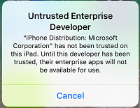
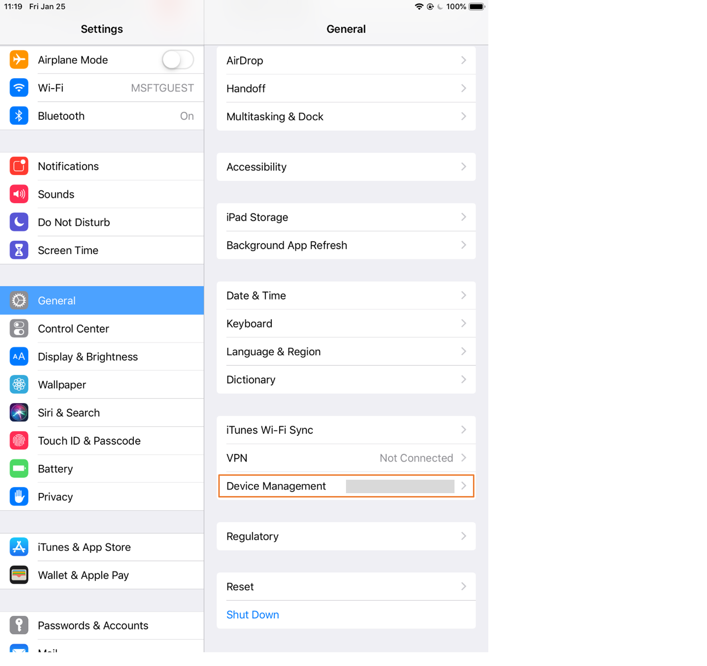
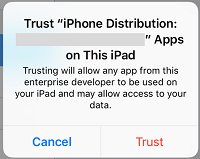

---
# required metadata

title: Company Portal messages users may see on devices 
titleSuffix: Microsoft Intune
description: Understand the different messages that end users may see in the Company Portal.
keywords:
author: lenewsad
ms.author: lanewsad
manager: dougeby
ms.date: 03/09/2017
ms.topic: conceptual
ms.service: microsoft-intune
ms.subservice: fundamentals
ms.localizationpriority: high
ms.technology:
ms.assetid: 3df993aa-48c5-4799-b68d-c85fe4f7b02c

# optional metadata

#ROBOTS:
#audience:
#ms.devlang:
ms.reviewer: aanavath
ms.suite: ems
search.appverid: MET150
#ms.tgt_pltfrm:
#ms.custom:
ms.collection: M365-identity-device-management
---

# Help end users understand Company Portal app messages

> [!NOTE]
> The following information applies only on devices with Android 6.0+ and iOS 10+.

Understand the different app messages that end users may see in the Company Portal. These app messages are commonly displayed at different points in the enrollment process. Learn where the messages appear, what the messages mean, and what happens if users deny access. Additionally, learn how to best explain the messages to users.

- __Allow Company Portal to make and manage phone calls?__
- __Allow Company Portal to access photos, media, and files on your device?__

> [!NOTE]
> We do not sell any data collected by our service to any third parties for any reason.

## Allow Company Portal to make and manage phone calls?

### Where it appears

The message **Allow Company Portal to make and manage phone calls?** appears when users tap **Enroll** in the Company Portal app while they are enrolling their device.

### What it means

By accepting this prompt, users allow their device's phone and IMEI numbers to be sent to the Intune service. These will appear on the admin console on the __Hardware__ page.

> [!NOTE]
> **The Company Portal app never makes or manages phone calls!** The message text is controlled by Google and cannot be changed.

To see the **Hardware** page, you must go to **Groups** > **All mobile devices** > **Devices**. Select the user's device, and go to **View Properties** > **Hardware**.

### What happens if users deny access

If users deny access, they can continue to use the Company Portal app and enroll their device. However, the device phone number and IMEI number will be blank on the __Hardware__ page in the admin console. The second time that users sign-in to the Company Portal app after denying access, the message displays a **Never ask again** check box that users can select which stops the prompt.

If users allow, but then later deny access, the message appears the next time users sign-in to the Company Portal app after enrollment.

If users later decide to allow access, they can go to **Settings** > **Apps** > **Company Portal** > **Permissions** > **Phone**, and turn it on.

### How to explain this to your users

Send your users to [Enroll your Android device in Intune](../intune-user-help/enroll-device-android-company-portal) for more information.

## Allow Company Portal to access your contacts?

### Where it appears

The message **Allow Company Portal to access your contacts?** appears when users tap **Enroll** in the Company Portal app while they are enrolling their device.

### What it means

By accepting this prompt, users allow Intune to create their work account and manage the Azure Active Directory identity that is registered for the user on that device.

> [!NOTE]
> **Microsoft never accesses your contacts!** The message text is controlled by Google and cannot be changed.

### What happens if users deny access

If users deny access, their device will not be enrolled in Intune and can't be managed. The second time that users sign in to the Company Portal app after denying access, the message displays a **Never ask again** check box that users can select to stop the prompt.

If users allow, but then later deny access, the message appears the next time users sign in to the Company Portal app after enrollment.

If users later decide to allow access, they can go to **Settings** > **Apps** > **Company Portal** > **Permissions** > **Phone**, and turn it on.

### How to explain this to your users

Send your users to [Enroll your Android device in Intune](../intune-user-help/enroll-device-android-company-portal) for more information.  

## Allow Company Portal to access photos, media, and files on your device?

### Where it appears

The message **Allow Company Portal to access photos, media, and files on your device?** appears when users tap **Send Data** to send logs to their IT admin.

### What it means

By accepting this prompt, users allow their device to write data logs to the device's SD card. This also enables those logs to be moved using a USB cable.   

> [!NOTE]
> **The Company Portal app never accesses users' photos, media, and files!** The message text is controlled by Google and cannot be changed.

### What happens if users deny access

If users deny access, they can still send data logs via email, but the logs won't be copied to the device's SD card.

The second time that users sign in to the Company Portal app after denying access, the message displays a **Never ask again** check box that users can select so that the message never shows again. If users allow, but then later deny access, the message appears the next time users try to send logs. However, if users later decide to allow access, they can go to **Settings** > **Apps** > **Company Portal** > **Permissions** > **Storage**, and then turn on the permission.

### How to explain this to your users

Send your users to [Send logs to your IT admin by email](../intune-user-help/send-logs-to-your-it-admin-by-email-android). 

## Your company support needs to give you access to company resources

### Where it appears

If you haven't added the Company Portal app to the **Allowed apps** or **Exempt apps** list, and a user attempts to sign in, the sign-in will fail. The following message displays:

> **Your company support needs to give you access to company resources**  
> Your company is using Windows Information Protection policies to protect your device. Your company support will need to make sure they allow the Company Portal to access those resources.

### What it means

Add the Company Portal to the **Allowed apps** or **Exempt apps** list in the Windows Information Protection (WIP) app protection policy. For more information, see [Create and deploy Windows Information Protection (WIP) app protection policy with Intune](../apps/windows-information-protection-policy-create.md).

## Approve a iOS/iPadOS company app (line-of-business app) on your iOS/iPadOS device 

### Where it appears

iOS apps developed by your organization that are not available in the App Store are not trusted by your device by default. When you install such apps using Company Portal and launch the app, the following message will be displayed:

### What it means

This message means you need to modify your iOS/iPadOS device settings to approve and install an app developed by your company on your iOS/iPadOS device.

When you install such apps using the Company Portal and launch the app, follow these steps to approve the app after you download it:

1. Upon launching an installed company app (line-of-business app), you will see the "Untrusted Enterprise Developer" message.  
   Press **Cancel**.
2. Navigate to **Settings** > **General** > **Device Management**.

   

3. Select **Management Profile** > **Enterprise app**.
4. Select the developer name.
5. Press **Trust _developer name_**.
6. Confirm the app by selecting **Trust** on the app install pop-up message.

   

    You should be able to launch and use the company app.

## See also
[What to tell your end users about using Intune](end-user-educate.md)
