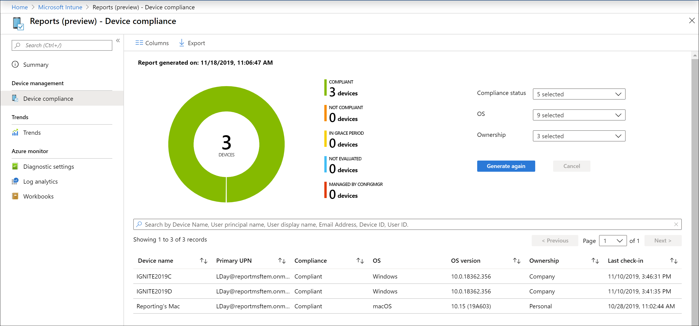
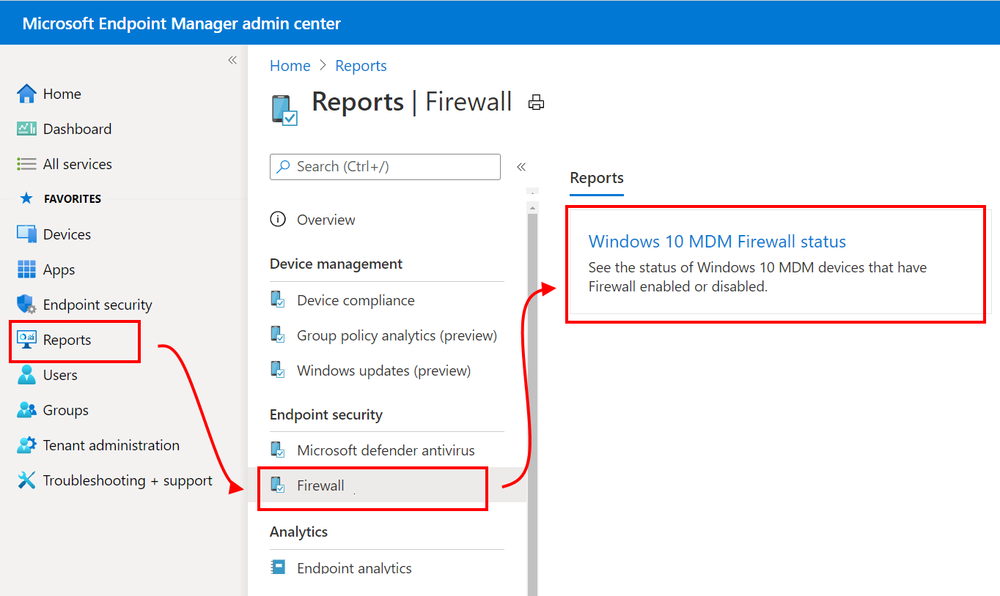
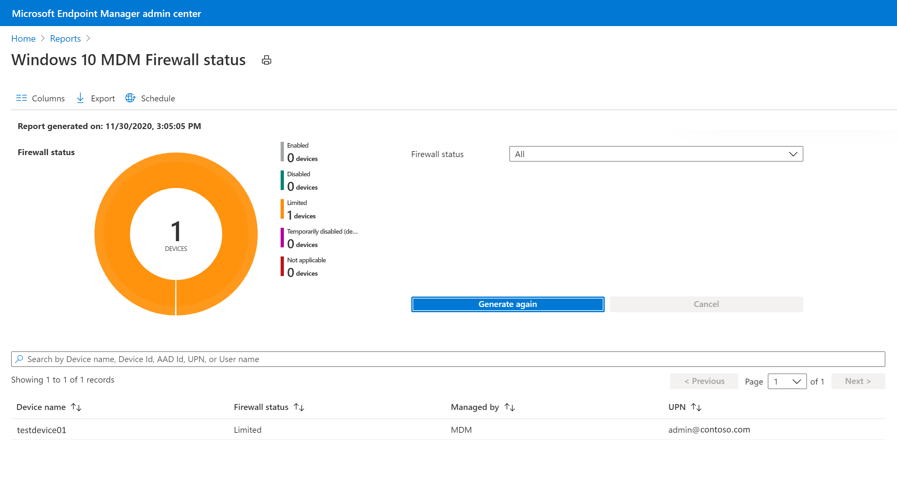
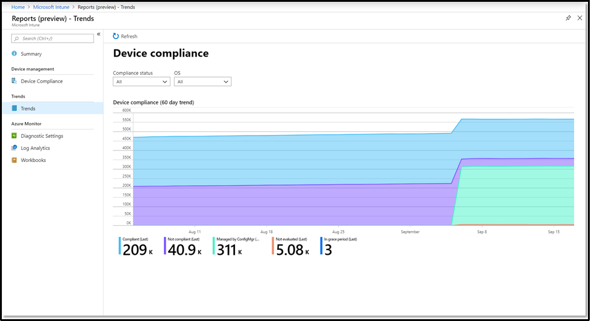
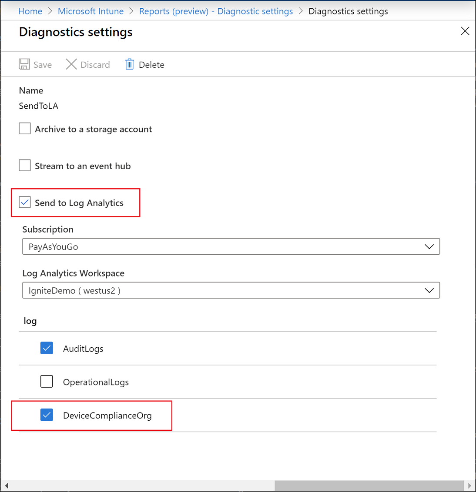
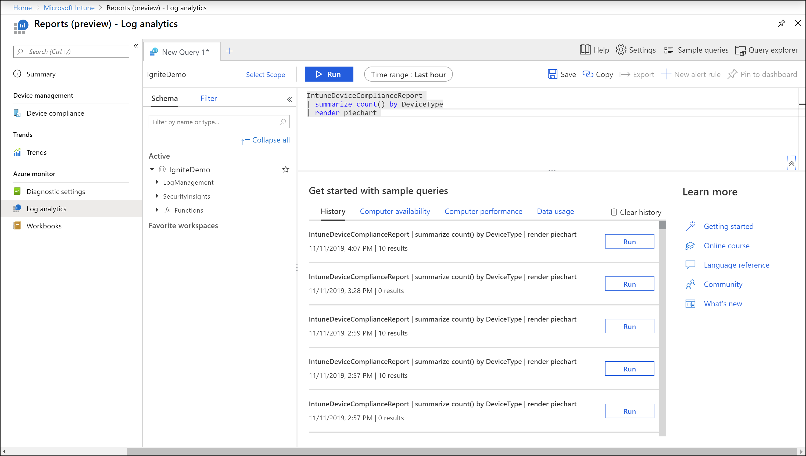

---
# required metadata

title: Microsoft Intune reports
titleSuffix: Microsoft Intune
description: Intune provides specific report types with focused views that contain consistent and timely data. 
keywords:
author: erikre
ms.author: erikre
manager: dougeby
ms.date: 05/10/2021
ms.topic: how-to
ms.service: microsoft-intune
ms.subservice: fundamentals
ms.localizationpriority: high
ms.assetid: 

# optional metadata

#ROBOTS:
#audience:

ms.suite: ems
#ms.tgt_pltfrm:
ms.custom: intune-azure
ms.collection: M365-identity-device-management
---
# Intune reports
Microsoft Intune reports allows you to more effectively and proactively monitor the health and activity of endpoints across your organization, and also provides other reporting data across Intune. For example, you will be able to see reports about device compliance, device health, and device trends. In addition, you can create custom reports to obtain more specific data. 

> [!NOTE]
> The Intune reporting changes will roll out gradually over a period of time to help you prepare and adapt to the new structure.

The report types are organized into the following focus areas:
- **Operational** - Provides timely, targeted data that helps you focus and take action. Admins, subject matter experts, and helpdesk will find these reports most helpful.
- **Organizational** - Provides a broader summary of an overall view, such as device management state. Managers and admins will find these reports most helpful.
- **Historical** - Provides patterns and trends over a period of time. Managers and admins will find these reports most helpful.
- **Specialist** - Allows you to use raw data to create your own custom reports. Admins will find these reports most helpful.

The reporting framework provides a consistent and more comprehensive reporting experience. The available reports provide the following functionality:
- **Search and sort** – You can search and sort across every column, no matter how large the dataset.
- **Data paging** – You can scan your data based on paging, either page-by-page or by jumping to a specific page.
- **Performance** - You can quickly generate and view reports created from large tenants.
- **Export** – You can quickly export reporting data generated from large tenants.

## Who can access the data?

Users with the following permissions can review logs:

- Global Administrator
- Intune Service Administrator
- Administrators assigned to an Intune role with **Read** permissions

## Reporting tiles

The **Home**, **Dashboard**, and **Apps Overview** panes provide updated tiles to show the number of app installation failures for the tenant. You can use the following export **ReportName** parameters to retrieve the related data:

**Export ReportName Parameters:**
- `AppStatusOverview` - App overview count as provided for the pie chart on the **Apps Overview** pane.
- `FailedAppCounts` - Failed app counts as provided on the **Apps Overview** pane, **Home** pane, and **Dashboard** pane.
- `TopFailedMobileApps` - Top three failed apps as provided on the **Apps Overview** pane.

## Noncompliant devices report (Operational)
The **Noncompliant devices** report provides data typically used by Helpdesk or admin roles to identify problems and help remediate issues. The data found in this report is timely, calls out unexpected behavior, and is meant to be actionable. The report is available alongside the workload, making the non-compliant devices report accessible without browsing away from active workflows. This report provides filtering, searching, paging, and sorting capabilities. Also, you can drill down to help troubleshoot.

You can view the **Noncompliant devices** report using the following steps:

1. Sign in to the [Microsoft Endpoint Manager admin center](https://go.microsoft.com/fwlink/?linkid=2109431).
2. Select **Devices** > **Monitor** > **Noncompliant devices**.

    

    > [!TIP]
    > If you have previously used Intune in the Azure portal, you found the above details in the Azure portal by signing in to [Intune](https://go.microsoft.com/fwlink/?linkid=2090973) and selecting **Device compliance** > **Noncompliant devices**.

## Noncompliant policies (Operational)

The **Noncompliant policies** report can help you troubleshoot policies that have compliance errors or conflicts.

When you select the report, it displays a list of compliance policies that have one or more devices with an error or a non-compliant status. The details include the count for each of those categories and the device platform. Use this report to drill in on individual entries to discover more information, and at each level you can sort and filter across records.

While viewing the report:

- Select a policy to view device compliance policies with devices in a noncompliant or error state. Information includes the Deployment status and when the status was last updated.
- Select a device from the list to dig deeper and view a list of settings from the policy. The list of settings includes the setting status like *Compliant*, *Noncompliant*, or *Not applicable*. If there was an error, the relevant error code is shown.
- If you then select a specific setting, you’ll see more details about the status or error code. This information also includes the profiles that were used to deploy the setting to the device.

To view the Noncompliant policies report:

1. Sign in to the [Microsoft Endpoint Manager admin center](https://go.microsoft.com/fwlink/?linkid=2109431).
2. Select **Devices** > **Monitor** > **Noncompliant policies**.

> [!NOTE]
> *This report is in preview.*

## Windows 10 unhealthy endpoints report (Operational)
The **Windows 10 unhealthy endpoints** report surfaces data typically used by Helpdesk or admin roles to identify problems and help remediate issues. The data found in this report is timely, calls out the unhealthy device, the primary user principal name (UPN), and the status of a number of settings. The report is available as a tab within the primary **Antivirus** workload. This report provides filtering, searching, paging, and sorting. 

You can view the **Windows 10 unhealthy endpoints** report using the following steps:

1. Sign in to the [Microsoft Endpoint Manager admin center](https://go.microsoft.com/fwlink/?linkid=2109431).
2. Select **Endpoint security** > **Antivirus** > **Windows 10 unhealthy endpoints** tab.

For information about the actions you can take with this report, see [Bulk actions for device reports](reports.md#bulk-actions-for-device-reports).

## Windows 10 active malware report (Operational)
The **Windows 10 active malware** report provides data to identify devices with malware problems and help remediate issues. The data found in this report is timely, calls out the unhealthy device, the user name, and severity. The report is available as a tab within the primary **Antivirus** workload. This report provides filtering, searching, paging, and sorting. 

You can view the **Windows 10 active malware** report using the following steps:

1. Sign in to the [Microsoft Endpoint Manager admin center](https://go.microsoft.com/fwlink/?linkid=2109431).
2. Select **Endpoint security** > **Antivirus** > **Windows 10 active malware** tab.

For information about the actions you can take with this report, see [Bulk actions for device reports](reports.md#bulk-actions-for-device-reports).

## Feature update failures report (Operational)

A Windows update report, the **Feature update failures** operational report provides failure details for devices that are targeted with a **Windows 10 feature updates** policy and have attempted an update. The data found in this report is timely and calls out number of devices with errors. You can drill down to help troubleshoot. This report provides filtering, searching, paging, and sorting.

Before this report can show data, you must configure *data collection* for the Windows 10 feature updates reports. For information about configuring data collection and how to use this report to resolve update failures, see [Reports for Windows 10 feature updates policy](../protect/windows-10-feature-updates.md).

To view the **Feature update failures** report, use the following steps:

1. Sign in to the [Microsoft Endpoint Manager admin center](https://go.microsoft.com/fwlink/?linkid=2109431).
2. Select **Devices** > **Monitor** > **Feature update failures**.

> [!NOTE]
> *This report is in preview.*

> [!IMPORTANT]  
> To get a complete picture of Windows feature updates status, use the following feature updates reports:
>
> - **[Windows 10 feature updates (Organizational)](#windows-10-feature-updates-organizational)**
> - **Feature update failures report (Operational)** *(this report)*  
>
> Together, these reports provide insight into the update state and compliance of Windows devices in your organization and can help you troubleshoot problems with feature update deployment.  

## Assignment failures report (Operational)
The **Assignment failures** operational report helps you troubleshoot errors and conflicts for configuration profiles that have been targeted to devices. This report will show a list of configuration profiles for the tenant and the number of devices in a state of error or conflict. Using this information, you can drill down to a profile to see a list of devices and users in a failure state related to the profile. Additionally, you can drill down even further to view a list of settings and setting details related to the cause of the failure. You have the ability to filter by type and platform, sort based on column, and search by profile name. 

You can view the **Assignment failures** report using the following steps:

1. Sign in to the [Microsoft Endpoint Manager admin center](https://go.microsoft.com/fwlink/?linkid=2109431).
2. Select **Devices** > **Monitor** > **Assignment failures**.

> [!NOTE]
> *This report is in preview.*

## App Install Status report (Operational)

The **App Install Status** report provides a list of apps with versions and installation details. App installation details includes **Version**, **Publisher**, and **Platform**. Additionally, the installation details provide the app install and failure totals for devices and users. You have the ability to sort and search this report as well.

To see a generated report, you can use the following steps:

1. Sign in to the [Microsoft Endpoint Manager admin center](https://go.microsoft.com/fwlink/?linkid=2109431).
2. Select **Reports** > **Install Status** > **App Install Status** to view the current data.

## Device Install Status report for apps (Operational)

Based on a selected app, the **Device Install Status** report provides a list of devices and status information related to the specific app. App installation details related to the device includes **UPN**, **Platform**, **Version**, **Status**, **Status details**, and **Last check-in**. You have the ability to sort, filter, and search this report as well.

To see a generated report of device state, you can use the following steps:

1. Sign in to the [Microsoft Endpoint Manager admin center](https://go.microsoft.com/fwlink/?linkid=2109431).
2. Select **Reports** > **Install Status** > **Device Install Status** > **Select an app**.
3. Click **Generate report** (or **Generate again**) to retrieve current data.

## Device compliance report (Organizational)

Device compliance reports are meant to be broad in nature and provide a more traditional reporting view of data to identify aggregated metrics. This report is designed to work with large datasets to get a full device compliance picture. For example, the device compliance report for device compliance shows all the compliance states for devices to give a broader view of the data, no matter how large the dataset. This report shows the full breakdown of records in addition to a convenient visualization of aggregated metrics. This report can be generated by applying filters on it and selecting the "Generate report" button. This will refresh the data to show the latest state with the ability to view the individual records that make up the aggregate data. Like most reports in the new framework, these records can be sorted and searched upon to focus on the information you need.

To see a generated report of device state, you can use the following steps:

1. Sign in to the [Microsoft Endpoint Manager admin center](https://go.microsoft.com/fwlink/?linkid=2109431).
2. Select **Reports** > **Device compliance** > **Reports** tab > **Device compliance**.
3. Select the **Compliance status**, **OS**, and **Ownership** filters to refine your report.
4. Click **Generate report** (or **Generate again**) to retrieve current data.

    

    > [!NOTE]
    > This **Device compliance** report provides a time stamp of when the report was last generated. 

For related information, see [Enforce compliance for Microsoft Defender for Endpoint with Conditional Access in Intune](../protect/advanced-threat-protection.md).

## Co-management eligibility report (Organizational)

The **Co-management eligibility** report provides an eligibility evaluation for devices that can be co-managed. Devices must upgrade to Windows 10 and enroll in Azure Active Directory before becoming eligible. Some devices (like devices with Windows Server OS) are not eligible for co-management. Co-management enables you to concurrently manage Windows 10 devices by using both Configuration Manager and Microsoft Intune. 

To see a generated report of device state, you can use the following steps:

1. Sign in to the [Microsoft Endpoint Manager admin center](https://go.microsoft.com/fwlink/?linkid=2109431).
2. Select **Reports** > **Cloud attached devices** > **Reports** tab > **Co-management eligibility**.
1. Click **Generate report** (or **Generate again**) to retrieve current data.

For related information, see [What is co-management?](../../configmgr/comanage/overview.md).

## Antivirus agent status report (Organizational)

The **Antivirus agent status** report provides the agent status of your organization's devices. 

The report is available from the primary **Microsoft Defender Antivirus** workload, and provides filtering, searching, paging, and sorting. The data found in this report is timely and shows the following details:

- If a device has real-time or network protection, as well as the state
- The status of Windows Defender
- If Tamper protection is enabled
- If the device is a virtual machine, or a physical device.
- Calls out the unhealthy device, the user name, and severity.

This report shows data visualizations as a pie chart for a breakdown of agent status count across devices, and includes remote actions. 

You can view the **Antivirus agent status** report using the following steps:

1. Sign in to the [Microsoft Endpoint Manager admin center](https://go.microsoft.com/fwlink/?linkid=2109431).
2. Select **Reports** > **Microsoft Defender Antivirus** to open the default reports view which is the **Summary** page. The Summary page displays aggregate details for the Antivirus reports, supports a *Refresh*, and reflects the data found in Antivirus agent status report.
3. Select the **Reports** tab > **Antivirus agent status** to open the report.
4. Click **Generate report** (or **Generate again**) to retrieve current data.

The information for this report is based on details available from the [Defender CSP](/windows/client-management/mdm/defender-csp), which is documented in the Windows client-management documentation.

Additional reports for Microsoft Defender Antivirus include:

- [Detected malware report](#detected-malware-report-organizational), an organizational report detailed in this article.
- [Antivirus policy reports](../protect/endpoint-security-antivirus-policy.md#antivirus-policy-reports) which are available in the Antivirus node under Endpoint security in the Microsoft Endpoint Manager admin center.

## Detected malware report (Organizational)

The **Detected malware** report provides the malware state of your organization's devices. This report shows the number of devices with detected malware, as well as malware details. The data found in this report is timely, calls out the device name and severity, as well as other malware related details. This report show a pie chart for the count of devices in each malware state. The report is available from the primary **Microsoft Defender Antivirus** workload. This report also provides filtering, searching, paging, and sorting.

You can view the **Detected malware** report using the following steps:

1. Sign in to the [Microsoft Endpoint Manager admin center](https://go.microsoft.com/fwlink/?linkid=2109431).
2. Select **Reports** > **Microsoft Defender Antivirus** to open the default reports view which is the Summary page. The Summary page displays aggregate details for the Antivirus reports, supports a *Refresh*, and reflects the data found in the [Antivirus agent status](#antivirus-agent-status-report-organizational) report.
3. Select the **Reports** tab > **Detected malware** to open the report.
4. Click **Generate report** (or **Generate again**) to retrieve current data.

The information for this report is based on details available from the [Defender CSP](/windows/client-management/mdm/defender-csp), which is documented in the Windows client-management documentation.

Additional reports for Microsoft Defender Antivirus include:

- [Antivirus agent status report](#antivirus-agent-status-report-organizational), an organizational report detailed in this article.
- [Antivirus policy reports](../protect/endpoint-security-antivirus-policy.md#antivirus-policy-reports) which are available in the Antivirus node under Endpoint security in the Microsoft Endpoint Manager admin center.

## Windows 10 feature updates (Organizational)

A Windows update report, the **Windows 10 feature updates** report provides an overall view of compliance for devices that are targeted with a **Windows 10 feature updates** policy. This report provides the update status based on update state. You can also see specific device update details. The data found in these reports is timely, calls out the device name and state, as well as other update related details. A summary report is available in the **Windows updates** workload. This report also provides filtering, searching, paging, and sorting.

For information about how to use this report to resolve update failures, see [Reports for Windows 10 feature updates policy](../protect/windows-10-feature-updates.md).

You can view the **Windows 10 feature updates** report using the following steps:

1. Sign in to the [Microsoft Endpoint Manager admin center](https://go.microsoft.com/fwlink/?linkid=2109431).
2. Select **Reports** > **Windows updates** to view the summary report.
3. Select the **Reports** tab and click the **Windows Feature Update Report** to see the **Windows 10 feature updates** report.
4. Select the **Update aggregated status** and **Ownership** filters to refine your report.
5. Click **Generate report** (or **Generate again**) to retrieve current data.

> [!IMPORTANT]  
> To get a complete picture of Windows feature updates status, use the following feature updates reports:
>
> - Windows 10 feature updates (Organizational) *(this report)*
> - [Feature update failures report (Operational)](#feature-update-failures-report-operational)
>
> Together, these reports provide insight into the update state and compliance of Windows devices in your organization and can help you troubleshoot problems with feature update deployment.  

## User Install Status for apps report (Operational)

Based on a selected app, the **User Install Status** report provides a list of users and status information related to the specific app. App installation details related to the user include **Name**, **UPN**, **Failures**, **Installs**, **Pending**, **Not Installed**, and **Not Applicable**. You have the ability to sort, filter, and search this report as well.

To see a generated report, you can use the following steps:

1. Sign in to the [Microsoft Endpoint Manager admin center](https://go.microsoft.com/fwlink/?linkid=2109431).
2. Select **Reports** > **Install Status** > **User Install Status** > **Select an app**.
3. Click **Generate report** (or **Generate again**) to retrieve current data.

## Windows 10 MDM Firewall status (Organizational)

*In public preview.*  *This report is also described in [Endpoint security firewall policy](../protect/endpoint-security-firewall-policy.md#windows-10-mdm-devices-with-firewall-off) along with the Windows 10 MDM devices with firewall off report, which is only available from within the endpoint security node.*

The **Windows 10 MDM Firewall status** report provides a high-level view of the firewall status for your managed devices. To view this report, open the [Microsoft Endpoint Manager admin center](https://go.microsoft.com/fwlink/?linkid=2109431), and then go to **Reports** > **Firewall** >  **Windows 10 MDM Firewall status**.

> [!div class="mx-imgBorder"]
> 

Data is reported through the Windows [DeviceStatus CSP](/windows/client-management/mdm/devicestatus-csp), and reports on the status of the firewall on your managed devices. You can filter returns for this report by using one or more of the status detail categories.

Status details include:

- **Enabled** – The firewall on, and successfully reporting.
- **Disabled** - The firewall is turned off.
- **Limited** – The firewall isn’t monitoring all networks, or some rules are turned off.
- **Temporarily Disabled (default)** – The firewall is temporarily not monitoring all networks
- **Not applicable** – The device doesn’t support firewall reporting.

> [!div class="mx-imgBorder"]
> 

## Co-managed workloads report (Organizational)

The **Co-Manage Workloads** report provides a report of devices that are currently co-managed. For each device, the report shows the management authority for the Compliance, Resource Access, Device Configuration, Windows Update for Business, Endpoint Protection, Modern Apps, and Office Apps workloads. The report also aggregates all device workloads to show a summary of total workload management. Co-management enables you to concurrently manage Windows 10 devices by using both Configuration Manager and Microsoft Intune. 

To see a generated report of device state, you can use the following steps:

1. Sign in to the [Microsoft Endpoint Manager admin center](https://go.microsoft.com/fwlink/?linkid=2109431).
2. Select **Reports** > **Cloud attached devices** > **Reports** tab >  **Co-Managed Workloads**.
3. Click **Generate report** (or **Generate again**) to retrieve current data.

For related information, see [What is co-management?](../../configmgr/comanage/overview.md)

## Device compliance trend report (Historical)

Device compliance trend reports are more likely to be used by admins and architects to identify long term trends for device compliance. The aggregated data is displayed over a period of time, and is useful for making future investment decisions, driving process improvements, or prompting investigation into any anomalies. Filters can also be applied to see specific trends. The data provided by this report is a snapshot of the current tenant state (near real-time). 

A compliance trend report for device compliance can show the trend of device compliance states over a period of time. You can identify where compliance peaks occurred and focus your time and effort accordingly.

You can view the **Device compliance trends** report using the following steps:

1. Sign in to the [Microsoft Endpoint Manager admin center](https://go.microsoft.com/fwlink/?linkid=2109431).
2. Select **Reports** > **Device compliance** > **Reports** tab > **Device compliance trends** to view device compliance over a 60 day trend.

    

## Azure Monitor integration reports (Specialist)
You can customize your own reports to get the data you want. The data in your reports will optionally be available via [Azure Monitor](/azure/azure-monitor/overview) using [Log Analytics](reports.md#log-analytics) and [Azure Monitor workbooks](reports.md#workbooks). These solutions allow you to create custom queries, configure alerts, and make dashboards to show the device compliance data in the manner you want. Additionally, you can retain the activity logs in your Azure storage account, integrate with the reports using [security information and event management (SIEM) tools](/microsoft-365/security/office-365-security/siem-server-integration), and correlate the reports to Azure AD activity logs. Azure Monitor workbooks can be used in addition to importing dashboards for custom reporting needs.

> [!NOTE]
> Complex reporting functionality require an Azure subscription.

An example specialist report could correlate a set of device details, including ownership data, with compliance data in a custom report. Then, this custom report could be displayed on an existing dashboard in the Azure Active Directory portal.

You can create and view custom reports using the following steps:

1. Sign in to the [Microsoft Endpoint Manager admin center](https://go.microsoft.com/fwlink/?linkid=2109431).
2. Select **Reports** > **Diagnostic settings** add a [diagnostic setting](reports.md#diagnostic-settings).

    

3. Click **Add diagnostic setting** to display the **Diagnostic settings** pane. 
    
   > [!NOTE]
   > An Azure subscription is required to use this capability. 

4. Add a **Name** for the diagnostic settings. 
5. Select the **Send to Log Analytics** and **DeviceComplianceOrg** settings.

    

6. Click **Save**.
7. Next, select **Log analytics** to create and run a new log query using [Log Analytics](reports.md#log-analytics).

   

8. Select **Workbooks** to create or open an interactive report using [Azure Monitor workbooks](reports.md#workbooks).

   

### Diagnostic settings
Each Azure resource requires its own diagnostic setting. The diagnostic setting defines the following for a resource:

- Categories of logs and metric data sent to the destinations defined in the setting. The available categories will vary for different resource types.
- One or more destinations to send the logs. Current destinations include Log Analytics workspace, Event Hubs, and Azure Storage.
- Retention policy for data stored in Azure Storage.

A single diagnostic setting can define one of each of the destinations. If you want to send data to more than one of a particular destination type (for example, two different Log Analytics workspaces), then create multiple settings. Each resource can have up to 5 diagnostic settings.

For more information, about diagnostic settings, see [Create diagnostic setting to collect platform logs and metrics in Azure](/azure/azure-monitor/platform/diagnostic-settings).

### Log Analytics
Log Analytics is the primary tool in the Azure portal for writing log queries and interactively analyzing the results of the queries. Even if a log query is used elsewhere in Azure Monitor, you'll typically write and test the query first using Log Analytics. For details about using Log Analytics and creating log queries, see [Overview of log queries in Azure Monitor](/azure/azure-monitor/log-query/log-query-overview). 

### Workbooks
Workbooks combine text, Analytics queries, Azure Metrics, and parameters into rich interactive reports. Workbooks are editable by any other team members who have access to the same Azure resources. For more information about workbooks, see [Azure Monitor workbooks](/azure/azure-monitor/app/usage-workbooks). Also, you can work with and contribute to workbook templates. For more information, see [Azure Monitor Workbook Templates](https://go.microsoft.com/fwlink/?linkid=867045).

## Bulk actions for device reports
The **Windows 10 unhealthy endpoints** and **Windows 10 active malware** reports provide bulk actions that are applicable to the devices selected within each report. To use a bulk action, you select a row corresponding to each device (up to 100 devices at a time) and select the action. The actions available are the following:
- **Restart** - This action performs a restart of the selected devices.
- **Quick scan** - This action performs a Windows Defender quick scan of the selected devices. 
- **Full scan** - This action performs a Windows Defender full scan of the selected devices. 

For more information about the difference between a *quick scan* and a *full scan*, see [Configure scheduled quick or full Microsoft Defender Antivirus scans](/windows/security/threat-protection/microsoft-defender-antivirus/scheduled-catch-up-scans-microsoft-defender-antivirus).

## Next steps 

Learn more about the following technologies:
- [Blog - Microsoft Intune reporting framework](https://techcommunity.microsoft.com/t5/Intune-Customer-Success/New-Reporting-Framework-Coming-to-Intune/ba-p/1009553)
- [Azure Monitor](/azure/active-directory/reports-monitoring/concept-activity-logs-azure-monitor)
- [What is Log Analytics?](/azure/azure-monitor/log-query/log-query-overview#what-is-log-analytics)
- [Log queries](/azure/azure-monitor/log-query/log-query-overview)
- [Get started with Log Analytics in Azure Monitor](/azure/azure-monitor/log-query/get-started-portal)
- [Azure Monitor workbooks](/azure/azure-monitor/app/usage-workbooks)
- [security information and event management (SIEM) tools](/microsoft-365/security/office-365-security/siem-server-integration)
