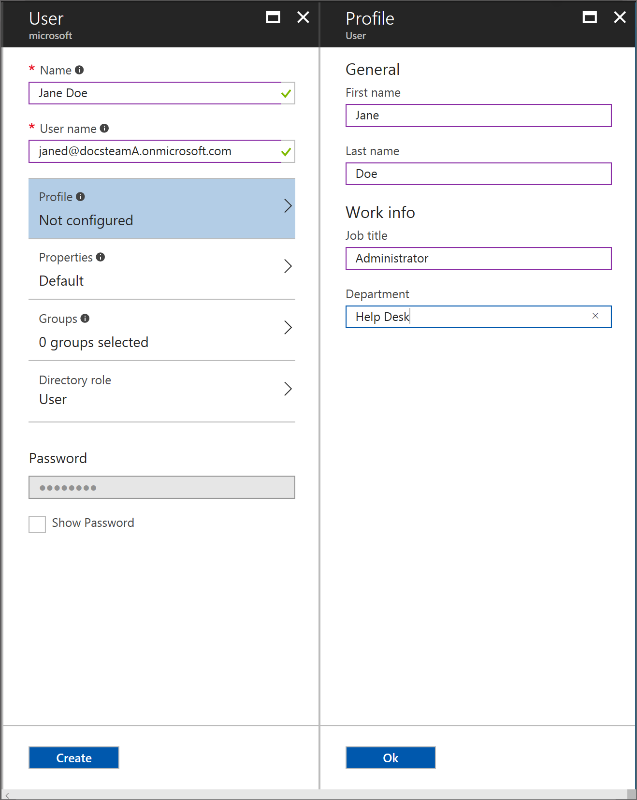
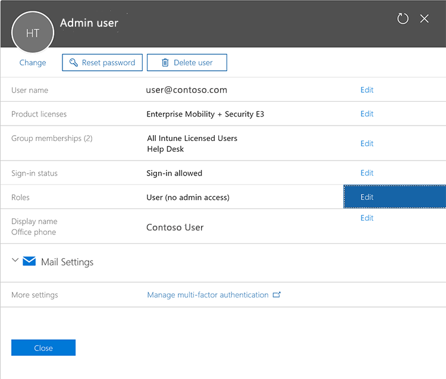
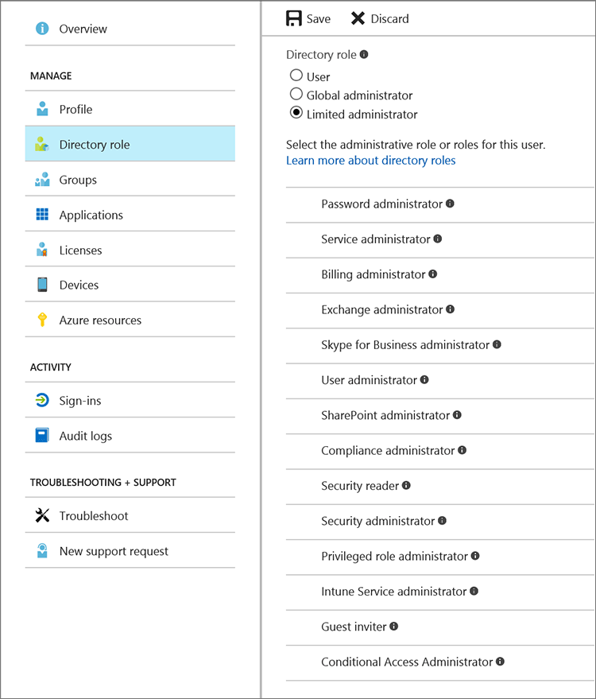

---
# required metadata

title: Add users and grant permissions
titleSuffix: Microsoft Intune
description:  Synchronize on-premises users with Azure AD and grant administrator permissions for your Intune subscription.
keywords:
author: ErikjeMS
ms.author: erikje
manager: dougeby
ms.date: 02/28/2018
ms.topic: conceptual
ms.service: microsoft-intune
ms.subservice: fundamentals
ms.localizationpriority: high
ms.technology:
ms.assetid: 6e9ec662-465b-4ed4-94c1-cff0fe18f126

# optional metadata

#ROBOTS:
#audience:

ms.reviewer: dougeby
ms.suite: ems
search.appverid: MET150
#ms.tgt_pltfrm:
ms.custom: intune-classic; get-started
ms.collection: M365-identity-device-management
---

# Add users and grant administrative permission to Intune

As an administrator, you can add users directly or synchronize users from your on-premises Active Directory. Once added, users can enroll devices and access company resources. You can also give users additional permissions including *global administrator* and *service administrator* permissions.

## Add users to Intune

You can manually add users to your Intune subscription via the [Microsoft 365 admin center](https://admin.microsoft.com) or the [Azure portal](https://portal.azure.com/#blade/Microsoft_Intune_DeviceSettings/ExtensionLandingBlade/overview). An administrator can edit user accounts to assign Intune licenses. You can assign licenses in either the Microsoft 365 admin center or the Intune Azure portal. For more information on using the Microsoft 365 admin center, see [Add users individually or in bulk to the Microsoft 365 admin center](https://support.office.com/article/Add-users-individually-or-in-bulk-to-Office-365-Admin-Help-1970f7d6-03b5-442f-b385-5880b9c256ec).

### Add Intune users in the Microsoft 365 admin center

1. Sign in to [Microsoft 365 admin center](https://admin.microsoft.com) with a global administrator or user management administrator account.
2. In the Office 365 menu, select **Admin**.
3. In the Admin center, select **Add a user**.

   

4. Specify the following user details:
   - **First name**
   - **Last name**
   - **Display name**
   - **User name** - Universal principle name (UPN) stored in Azure Active Directory used to access the service
   - **Location**
   - **Contact information** (optional)
   - **Password** - Auto-generate or specify

     

5. Assign an Intune license. Select **Product licenses** and choose the product license. A license including Intune is required.
6. Choose **Add** to create the new user.

### Add Intune users in the Azure portal

1. In the [Microsoft Endpoint Manager Admin Center](https://go.microsoft.com/fwlink/?linkid=2109431), choose **Users** > **All users**.
2. In the Admin center, select **New user**.
3. Specify the following user details:
   - **Name**
   - **User name** - The new name in Azure Active Directory portal
   
   Choose **OK** to continue.
4. Optionally, you can specify the following user properties:
   - **Profile** - Work information including **Job title** and **Department**
   - **Groups** - Select groups to add for the user
   - **Directory role** - Give the user administrative permissions including an Intune service administrator role.

   Select **Create** to add the new user to Intune.
5. Select **Profile**, and then choose a **Usage location** for the new user. Usage location is required before you can assign the new user an Intune license. Choose **Save** to continue.
    
6. Select **Licenses** and then choose **Assign** to assign an Intune license for this user. An Intune license is required to enroll devices or access company resources. Select **Products**, choose the license type, choose **Select**, and then choose **Assign**.

## Grant admin permissions

After you've added users to your Intune subscription, we recommend that you grant a few users administrative permission.  To grant admin permissions, follow these steps:

### Give admin permissions in Office 365

1. Sign in to the [Microsoft 365 admin center](https://admin.microsoft.com) with a global administrator account.
2. In the Office 365 menu, select **Admin**.
3. In the Admin center, choose **Active users** and then choose the user to give admin permissions.

4. In the **Roles** column, choose **Edit**.

    

5. Choose the admin permission to grant from the list of available roles.

6. Choose **Save**.

### Give admin permissions in the Azure portal

1. Sign in to the [Azure portal](https://portal.azure.com) with a global administrator account.
2. In the Azure portal, choose **User**, and then choose the user you want to give admin permissions.
3. Select **Directory role**, and then select the permission.
  
4. Choose **Save**.

### Types of administrators

Assign users one or more administrator permissions. These permissions define the administrative scope for users and the tasks they can manage. Administrator permissions are common between the different Microsoft cloud services, and some services might not support some permissions. Both the Azure portal and Microsoft 365 admin center list limited administrator roles that are not used by Intune. Intune administrator permissions include the following options:

- **Global administrator** - (Office 365 and Intune) Accesses all administrative features in Intune. By default the person who signs up for Intune becomes a Global admin. Global admins are the only admins who can assign other admin roles. You can have more than one global admin in your organization. As a best practice, we recommend that only a few people in your company have this role to reduce the risk to your business.
- **Password administrator** - (Office 365 and Intune) Resets passwords, manages service requests, and monitors service health. Password admins are limited to resetting passwords for users.
- **Service administrator** - (Office 365 and Intune) Opens support requests with Microsoft, and views the service dashboard and message center. They have “view only” permissions except for opening support tickets and reading them.
- **Billing administrator** - (Office 365 and Intune) Makes purchases, manages subscriptions, manages support tickets, and monitors service health.
- **User administrator** - (Office 365 and Intune) Resets passwords, monitors service health, adds and deletes user accounts, and manages service requests. The user management admin can’t delete a global admin, create other admin roles, or reset passwords for other admins.
- **Intune Service administrator** - All Intune Global administrator permissions except permission to create administrators with **Directory Role** options.

The account you use to create your Microsoft Intune subscription is a global administrator. As a best practice, do not use a global administrator for day-to-day management tasks. While an administrator does not require an Intune license to access the Intune on Azure portal, in order to perform certain management tasks, such as setting up the Exchange service Connector,  an Intune license is required.

To access the Microsoft 365 admin center, your account must have a **Sign-in allowed** set. In the Azure portal under **Profile**, set **Block sign in** to **No** to allow access. This status is different from having a license to the subscription. By default, all user accounts are **Allowed**. Users without administrator permissions can use the Microsoft 365 admin center to reset Intune passwords.

## Sync Active Directory and add users to Intune

You can configure directory synchronization to import user accounts from your on-premises Active Directory to Microsoft Azure Active Directory (Azure AD) which includes Intune users. Having your on-premises Active Directory service connected with all of your Azure Active Directory-based services makes managing user identity much simpler. You can also configure single sign-on features to make the authentication experience for your users familiar and easy. By linking the same [Azure AD tenant](https://azure.microsoft.com/documentation/articles/active-directory-aadconnect/) with multiple services, the user accounts that you have previously synchronized are available to all cloud-based services.

### How to sync on-premises users with Azure AD

The only tool that you need to synchronize your user accounts with Azure AD is the [Azure AD Connect wizard](https://www.microsoft.com/download/details.aspx?id=47594). The Azure AD Connect wizard provides a simplified and guided experience for connecting your on-premises identity infrastructure to the cloud. Choose your topology and needs (single or multiple directories, password hash sync, pass-through authentication, or federation). The wizard deploys and configures all components required to get your connection up and running. Including: sync services, Active Directory Federation Services (AD FS), and the Azure AD PowerShell module.

> [!TIP]
> Azure AD Connect encompasses functionality that was previously released as Dirsync and Azure AD Sync. Learn more about [directory integration](https://technet.microsoft.com/library/jj573653.aspx). To learn about syncing user accounts from a local directory to Azure AD, see [Similarities between Active Directory and Azure AD](https://technet.microsoft.com/library/dn518177.aspx).
