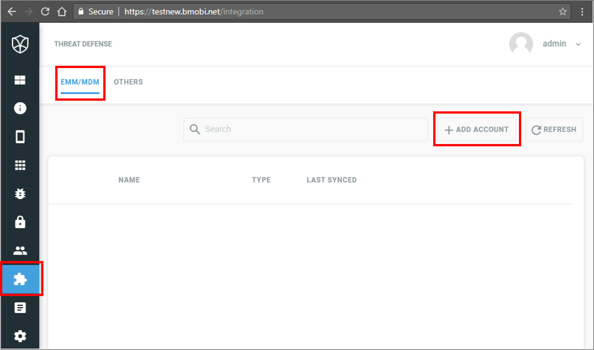

---
# required metadata

title: Set up the Better Mobile integration with Intune
titleSuffix: Intune on Azure
description: "Better Mobile connector integration with Intune"
keywords:
author: brenduns
ms.author: brenduns
manager: dougeby
ms.date: 07/25/2018
ms.topic: conceptual
ms.service: microsoft-intune
ms.subservice: protect
ms.localizationpriority: high
ms.technology:
ms.assetid: 

# optional metadata

#ROBOTS:
#audience:
#ms.devlang:
#ms.reviewer: [ALIAS]
#ms.suite: ems
search.appverid: MET150
#ms.tgt_pltfrm:
#ms.custom:
ms.collection: M365-identity-device-management
---

# Integrate Better Mobile with Intune

Complete the following steps to integrate the Better Mobile Threat Defense solution with Intune.

## Before you begin

The following steps are to be completed in the [Better Mobile admin console](https://aad.bmobi.net) and will enable a connection to Better Mobile's service for both Intune enrolled devices (using device compliance) and unenrolled devices (using app protection policies).

Before starting the process of integrating Better Mobile with Intune, make sure you have the following:

- Microsoft Intune subscription

- Azure Active Directory admin credentials to grant the following permissions:

  - Sign in and read user profile

  - Access the directory as the signed-in user

  - Read directory data

  - Send device information to Intune

- Admin credentials to access the Better Mobile admin console.

### Better Mobile app authorization

The Better Mobile app authorization process follows:

- Allow the Better Mobile service to communicate information related to device health state back to Intune.

- Better Mobile syncs with Azure AD Enrollment Group membership to populate its device's database.

- Allow the Better Mobile admin console to use Azure AD Single Sign On (SSO).

- Allow the Better Mobile app to sign in using Azure AD SSO.

## To set up Better Mobile integration

1. Go to the [Better Mobile admin console](https://aad.bmobi.net) and sign in with your credentials.
2. Choose **Integration** > **EMM/MDM** > **ADD ACCOUNT**.

     

3. Choose **Intune**.
4. Next to **ACCOUNT NAME**, type a descriptor.
5. In the **Microsoft Sign in** window, enter your Intune credentials.
6. In the **Permissions requested** window, choose **Accept**.
7. Search for the Azure AD Security groups that you want Better Mobile to sync devices from, and select them in the list. Then select **Continue**.
8. Select **Done**.
9. The **Add account** page reappears. Close the page.

## Next steps

- [Set up Better Mobile apps for enrolled devices](mtd-apps-ios-app-configuration-policy-add-assign.md)
- [Set up Better Mobile apps for unenrolled devices](mtd-add-apps-unenrolled-devices.md)
