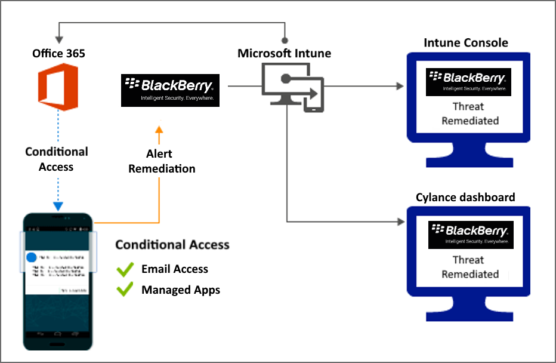
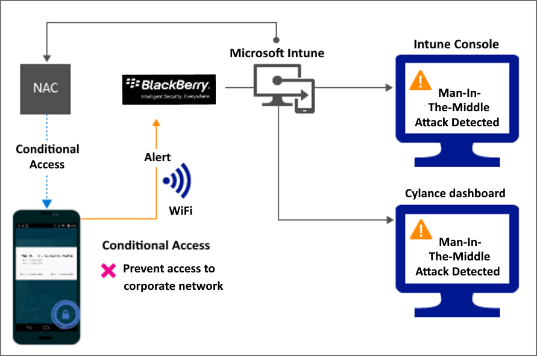
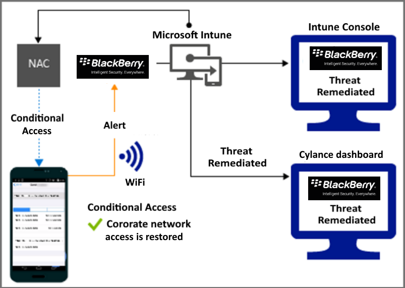
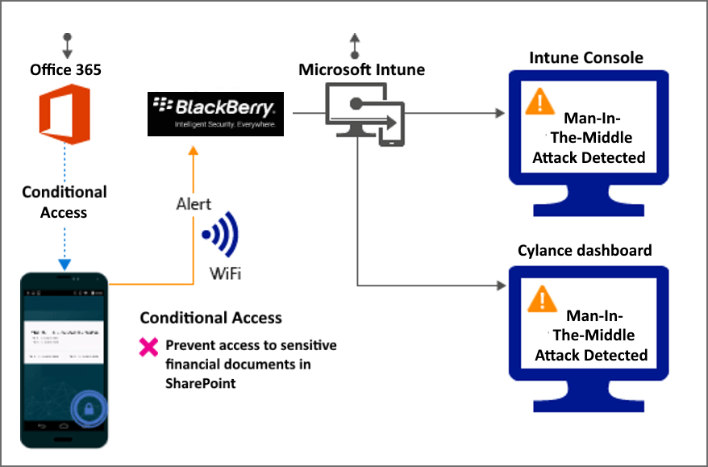
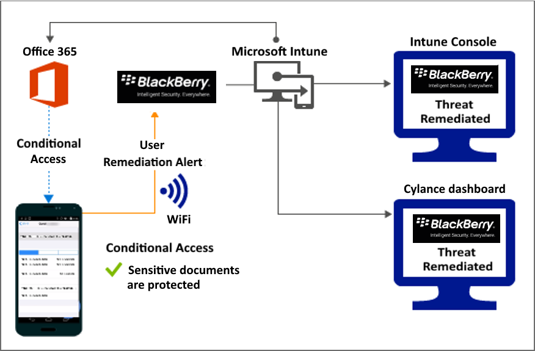

---
# required metadata

title: BlackBerry Protect Mobile connector for Intune
titleSuffix: Intune on Azure
description: Learn about the Blackberry Protect Mobile MTD connector, which enables you to control mobile device access to your corporate resources.
keywords:
author: brenduns
ms.author: brenduns
manager: dougeby
ms.date: 12/16/2021
ms.topic: how-to
ms.service: microsoft-intune
ms.subservice: protect
ms.localizationpriority: high
ms.technology:
ms.assetid:  

# optional metadata

#ROBOTS:
#audience:
#ms.devlang:
ms.reviewer: aanavath
ms.suite: ems
search.appverid: MET150
#ms.tgt-pltfrm:
ms.custom: intune-azure
ms.collection: M365-identity-device-management
---

# Use BlackBerry Protect Mobile with Intune

Control mobile device access to corporate resources using Conditional Access based on risk assessment conducted by BlackBerry Protect Mobile (powered by Cylance AI), a mobile threat defense (MTD) solution that integrates with Microsoft Intune. Risk is assessed based on telemetry collected from devices running the BlackBerry Protect Mobile app.

You can configure Conditional Access policies based on a BlackBerry Protect risk assessment, enabled through Intune device compliance policies for enrolled devices. You can set up your policies to allow or block noncompliant devices from accessing corporate resources based on detected threats. For unenrolled devices, you can use app protection policies to enforce a block or selective wipe based on detected threats.  

For more information about BlackBerry UES, BlackBerry Protect, and Cylance AI, see [BlackBerry UES documentation](https://docs.blackberry.com/en/unified-endpoint-security/blackberry-ues).  

## Supported platforms

- **Android 9.0 and later**

- **iOS 13.0 and later**

## Prerequisites

- Azure Active Directory Premium

- Microsoft Intune subscription

- BlackBerry UES account with access to UES management console 

## How do Intune and the BlackBerry MTD connector help protect your company resources?

The BlackBerry Protect Mobile app for Android and iOS/iPadOS captures file system, network stack, device, and application telemetry where available, then sends the telemetry data to the Cylance AI Protection cloud service to assess the device's risk for mobile threats.

- **Support for enrolled devices** - Intune device compliance policy includes a rule for MTD, which can use risk assessment information from BlackBerry Protect. When the MTD rule is enabled, Intune evaluates device compliance with the policy that you enabled. If the device is found noncompliant, users are blocked access to corporate resources, such as Exchange Online and SharePoint Online. Users also receive guidance from the BlackBerry Protect app installed on their devices to resolve the issue and regain access to corporate resources. To support using BlackBerry Protect with enrolled devices:
  - [Add MTD apps to devices](../protect/mtd-apps-ios-app-configuration-policy-add-assign.md)
  - [Create a device compliance policy that supports MTD](../protect/mtd-device-compliance-policy-create.md)
  - [Enable the MTD connector in Intune](../protect/mtd-connector-enable.md)

- **Support for unenrolled devices** - Intune can use the risk assessment data from the BlackBerry Protect app on unenrolled devices when you use Intune app protection policies. Admins can use this combination to help protect corporate data within a Microsoft Intune protected app, Admins can also issue a block or selective wipe for corporate data on those unenrolled devices. To support using BlackBerry Protect with unenrolled devices:

  - [Add the MTD app to unenrolled devices](../protect/mtd-add-apps-unenrolled-devices.md)
  - [Create a Mobile Threat Defense app protection policy](../protect/mtd-app-protection-policy.md)
  - [Enable the MTD connector in Intune for unenrolled devices](../protect/mtd-enable-unenrolled-devices.md)
  
## Sample scenarios

The following scenarios demonstrate the use of BlackBerry Protect Mobile MTD when integrated with Intune:

### Control access based on threats from malicious apps

When malicious apps such as malware are detected on devices, you can block devices until the threat is resolved:

- Connecting to corporate e-mail

- Syncing corporate files with the OneDrive for Work app

- Accessing company apps

*Block when malicious apps are detected:*

> [!div class="mx-imgBorder"]
> 

*Access granted on remediation:*

> [!div class="mx-imgBorder"]
> 

### Control access based on threat to network

Detect threats like **Man-in-the-middle** in network, and protect access to Wi-Fi networks based on the device risk.

*Block network access through Wi-Fi:*

> [!div class="mx-imgBorder"]
> 

*Access granted on remediation:*

> [!div class="mx-imgBorder"]
> 

### Control access to SharePoint Online based on threat to network

Detect threats like **Man-in-the-middle** in network, and prevent synchronization of corporate files based on the device risk.

*Block SharePoint Online when network threats are detected:*

> [!div class="mx-imgBorder"]
> 

*Access granted on remediation:*

> [!div class="mx-imgBorder"]
>   

## Next steps

- [Integrate BlackBerry Protect Mobile with Intune](blackberry-mtd-connector-integration.md)

- [Set up BlackBerry Protect Mobile app](mtd-apps-ios-app-configuration-policy-add-assign.md)

- [Create BlackBerry Protect Mobile device compliance policy](mtd-device-compliance-policy-create.md)

- [Enable BlackBerry Protect Mobile MTD connector](mtd-connector-enable.md)  
