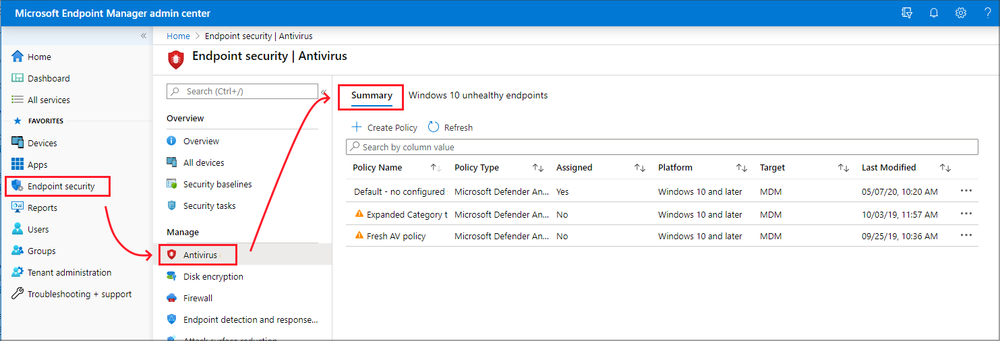

---
# required metadata

title: View reports and status for endpoint security antivirus policies in Microsoft Intune | Microsoft Docs
description: View device and antivirus status as reported for Windows 10 devices that recieve endpoint security antivirus policy in Microsoft Endpoint Manager. 
keywords:
author: brenduns
ms.author: brenduns
manager: dougeby
ms.date: 05/15/2020
ms.topic: reference
ms.service: microsoft-intune
ms.subservice: protect
ms.localizationpriority: medium
ms.technology:

# optional metadata

#ROBOTS:
#audience:
#ms.devlang:
ms.suite: ems
search.appverid: MET150
#ms.tgt_pltfrm:
ms.custom: intune-azure
ms.collection: M365-identity-device-management
ms.reviewer: mattsha

---

# Endpoint security Antivirus policy reports

You can view report and status details about your endpoint security Antivirus policies and device status from the Endpoint security node  in the [Microsoft Endpoint Manager admin center](https://go.microsoft.com/fwlink/?linkid=2109431).

Select **Endpoint security** and then select Antivirus. By default, this opens to the **Summary** page. Additional report and status views are available as additional pages.

## Summary

On the **Summary** page, you can [create new policies](../protect/endpoint-security-policy.md#create-an-endpoint-security-policy) and view a list of the policies that were previously created. The list includes high-level details about the profile that policy includes (Policy Type), and if the policy is assigned.

When you select a policy from the list, the *Overview* page for that policy instance opens and displays more information. When you select a tile from this view, Intune displays additional details for that profile if they’re available.

## Windows 10 unhealthy endpoints

On the **Windows 10 unhealthy endpoints** page you can view information about the antivirus status of your MDM managed Windows 10 devices. This information is returned from Windows Defender Antivirus that runs on the device, as *Threat agent status*.

Only devices with detected issues appear in this view. This view doesn't display details for devices that are identified as clean.

## Next steps

[Configure Endpoint security policies](../protect/endpoint-security-policies.md)