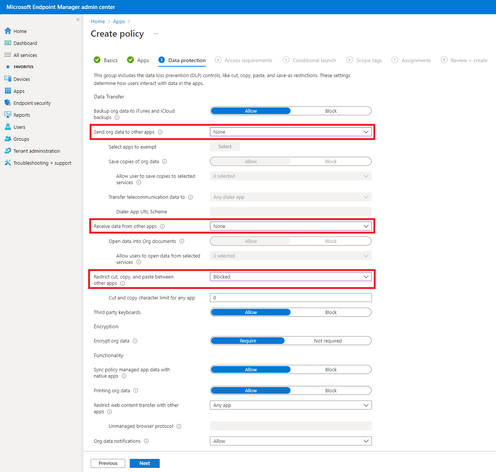
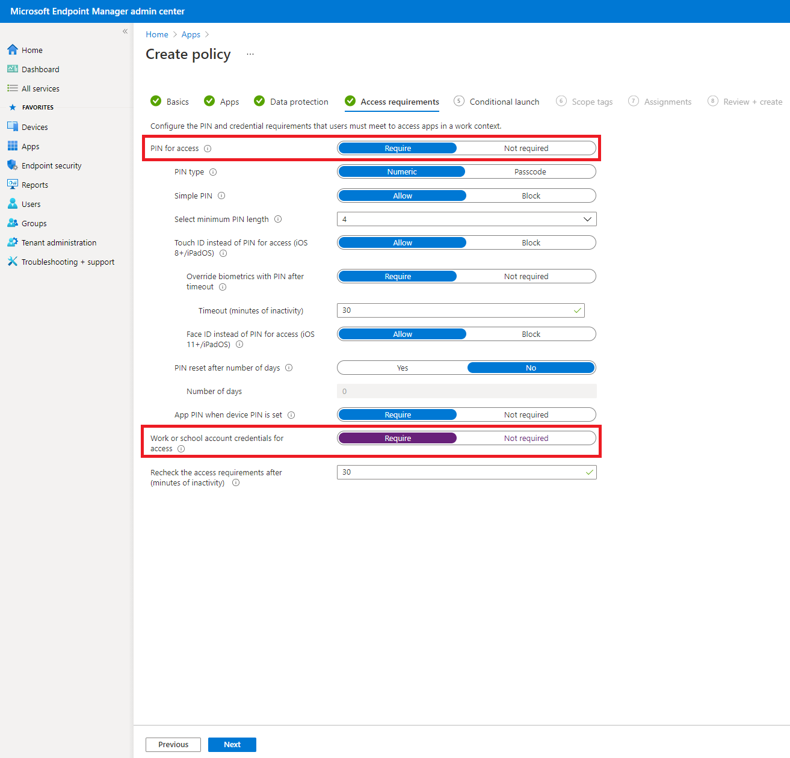
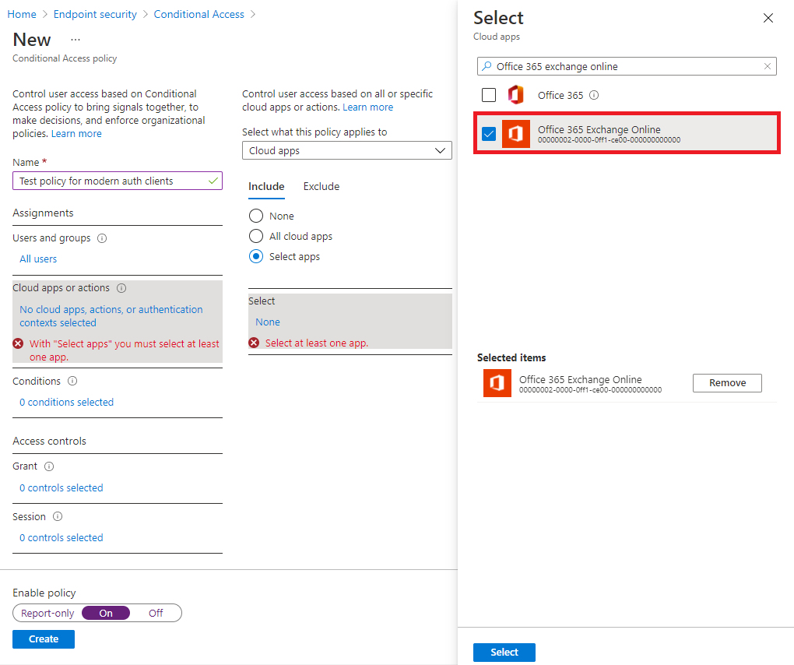
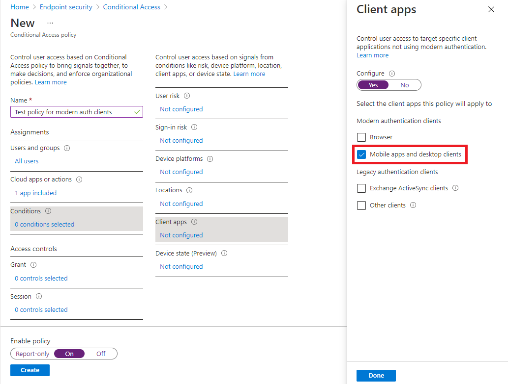
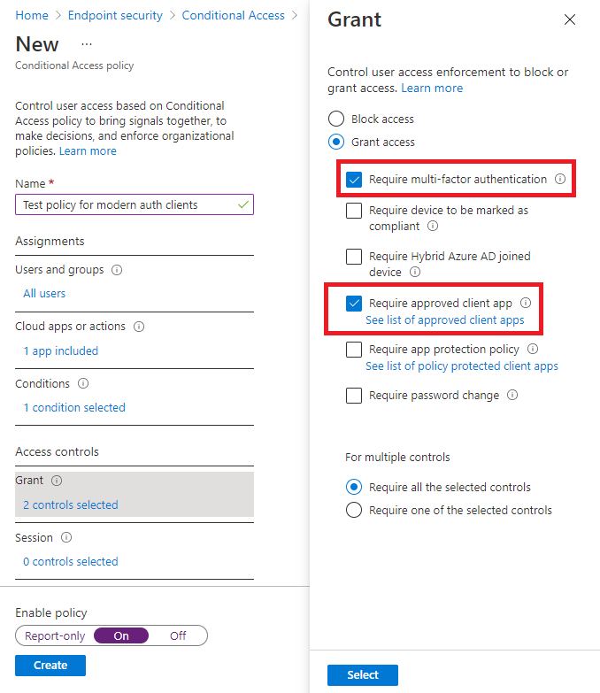
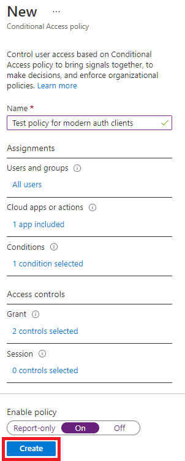
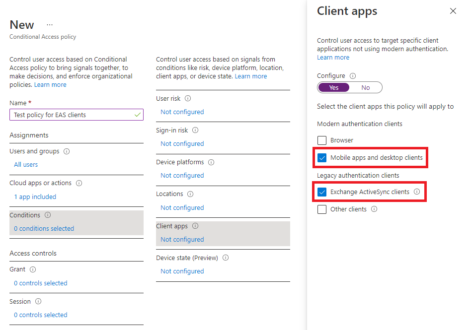
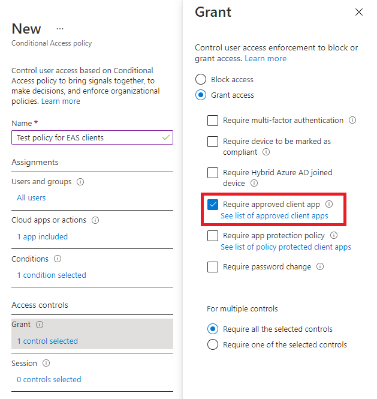

---
# required metadata

title: Tutorial - Protect Exchange Online email on unmanaged devices
titleSuffix: Microsoft Intune
description: Learn to secure Microsoft 365 Exchange Online with Intune app protection policies and Azure AD Conditional Access.
keywords:
author: brenduns
ms.author: brenduns
manager: dougeby
ms.date: 04/30/2020
ms.topic: tutorial
ms.service: microsoft-intune
ms.subservice: protect
ms.localizationpriority: high
ms.technology:
ms.assetid: 

# optional metadata

#ROBOTS:
#audience:

ms.reviewer:
ms.suite: ems
#ms.tgt_pltfrm:
ms.custom: intune-azure
ms.collection: M365-identity-device-management
---

# Tutorial: Protect Exchange Online email on unmanaged devices

Learn about using app protection policies with Conditional Access to protect Exchange Online, even when devices aren't enrolled in a device management solution like Intune. In this tutorial, you'll learn how to:

> [!div class="checklist"]
> * Create an Intune app protection policy for the Outlook app. You'll limit what the user can do with app data by preventing "Save As" and restrict cut, copy, and paste actions.
> * Create Azure Active Directory (Azure AD) Conditional Access policies that allow only the Outlook app to access company email in Exchange Online. You'll also require multi-factor authentication (MFA) for Modern authentication clients, like Outlook for iOS and Android.

## Prerequisites

You'll need a test tenant with the following subscriptions for this tutorial:

- Azure Active Directory Premium ([free trial](https://azure.microsoft.com/free/?WT.mc_id=A261C142F))
- Intune subscription ([free trial](../fundamentals/free-trial-sign-up.md))
- Microsoft 365 Apps for business subscription that includes Exchange ([free trial](https://go.microsoft.com/fwlink/p/?LinkID=510938))

## Sign in to Intune

For this tutorial, when you sign in to the [Microsoft Endpoint Manager admin center](https://go.microsoft.com/fwlink/?linkid=2109431), sign in as a [Global administrator](../fundamentals/users-add.md#types-of-administrators) or an Intune [Service administrator](../fundamentals/users-add.md#types-of-administrators). If you've created an Intune Trial subscription, the account you created the subscription with is the Global administrator.

## Create the app protection policy

In this tutorial, we'll set up an Intune app protection policy for iOS for the Outlook app to put protections in place at the app level. We'll require a PIN to open the app in a work context. We'll also limit data sharing between apps and prevent company data from being saved to a personal location.

1. Sign in to the [Microsoft Endpoint Manager admin center](https://go.microsoft.com/fwlink/?linkid=2109431).

2. Select **Apps** > **App protection policies** > **Create policy**, and select **iOS/iPadOS** for the platform.

3. On the **Basics** page, configure the following settings:

   - **Name**: Enter **Outlook app policy test**.
   - **Description**: Enter **Outlook app policy test**.

   The **Platform** value is set to your previous choice.

   Click **Next** to continue.

4. The **Apps** page allows you to choose how you want to apply this policy to apps on different devices. Configure the following options:

   - For **Target to all app types**: Select **No**, and then for **App types**, select the checkbox for **Apps on unmanaged devices**.
   - Click **Select public apps**. In the Apps list, select **Outlook**, and then choose **Select**.  Outlook now appears under *Public apps*.

   Click **Next** to continue.

5. The **Data protection** page provides settings that determine how users interact with data in the apps that this app protection policy applies.​ Configure the following options:

   Below *Data Transfer*, configure the following settings, leaving all other settings at their default values:

   - For **Send org data to other apps**, select **None**.  
   - For **Receive data from other apps**, select **None**.  
   - For **Save copies of org data**, select **Block**.  
   - For **Restrict cut, copy and paste between other apps**, select **Blocked**. 

   

   Select **Next** to continue.

6. The **Access requirements** page provides settings to allow you to configure the PIN and credential requirements that users must meet to access apps in a work context. Configure the following settings, leaving all other settings at their default values:

   - For **PIN for access**, select **Require**.
   - For **Work or school account credentials for access**, select **Require**.

   

   Select **Next** to continue.

7. The **Conditional launch** page provides settings to set the sign-in security requirements for your app protection policy. For this tutorial, you don't need to configure these settings.

   Click **Next** to continue.

8. Use the **Assignments** page to assign the app protection policy to groups of users. For this tutorial, you won't assign this policy to a group.  

   Click **Next** to continue.

9. On the **Next: Review + create** page, review the values and settings you entered for this app protection policy. Click **Create** to create the app protection policy in Intune.

The app protection policy for Outlook is created. Next, you'll set up Conditional Access to require devices to use the Outlook app.

## Create Conditional Access policies

Now we'll create two Conditional Access policies to cover all device platforms.  

- The first policy will require that Modern Authentication clients use the approved Outlook app and multi-factor authentication (MFA). Modern Authentication clients include Outlook for iOS and Outlook for Android.  

- The second policy will require that Exchange ActiveSync clients use the approved Outlook app. (Currently, Exchange Active Sync doesn't support conditions other than device platform). You can configure Conditional Access policies in either the Azure AD portal or the Intune portal. Since we're already in the Intune portal, we'll create the policy here.  

### Create an MFA policy for Modern Authentication clients  

1. Sign in to the [Microsoft Endpoint Manager admin center](https://go.microsoft.com/fwlink/?linkid=2109431).

2. Select **Endpoint security** >  **Conditional access** > **New policy**.  

3. For **Name**, enter **Test policy for modern auth clients**.  

4. Under **Assignments**, select **Users and groups**. On the **Include** tab, select **All users**, and then select **Done**.

5. Under **Assignments**, select **Cloud apps or actions**. Because we want to protect Microsoft 365 Exchange Online email, we'll select it by following these steps:

   1. On the **Include** tab, choose **Select apps**.
   2. Choose **Select**.
   3. In the Applications list, select **Office 365 Exchange Online**, and then choose **Select**.
   4. Select **Done** to return to the New policy pane.

   

6. Under **Assignments**, select **Conditions** > **Device platforms**.

   1. Under **Configure**, select **Yes**.
   2. On the **Include** tab, select **Any device**.
   3. Select **Done**.

7. On the **Conditions** pane, select **Client apps**.

   1. Under **Configure**, select **Yes**.
   2. Select **Mobile apps and desktop clients** and **Modern authentication clients**.
   3. Clear the other check boxes.
   4. Select **Done** > **Done** to return to the New policy pane.

   

8. Under **Access controls**, select **Grant**.

   1. On the **Grant** pane, select **Grant access**.
   2. Select **Require multi-factor authentication**.
   3. Select **Require approved client app**.
   4. Under **For multiple controls**, select **Require all the selected controls**. This setting ensures that both requirements you selected are enforced when a device tries to access email.
   5. Choose **Select**.

   

9. Under **Enable policy**, select **On**, and then select **Create**.

     

The Conditional Access policy for Modern Authentication clients is created. Now you can create a policy for Exchange Active Sync clients.

### Create a policy for Exchange Active Sync clients

1. Sign in to the [Microsoft Endpoint Manager admin center](https://go.microsoft.com/fwlink/?linkid=2109431).

2. Select **Endpoint security** > **Conditional Access** > **New policy**.

3. For **Name**, enter **Test policy for EAS clients**.

4. Under **Assignments**, select **Users and groups**. On the *Include* tab, select **All users**, and then select **Done**.

5. Under **Assignments**, select **Cloud apps or actions**. Select Microsoft 365 Exchange Online email with these steps:

   1. On the *Include* tab, choose **Select apps**.
   2. Choose **Select**.
   3. From the list of *Applications*, select **Office 365 Exchange Online**, and then choose **Select**, and then **Done**.
  
6. Under **Assignments**, select **Conditions** > **Device platforms**.

   1. Under **Configure**, select **Yes**.
   2. On the **Include** tab, select **Any device**, and then select **Done**.

7. On the **Conditions** pane, select **Client apps**.

   1. Under **Configure**, select **Yes**.
   2. Select **Mobile apps and desktop clients**.
   3. Select **Exchange ActiveSync clients** and **Apply policy only to supported platforms**.  
   4. Clear all other check boxes.  
   5. Select **Done**, and then select **Done** again.  

     

8. Under **Access controls**, select **Grant**.

   1. On the **Grant** pane, select **Grant access**.
   2. Select **Require approved client app**. Clear all other check boxes.
   3. Choose **Select**.

   

9. Under **Enable policy**, select **On**, and then select **Create**.

Your app protection policies and Conditional Access are now in place and ready to test.

## Try it out

With the policies you've created, devices will need to enroll in Intune and use the Outlook mobile app to access Microsoft 365 email. To test this scenario on an iOS device, try signing in to Exchange Online using credentials for a user in your test tenant.

1. To test on an iPhone, go to **Settings** > **Passwords & Accounts** > **Add Account** > **Exchange**.

2. Enter the email address for a user in your test tenant, and then press **Next**.  
3. Press **Sign In**.

4. Enter the test user's password, and press **Sign in**.

5. The message **More information is required** appears, which means you're being prompted to set up MFA. Go ahead and set up an additional verification method.

6. Next you'll see a message that says you're trying to open this resource with an app that isn't approved by your IT department. The message means you're being blocked from using the native mail app. Cancel the sign-in.

7. Open the Outlook app and select **Settings** > **Add Account** > **Add Email Account**.

8. Enter the email address for a user in your test tenant, and then press **Next**.

9. Press **Sign in with Office 365**. You'll be prompted for additional authentication and registration. Once you've signed in, you can test actions such as cut, copy, paste, and "Save As".

## Clean up resources

When the test policies are no longer needed, you can remove them.

1. Sign in to the [Microsoft Endpoint Manager admin center](https://go.microsoft.com/fwlink/?linkid=2109431).

2. Select **Devices** **Compliance policies**.

3. In the **Policy Name** list, select the context menu (**...**) for your test policy, and then select **Delete**. Select **OK** to confirm.

4. Select **Endpoint security** > **Conditional access**.

5. In the **Policy Name** list, select the context menu (**...**) for each of your test policies, and then select **Delete**. Select **Yes** to confirm.

## Next steps
In this tutorial, you created app protection policies to limit what the user can do with the Outlook app, and you created Conditional Access policies to require the Outlook app and require MFA for Modern Authentication clients. To learn about using Intune with Conditional Access to protect other apps and services, see [Set up Conditional Access](conditional-access.md).
