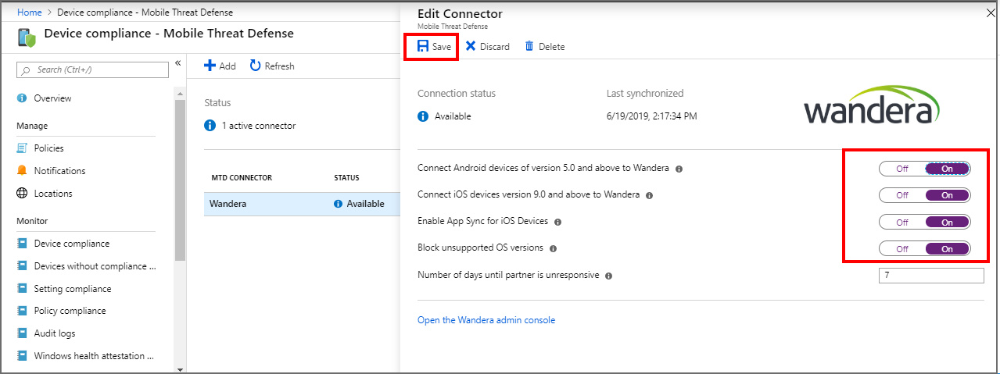
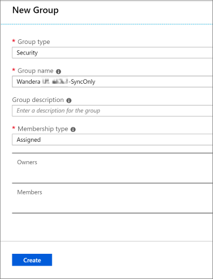

---
# required metadata

title: Set up Wandera Mobile Threat Protection integration with Intune
titleSuffix: Intune on Azure
description: How to set up the Wandera Mobile Threat Protection solution with Microsoft Intune to control mobile device access to your corporate resources.
keywords:
author: brenduns
ms.author: brenduns
manager: dougeby
ms.date: 06/26/2020
ms.topic: how-to
ms.service: microsoft-intune
ms.subservice: protect
ms.localizationpriority: high
ms.technology:
ms.assetid:  

# optional metadata

#ROBOTS:
#audience:

#ms.reviewer: davidra
#ms.suite: ems
search.appverid: MET150
#ms.tgt_pltfrm:
#ms.custom:
ms.collection: M365-identity-device-management
---

# Integrate Wandera Mobile Threat Protection with Intune  

Complete the following steps to integrate the Wandera Mobile Threat Defense solution with Intune.  

## Before you begin  

Before you start the process to integrate Wandera with Intune, make sure you have the following prerequisites in place:

- Intune subscription
- Azure Active Directory administrator credentials and assigned role that is able to grant the following permissions:

    - Sign in and read user profile
    - Access the directory as the signed-in user
    - Read directory data
    - Send device risk information to Intune
 
- A valid Wandera subscription
    - An administrator account with super admin privileges

## Integration overview

Enabling Mobile Threat Defense integration between Wandera and Endpoint Manager entails:

- Enabling Wandera’s UEM Connect service to synchronize information with Azure and Endpoint Manager. This includes user and device Life Cycle Management (LCM) metadata, along with Mobile Threat Defense (MTD) device threat level.
- Create Activation Profiles in Wandera to define device enrollment behavior.
- Deploy Wandera over-the-air to managed iOS and Android devices.
- Configure Wandera for end user self-service using MAM-WE on unmanaged iOS and Android devices.

## Set up Wandera Mobile Threat Defense integration

Setting up integration between Wandera and Intune does not require any support from Wandera staff and can be easily accomplished in a matter of minutes.

### Enable support for Wandera in Intune

1. Sign in to the [Microsoft Endpoint Manager admin center](https://go.microsoft.com/fwlink/?linkid=2109431).
2. Select **Tenant administration** > **Connectors and tokens** > **Mobile Threat Defense** > **Add**.
3. On the **Add Connector** page, use the dropdown and select **Wandera**. And then select **Create**.  
4. On the Mobile Threat Defense pane, select the **Wandera** MTD Connector from the list of connectors to open the **Edit connector** pane. Select **Open the Wandera admin console** to open [RADAR](https://radar.wandera.com/login), the Wandera admin console, and sign in. 
5. In the Wandera RADAR console, go to **Integrations > UEM Integration**, and select the **UEM Connect** tab. Use the EMM Vendor drop-down and select **Microsoft Intune**.
6. You will be presented with a screen similar to the below, indicating the permission grants required to complete the integration:

    

7. Next to Intune User and Device Sync, click the Grant button to start the process to provide consent for Wandera to perform Life Cycle Management (LCM) functions with Azure and Endpoint Manager.
8. When prompted, select or enter your Azure admin credentials. Review the requested permissions, then select the checkbox to Consent on behalf of your organization. Finally, click Accept to authorize the LCM integration.

   

10. You will be automatically returned back to the RADAR admin console.  If the authorization was successful, you will see a green tick mark next to the Grant button.
11.	Repeat the consent process for the remaining listed integrations by clicking on their corresponding Grant buttons until you have green tick marks next to each.

    

12.	Return to the Intune console, and resume editing the Wandera MTD Connector. Set all of the available toggles to On, and then Save the configuration.

    

Intune and Wandera are now connected.

## Create Activation Profiles in Wandera

Endpoint Manager-based deployments are facilitated using Wandera Activation Profiles defined in RADAR.  Each Activation Profile defines specific configuration options like authentication requirements, service capabilities, and initial group membership.

After creating an Activation Profile in Wandera, you “assign” it to users and devices in Endpoint Manager.  While an Activation Profile is universal across device platforms and management strategies, the steps below define how to configure Endpoint Manager based upon these differences.

The steps from here assume you have created an Activation Profile in Wandera that you would like to deploy via Endpoint Manager to your target devices. Please see the [Activation Profiles Guide](missing) for more details on creating and using Wandera Activation Profiles.

> [!NOTE]
> When creating Activation Profiles for deployment via Endpoint Manager or MAM-WE, be sure to set Associated User to the Authenticated by Identity Provider > Azure Active Directory option for maximum security, cross-platform compatibility, and a streamlined end user experience.

## Configure the Wandera applications and synchronization group

To deploy Wandera, you will add the Wandera mobile apps for the platforms you use (iOS and Android) to Intune, and assign them to a specific group for synchronization; the *SyncOnly* group.

The following sections and procedures will guide you through this process.

For more information about this process from Wandera, sign in to Wandera [RADAR](https://radar.wandera.com/login). Go to **Settings** > **EMM Integration**, select the **App Push** tab, and then select **Microsoft Intune**. The App Push tab updates with instructions that are specific to Intune.

### Add the Wandera apps

Create client apps in Intune to deploy the Wandera app to Android and iOS/iPadOS devices. See [Add MTD apps](mtd-apps-ios-app-configuration-policy-add-assign.md) for the procedures and custom details specific to the Wandera apps.  

After you create the apps, return here to create the synchronization group and assign the apps.

### Create the synchronization group and assign the apps

1. Get the name of the **SyncOnly** group that appears below **EMM Label** from within the Wandera RADAR console. You might have saved this name during step 7 while [enabling support for Wandera in Intune](#enable-support-for-wandera-in-intune). Use this name as the name of the group in Intune for Wandera synchronization.

2. In the Endpoint Manager admin center, go to **Groups** and select **New group**. Specify the following to configure the synchronization group for use by Wandera:

   - **Group type**: **Security**
   - **Group name**: Specify the **SyncOnly** name you retrieved from the Wandera RADAR admin console.

   

3. Select **Members** and assign groups that include the Android and iOS/iPadOS devices you want to use with Wandera.

4. Select **Create** to save the group.

For more information, see [Deploy apps](../apps/apps-deploy.md)

### Assign the Wandera apps to the synchronization group

Repeat the following procedure for the Wandera app you created for iOS/iPadOS and for Android.

1. Sign in to the [Microsoft Endpoint Manager admin center](https://go.microsoft.com/fwlink/?linkid=2109431).
2. Select **Apps** > **All apps** and select the Wandera app.
3. Select **Assignments** and then **Add group**.  
4. On the *Add group* pane, for *Assignment type* select **Required**.
5. Select **Included groups**, and then **Select groups to include**. Specify the group you created for Wandera synchronization, and then click **Select** > **OK** > **OK**. Select **Save** to complete the group assignment. 

## Next Steps

Now that you have Wandera integrated with Endpoint Manager, you can now tune your configuration, view reports, and deploy more broadly across your fleet of mobile devices. For detailed configuration guides, see the [Support Center Getting Started Guide](https://radar.wandera.com/?return_to=https://wandera.force.com/Customer/s/getting-started) in the Wandera documentation.
