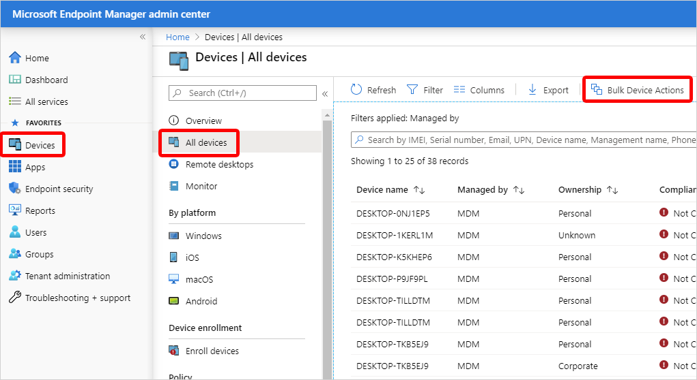

---
# required metadata

title: Use bulk device actions in Microsoft Intune device.
titleSuffix:
description: Use bulk remote device actions.
keywords:
author: ErikjeMS
ms.author: erikje
manager: dougeby
ms.date: 3/12/2020
ms.topic: conceptual
ms.service: microsoft-intune
ms.subservice: remote-actions
ms.localizationpriority: high
ms.technology:
ms.assetid: 

# optional metadata

#ROBOTS:
#audience:

#ms.reviewer: coferro
ms.suite: ems
search.appverid: MET150
#ms.tgt_pltfrm:
ms.custom: intune-azure
ms.collection: M365-identity-device-management
---

# Use bulk device actions

You can use bulk device actions for the following remote actions:
- Autopilot reset
- custom notifications
- delete
- rename
- restart
- sync
- wipe

## Use a bulk device action

1. Sign in to the [Microsoft Endpoint Manager Admin Center](https://go.microsoft.com/fwlink/?linkid=2109431).
2. Choose **Devices** > **All devices** > **Bulk Device Actions**.

3. On the **Bulk device action** page, select an **OS** and **Device action**. Some device actions have additional options or fields to populate. Choose **Next**.
4. On the **Devices** page, select from 1 to 100 devices > **Next**.
5. On the **Review + create** page, select **Create**.

## Next steps
[Device management overview.](device-management.md)
