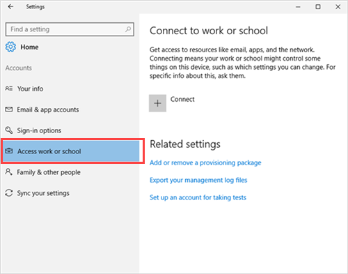
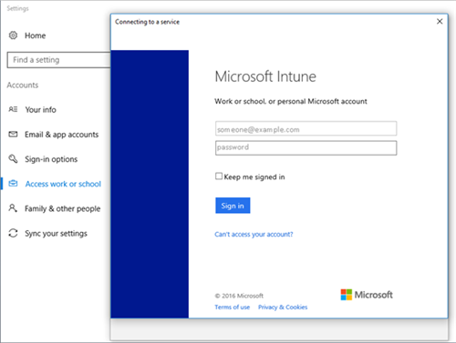

---
# required metadata

title: Enroll Windows 10 device in Intune | Microsoft Docs
description: Enroll your Windows 10 device in Intune to get remote access to work or school.  
keywords:
author: lenewsad
ms.author: lanewsad
manager: dougeby
ms.date: 2/12/2021
ms.topic: end-user-help
ms.prod:
ms.service: microsoft-intune
ms.subservice: end-user
ms.technology:
ms.assetid: 812e82df-76df-402b-bfe9-29302838f40e
searchScope:
 - User help

# optional metadata

ROBOTS:  
#audience:

ms.reviewer: amanh
ms.suite: ems
#ms.tgt_pltfrm:
ms.custom: intune-enduser
ms.collection: 
---

# Enroll Windows 10 devices in Intune  

Enroll your Windows 10 device in Intunet to get access to work or school things such as email, apps, and internal websites. This article describes how to enroll devices running on Windows 10, version 1607 and later, and Windows 10, version 1511 and earlier. Before you begin, make sure you [verify the version on your device](using-your-windows-device-with-intune.md) so that you can follow the correct set of instructions.  

Windows 10 is supported across various device types including desktop, laptop, and tablet. The enrollment steps are the same on all device types but your screen may look a little different from the images shown in this article.  
 
> [!VIDEO https://www.youtube.com/embed/TKQxEckBHiE?rel=0]

## Enroll Windows 10, version 1607 and later device 
These steps describe how to enroll a device that runs on Windows 10, version 1607 and later.  

1. Go to **Start**. 

2. Open the **Settings** app. If the app isn't readily available in your apps list, go to the search bar and type "settings."

3. Select **Accounts** > **Access work or school** > **Connect**.  

      

4. To get to your organization's Intune sign-in page, enter your work or school email address. Then select **Next**.  

     

5. Sign in to Intune with your work or school account.  

      

    You'll eventually see a message that your company or school is registering your device.

6. If your organization requires you to set up a PIN for Windows Hello, you'll be prompted to enter a verification code. Enter the code and continue through the on-screen steps to create a PIN.  

7. On the **You're all set!** screen, select **Done**. Your device is now enrolled.  

8. To double-check your connection, go back to **Settings** > **Accounts** > **Access work or school**.  Your account should now be listed.  

## Enroll Windows 10, version 1511 and earlier device  
These steps describe how to enroll a device that runs on Windows 10, version 1511 and earlier.  

1. Go to **Start**. 

2. Open the **Settings** app. If the app isn't readily available in your apps list, go to the search bar and type "settings."

3. Select **Accounts** > **Your account**.  

      

5. Select **Add a work or school account**.  

      

6. Sign in with your work or school credentials.  

      

## Troubleshooting 
For a non-exhaustive list of error messages and other connection remedies, see [Troubleshoot Windows 10 device access](troubleshoot-your-windows-10-device-windows.md).  

## IT administrator support   

If you're an IT administrator and run in to problems while enrolling devices, see [Troubleshooting Windows device enrollment problems in Microsoft Intune](https://support.microsoft.com/help/4469913). This article lists common errors, their causes, and steps to resolve them. 

## Next steps  
If you need help setting up your device or using Company Portal, contact your organization's IT support team. Sign in to the [Company Portal website](https://go.microsoft.com/fwlink/?linkid=2010980) to find your help desk information.  

 

