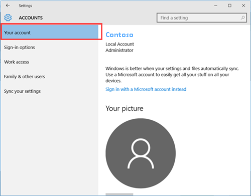

---
# required metadata

title: Enroll Windows 10 device in Intune | Microsoft Docs
description: Set up your Windows 10 device in Intune Company Portal to get remote access to work or school.  
keywords:
author: lenewsad
ms.author: lanewsad
manager: dougeby
ms.date: 6/22/2021
ms.topic: end-user-help
ms.prod:
ms.service: microsoft-intune
ms.subservice: end-user
ms.technology:
ms.assetid: 812e82df-76df-402b-bfe9-29302838f40e
searchScope:
 - User help

# optional metadata

ROBOTS:  
#audience:

ms.reviewer: amanh
ms.suite: ems
#ms.tgt_pltfrm:
ms.custom: intune-enduser
ms.collection: 
---

# Enroll Windows 10 devices in Intune    

Enroll your Windows 10 device in Intune to get mobile access to work or school apps, email, and Wi-Fi. This article describes how to set up devices running:

* Windows 10, version 1607 and later
* Windows 10, version 1511 and earlier  

To identify the version of Windows running on your device, see [Which version of Windows operating system am I running?](https://go.microsoft.com/fwlink/?linkid=2166188).  

Windows 10 is supported on desktop and mobile devices. Setup steps are the same on all device types but appearance may vary from one device to the next.  
 
> [!VIDEO https://www.youtube.com/embed/TKQxEckBHiE?rel=0]  

## Get Company Portal
You can enroll Windows 10 devices through the Intune Company Portal website or app. Devices running Windows 7 or 8.1 must enroll through the Company Portal website. To access Company Portal: 

* Install the app from the [Microsoft Store](https://go.microsoft.com/fwlink/?linkid=2141417).    
* [Sign on to the Company Portal website](https://go.microsoft.com/fwlink/?linkid=2010980) with your work or school credentials.  

## Enroll Windows 10, version 1607 and later device 
These steps describe how to enroll a device that runs on Windows 10, version 1607 and later.  

1. Open Company Portal and sign in with your work or school account. *For PM: What is the reason for needing to decline the automatic prompt? It sounds like the error message doesn't mean anything b/c they can proceed anyway--is this something we want to tell them so that they don't worry? Can you drop a screenshot in the work item so that I can see the error message?*

2. On the **Set up your device** screen, select **Next**. 

      

3. On the **Connect to work** screen, select **Connect**.  

      

4. When prompted to, sign in with your work or school account again. If you're using the Company Portal website, the prompt may open in a new window. *For PM: Is the last sentence accurate in that the caveat is only for website and not app?*  

      

5. On the **Setting up your device** screen, select **Go**.  

6. After setup is complete, you'll be redirected to the **Connect to work** screen. *PM: Is this correct? Or will they be on that screen already?* Select **Next** > **Done** to finish setup.  

      

## Sync device to fix connection problems  

If at any time after enrolling your device you have trouble accessing work or school things, try syncing your device. Open the Settings app and select **Accounts** > **Access work or school** > **Info** > **Sync**.     

## Enroll Windows 10, version 1511 and earlier device  *For PM: This section does not use Company Portal to enroll devices--do you want to make any updates to this section, delete, or leave as-is?*  
These steps describe how to enroll a device that runs on Windows 10, version 1511 and earlier.  

1. Go to **Start** and open the **Settings** app. 

3. Select **Accounts** > **Your account**.  

      

5. Select **Add a work or school account**.  

      

6. Sign in with your work or school credentials.  

      

## Troubleshooting 
For a non-exhaustive list of error messages and resolutions, see [Troubleshoot Windows 10 device access](troubleshoot-your-windows-10-device-windows.md).  

## Support for IT administrators    

If you're an IT administrator and run into problems while enrolling devices, see [Troubleshooting Windows device enrollment problems in Microsoft Intune](https://support.microsoft.com/help/4469913). This article lists common errors, their causes, and steps to resolve them. 

## Next steps  
If you need more help setting up your device or using Company Portal, contact your support person. Sign in to the [Company Portal website](https://go.microsoft.com/fwlink/?linkid=2010980) for your organization's contact information.   

 

