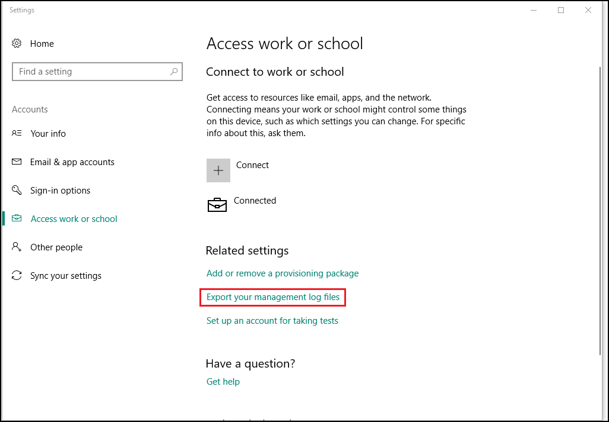

---
# required metadata

title: Export your management log files  
description: Learn how to export diagnostic log files to share with your support person.    
keywords:
author: lenewsad
ms.author: lanewsad
manager: dougeby
ms.date: 10/04/2021
ms.topic: end-user-help
ms.prod:
ms.service: microsoft-intune
ms.subservice: end-user
ms.technology:
ms.assetid: 038747fb-5b52-47c4-a2b6-f9218da4cfe1
searchScope:
 - User help

# optional metadata

ROBOTS:  
#audience:

ms.reviewer: priyar
ms.suite: ems
#ms.tgt_pltfrm:
ms.custom: intune-enduser
ms.collection: 
---

# Export your management log files     

**Applies to**  
- Windows 10  
- Windows 11  

Whenever an an error or event occurs on your device, it's saved to a document called a _diagnostic log_. These logs contain additional details, and when exported, they can provide your support team with enough information about the event or error to diagnose why it happened. 

1. Open the **Settings** app on your device.  
2. Go to **Accounts** > **Access work or school**.  
3. Select **Export your management log files**.  

   

4. The logs will be saved in **C:\Users\Public\Public Documents\MDMDiagnostics**. Two files will be created: one is the log itself, and the other is a document that allows your admin to review the logs in different programs, like Microsoft Excel. Attach both of these files to an email and send that email to your admin. If you do this more than once, simply choose the files from the day you created the logs. 

You may also need to send [logs from the Company Portal app](send-logs-to-your-it-admin-cp-windows.md) to give your company support more help in trying to troubleshoot any issues they may find. 

Still need help? Contact your company support. For contact information, check the [Company Portal website](https://go.microsoft.com/fwlink/?linkid=2010980).
