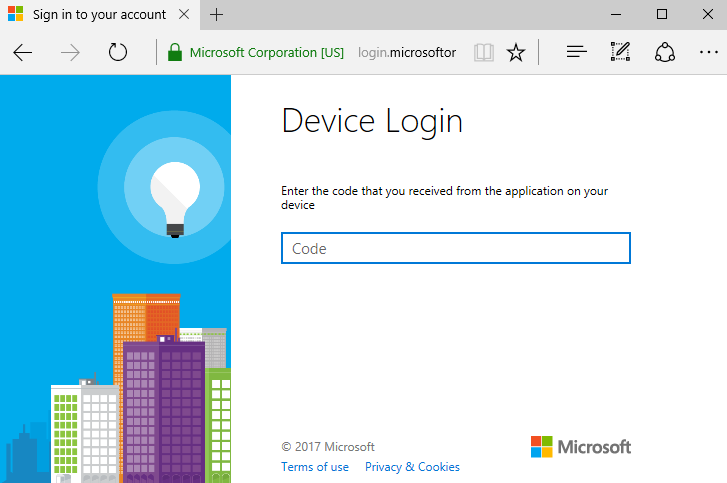

---
# required metadata

title: How to sign in to Company Portal app | Microsoft Docs
description: Learn where to get the Company Portal app and how to sign in.
keywords:
author: lenewsad
ms.author: lanewsad
manager: dougeby
ms.date: 10/04/2021
ms.topic: end-user-help
ms.prod:
ms.service: microsoft-intune
ms.subservice: end-user
ms.technology:
ms.assetid: cfd214bc-f072-4808-af2e-a3cbf7af9bca
searchScope:
 - User help

# optional metadata

ROBOTS:  
#audience:

ms.reviewer: esmich
ms.suite: ems
#ms.tgt_pltfrm:
ms.custom: intune-enduser
ms.collection: 
---

# How to sign in to Company Portal  

**Applies to**  
- Windows 10  
- Windows 11  

Company Portal is available for Windows 10/11, Android, iOS, and macOS devices from the following locations (respectively): 

* [Microsoft Store](https://go.microsoft.com/fwlink/?linkid=2141417)  
* [Google Play](https://go.microsoft.com/fwlink/?linkid=2141416)  
* [Apple App Store](https://go.microsoft.com/fwlink/?linkid=2141414)  
* [Enroll my Mac](https://go.microsoft.com/fwlink/?linkid=853070): Selecting this link will immediately download the Company Portal installer package on your device.  

There are three ways to sign in to the Company Portal app.

* Sign in with your school or work email address and password.  
* Sign in with certificate-based authentication.  
* Sign in from another device.   

This article describes how to sign in using each of these methods. For the best experience, use the method that your organization recommends or requires. 

## Sign in with school or work account    
Complete the following steps to sign in to Company Portal with your school or work account. 

1. Open the app and tap **Sign In**.  

2. Enter the email address associated with your school or work account and then tap **Next**.

3. Enter your password and tap **Sign In**.

4. Wait while the app verifies your credentials. When done, you can access the features in the app and your organization's resources.  

## Sign in with certificate  
You'll only see this sign-in option if your organization allows certificate-based authentication and you have a certificate available to use.  

1. Open the Company Portal app on your device.  

2. Enter the email address associated with your work or school account and then tap **Next**.   

3. Tap **Sign in with a certificate**.  

4. Tap **Continue** to use the certificate.  
5. Wait while the app verifies your certificate. When done, you can access the features in the app and your organization's resources.  

## Sign in via another device    

If you normally use a smart card to access work resources, follow the steps in this section to sign in to Company Portal.  

1. Open Company Portal on the device you'll be using to access your work resources.  

2. Select **Sign in from another device**.  

3. Write down the one-time, sign-in code that appears on screen (or just keep this screen handy for the next couple steps). 

   

3. Switch to your other device (the one you're using to authenticate) and go to [https://microsoft.com/devicelogin](https://microsoft.com/devicelogin).  

4. When prompted to, enter the code.  

   

4. Select  __Continue__ to allow the Company Portal to sign in on your work device.   

5. Once the screen says that you're signed in to Company Portal, you can close the browser and switch to your work device.  

## Next steps  

Stuck or need help? Contact your IT support person. For contact information, check the [Company Portal website](https://go.microsoft.com/fwlink/?linkid=2010980).  
