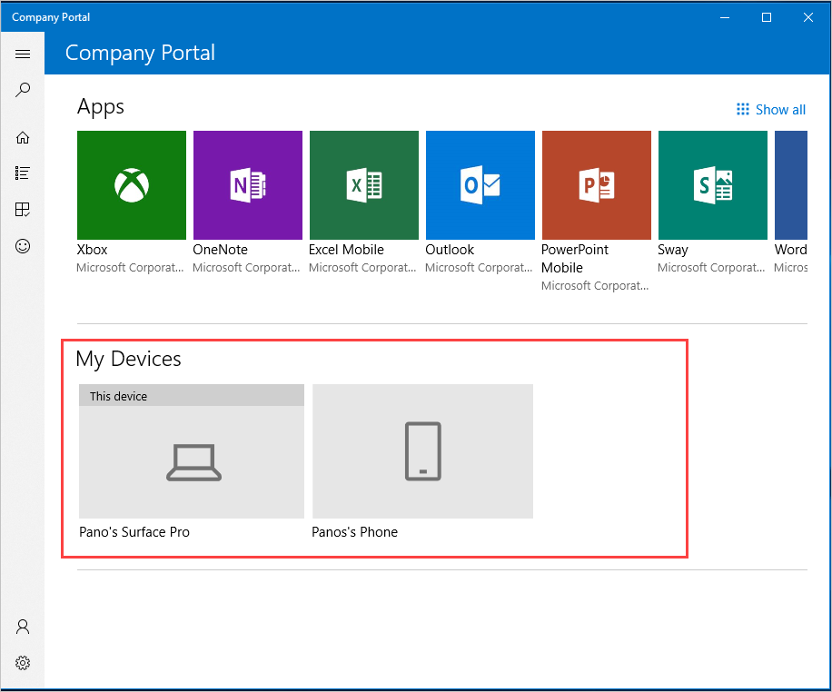
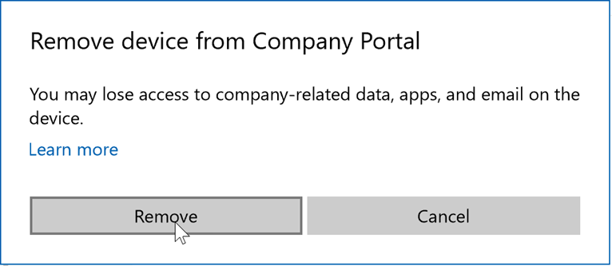

# Remove your Windows device from management

Remove a registered, Windows device from management when you no longer want or need to:  
* Use your device for work or school. 
* Access work or school email, apps, or other resources.

After you unregister the device, you'll lose device access to school or work resources. You can remove the following Windows devices from management:  
* Windows 10 devices 
* Windows 8.1 computer
* Windows 8.1 phone
 
Make sure to read [What happens if you remove device from Intune](unenroll-your-device-from-intune-windows.md#what-happens-if-you-remove-device-from-intune) before unenrolling your device.  

## What happens if you remove device from Intune  
This section describes how your device and access to work or school will change after you remove your device from Intune. 

### Windows 10, Windows 8.1, Windows 8, Windows 7, Windows Vista
After you unenroll a device running Windows 10, Windows 8.1, Windows 7 or Windows Vista:  

- Your device is removed from Company Portal.
- You can't install apps from the Company Portal.  
- Intune client software (if installed) will be removed from your computer.  
- Intune Endpoint Protection software is removed from your computer. If your computer has other virus protection software installed that's disabled, be sure to re-enable it after Intune Endpoint Protection is removed. Otherwise, your computer is vulnerable to viruses and malware. 
- Changes to device settings (for example, disabling the camera or requiring a certain password length) are no longer required.    
- Your computer no longer receives automatic software updates or antivirus software updates from the Intune service. But, depending on how it is set up, your computer might still receive updates from the Windows Server Update Services, Windows Update, or Microsoft Update.

In addition, for Windows 8.1:  

- You lose access to work apps and data on your device.   
- Email apps, such as Windows Mail, can't open work email that's stored on your device.   
- You might not be able to connect to your org's network via Wi-Fi or virtual private network (VPN).  
- You could lose access to internal file shares and websites from your device.   

## Windows RT running Windows 8.1

- The Company Portal app is uninstalled from your device. Your device is removed from Company Portal and the app is uninstalled from your device.  
- You can't install apps from Company Portal.  
- You lose access to work apps and data on your device.  
- Changes to device settings (for example, disabling the camera or requiring a certain password length) are no longer required.  
- You might not be able to connect to your org's network via Wi-Fi or virtual private network (VPN).  
- You could lose access to internal file shares and websites from your device.   
- Email apps, such as Windows Mail, can't open work email that's stored on your device.   

## Remove Windows 10, Windows 8, Windows 7, Windows Vista
This section describes how to remove a Windows 10, Windows 8, Windows 7, or Windows Vista device from Intune. If one set of instructions doesn't work for you, try the next set.    

### Remove in Company Portal, **Home** page    

1. Open the Company Portal app.
2. On the **Home page**, go down to the **My Devices** section.
3. Select the device you want to remove.
3. In the top, right-corner of the app, select the **See more** icon.
4. Select **Remove**. 
5. To confirm device removal, select **Remove**.  

### Remove in Company Portal, device context menu  

1. Open the Company Portal app and go to **My Devices**.

    

2. Right-click or press and hold a device to open its [context menu](/windows/uwp/design/controls-and-patterns/menus).  

3. Select **Remove**.  

      

5. In the confirmation, click **Learn More** to read how your access to work and school resources might change. To confirm device removal, select **Remove**.   

       

### Remove in device Settings app
1. Open the Settings app. 
2. Go to **Accounts** > **Access work or school**.
3. Select the connected account that you want to remove > **Disconnect**.
4. To confirm device removal, select **Yes**.

## Remove Windows 8.1 computer
Complete the following steps to remove a Windows 8.1 computer from Intune.

1. Go to **PC Settings** > **Network** > **Workplace**.
2. Under **Workplace Join**, select **Leave**.
3. Under **Turn on device management,** select **Turn off**.
4. On the popup window that opens, select **Turn off**.  

## Removing your personal information after removing the Company Portal  

There are two kinds of data that the Company Portal stores on your Windows device:

- **Diagnostic logs**: Standard app activity data that Microsoft collects. This is automatically erased when you uninstall the Company Portal app. App activity data is, for example, data about how long the app was open or if the app crashed.
- **Application cache**: Support files that are required for the app to work, such as icons and settings.

To delete the stored logs and cache, complete one of the following steps:

* [Uninstall the Company Portal app](https://support.microsoft.com/help/4028003/windows-10-uninstall-apps-and-programs) 

* Reset the Company Portal app. Open the **Settings** app and select > **Apps** > **Company Portal** > **Advanced options** > **Reset**. 

## Next steps  

Still need help? Contact your company support. For contact information, check the [Company Portal website](https://go.microsoft.com/fwlink/?linkid=2010980).
