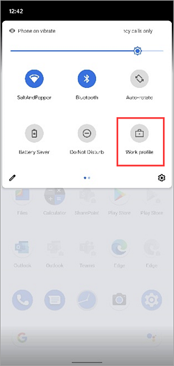
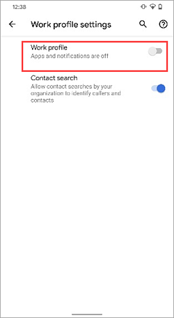
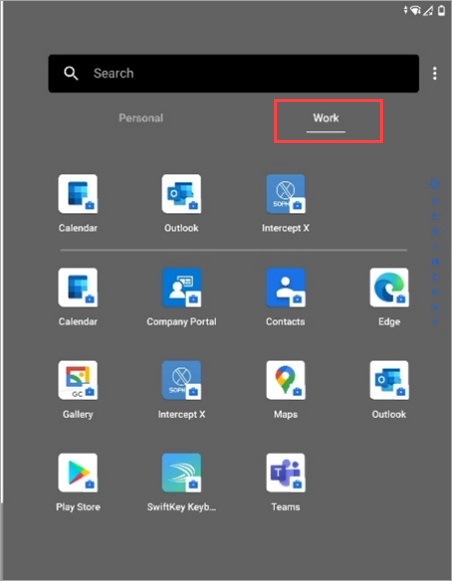
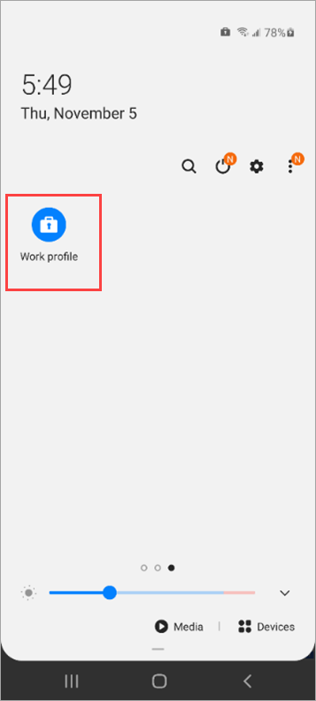

---
# required metadata

title: What happens when you create a work profile | Microsoft Docs
description: Describes how to encrypt an Android device
keywords:
author: lenewsad
ms.author: lanewsad
manager: dougeby
ms.date: 11/11/2020
ms.topic: end-user-help
ms.prod:
ms.service: microsoft-intune
ms.subservice: end-user
ms.technology:
ms.assetid: b217da11-2cd7-49ab-a91f-2f6d7784c6b6
searchScope:
 - User help

# optional metadata

ROBOTS:  
#audience:

ms.reviewer: arnab
ms.suite: ems
#ms.tgt_pltfrm:
ms.custom: intune-enduser
ms.collection: 
---

# Introduction to Android work profile

A work profile is set up on an Android device to separate work apps and data from personal apps and data. The work profile lives on a separate part of the device so that your personal things stay private and unaffected by work. In this article, you'll learn how to:  

* Find your work profile. 
* Tell the difference between work apps and personal apps. 
* Get more apps for work.  
* Pause your work profile.  

Your IT support person can only manage the work-related email, apps, settings, and data on your device. They can’t access the personal email, apps, settings, and data. They also can’t reset or wipe your device. 

To learn how to set up a work profile, see [Create a work profile and enroll your device](enroll-device-android-work-profile.md).  

## Access your work profile  
Once you've set up a work profile, your organization can automatically install work apps on your device. 

The location of the work profile varies by device manufacturer and Android version. This section describes where to find the work profile in the app drawer and on the home screen.  

> [!NOTE] 
> If you're using a custom launcher, work apps can appear in places other than the app drawer or home screen folder.    

### App drawer  
Swipe up on the home screen or select **Apps** to access the app drawer. Work apps appear alongside your personal apps or within a **Work** tab in your app drawer.  

  

To see how it appears on other Android devices, skip to [Examples of work profile](what-happens-when-you-create-a-work-profile-android.md#work-profile-in-app-drawer). 

### Folder  
On some devices, work apps are in a work-designated folder on the home screen. This folder is automatically created during setup.  

  

To see how the work profile folder appears on other Android devices, skip to [Examples of work profile](what-happens-when-you-create-a-work-profile-android.md#work-profile-folder).  

## Identify work apps 
Work apps are marked with a briefcase badge, while personal apps do not have a briefcase badge. Some screen readers or voice assistants identify work apps by saying "work" before the app name.  

After you've set up the work profile, you may have duplicate apps. For example, you could have two Outlook apps. To check your work email, use the version that's marked with the briefcase.  

For the best experience, always sign in to work apps with your work account, and sign in to personal apps with your personal account. 

|Personal app (no briefcase)|Work app (briefcase)|
|---|---|  
|||  

The appearance of the briefcase can vary slightly from device to device. To see how it appears on other Android devices, skip to [Examples of briefcase badge](what-happens-when-you-create-a-work-profile-android.md#examples-of-briefcase-badge).  

## Get more work apps  

Open the work version of the Google Play Store to see all apps your organization has made available to you.  

  

Continue to use the work version of the Play Store to search for and install other apps for work.  If you don’t see an app you need for work, you can request it from your IT support person. 

The appearance of the Google Play Store app varies by device manufacturer and Android version, but the work version is always marked with a briefcase.  

## Pause the work profile  

Pause the work profile to take a break from work apps and notifications. Pausing effectively turns off the work profile by disabling work apps and work notifications. 

The location of the pause setting varies by device manufacturer and Android version (Android 7 and later is required). It's commonly found in quick settings, the Settings app, or the app drawer.  

### Pause in quick settings
Swipe down on your screen to access the quick settings menu. Tap **Work profile** to pause the work profile.   

 

To see how quick settings appear on other Android devices, skip to [Examples of pause setting](what-happens-when-you-create-a-work-profile-android.md#quick-settings).  

### Pause in Settings app 
Open the Settings app and go to **Work profile** settings.Switch the **Work profile** toggle off.    

  

To see how work profile settings appear on other Android devices, skip to [Examples of pause setting](what-happens-when-you-create-a-work-profile-android.md#settings-app).  

### Pause in app drawer
 Swipe up on the home screen or select **Apps** to access the app drawer. Tap the **Work** tab and then switch the **Work profile** toggle off.  

   > [!div class="mx-imgBorder"]
   >   
 

## Examples of work profile  
This section shows examples where the work profile is located on common Android devices.  

### Work profile folder
Examples of how the work profile appears as a home screen folder.  

A **Work apps** folder appears on the Surface Duo (Android 10) home screen.  

 

A **Work apps** folder appears on the Samsung Galaxy S20 (Android 10) home screen. A folder isn't always automatically created.    

  

A **Work** folder appears on the Nexus 5X (Android 8.1.0) home screen.  

  

### Work profile in app drawer 
Examples of where the work profile appears in the app drawer.  

A **Work** tab appears at the top of the Surface Duo (Android 10) app drawer.   

   > [!div class="mx-imgBorder"]
   >   

A **Work** tab appears at the top of the Google Pixel 4 (Android 11) app drawer.  

   > [!div class="mx-imgBorder"]
   >   

A **Work** tab appears at the bottom of the Samsung Galaxy S20 (Android 10) app drawer.  

   > [!div class="mx-imgBorder"]
   >   

Work apps appear alongside personal apps in the Nexus 5X (Android 8.1.0) app drawer.  

   > [!div class="mx-imgBorder"]
   >   

## Examples of briefcase badge  
The following images show how badges appear on common Android devices. 

Surface Duo (Android 10)  
   > [!div class="mx-imgBorder"]
   > 

Google Pixel 4 (Android 11)  
   > [!div class="mx-imgBorder"]
   > 

Samsung Galaxy S20 (Android 10)  

   > [!div class="mx-imgBorder"]
   > 

Nexus 5X (Android 8.1.0)  

   > [!div class="mx-imgBorder"]
   > 

## Examples of pause setting  
This section shows examples of where the pause feature is on common Android devices.  

### Quick settings  
Examples of the pause feature in the quick settings menu.  

**Work profile** is turned on in the Surface Duo (Android 10) quick settings.  

   > [!div class="mx-imgBorder"]
   > 

**Work profile** is paused in the Google Pixel 4 (Android 11) quick settings.   

   > [!div class="mx-imgBorder"]
   > 

**Work profile** is turned on in the Samsung Galaxy S20 (Android 10) quick settings.  

   > [!div class="mx-imgBorder"]
   >   

   **Work mode** is paused in the Nexus 5X quick settings.  

   > [!div class="mx-imgBorder"]
   >   

### Settings app   
Examples of the pause feature in the Settings app.  

**Work profile** is paused in Surface Duo (Android 10) settings.   

   > [!div class="mx-imgBorder"]
   >   

**Work profile** is paused in Google Pixel 4 (Android 11) settings.   

   > [!div class="mx-imgBorder"]
   >   

**Work profile** is turned on in Samsung Galaxy S20 (Android 10) settings.   

   > [!div class="mx-imgBorder"]
   >  

**Work mode** is paused in Nexus 5X (Android 8.1.0) settings.  

   > [!div class="mx-imgBorder"]
   >  

### App drawer  
An example of the pause feature in the app drawer. Some devices do not show the pause option in the app drawer.   

**Work profile** is paused in Google Pixel 4 (Android 11) settings.   

   > [!div class="mx-imgBorder"]
   >   

## Next steps   
Still need help? Contact your IT support person. For contact information, check the [Company Portal website](https://go.microsoft.com/fwlink/?linkid=2010980).  
